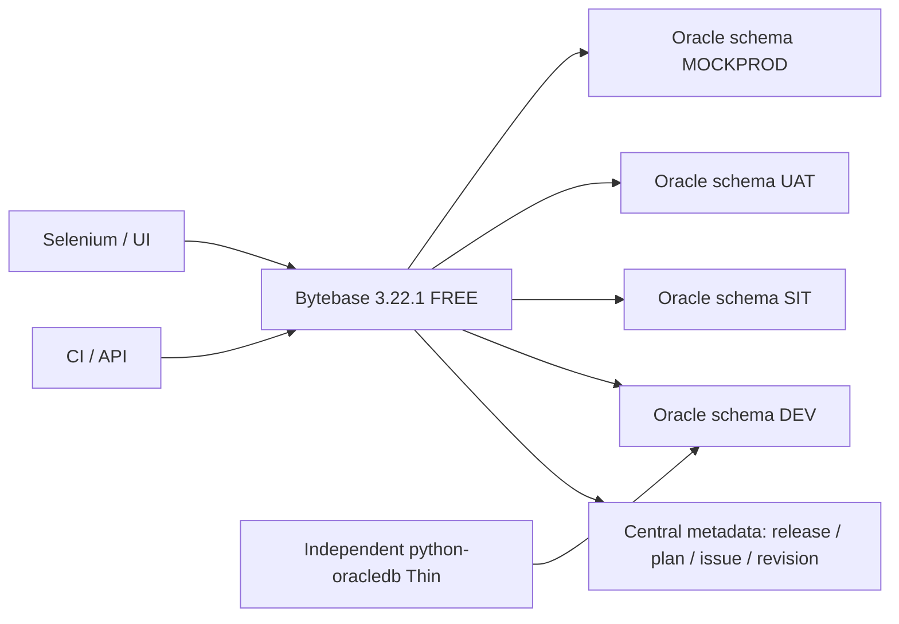

# Kết quả Bytebase Oracle API/UI POC

**Bytebase có native release/version và xử lý replay tốt hơn ODC. Build FREE hiện tại chưa đạt kiểm soát triển khai production.**

Ngày quan sát: 04/10/2026. Kết quả 45 tiêu chí gốc: 17 PASS, 14 PARTIAL, 3 BLOCKED, 4 FAIL, 7 NOT_RUN.

Runtime: Bytebase `3.22.1`, commit `a85f6cb4195299995e8554303550d672d5093e1d`, subscription `FREE`. Oracle `26ai 23.26.4.1.0`.

## Phạm vi và mô hình triển khai

Bytebase đã có trên cụm. POC tạo project `projects/bbpoc-20261004` và năm project-owned instance/database resource. Mỗi datasource dùng schema owner giới hạn riêng.

Một Oracle service chứa DEV, SIT, UAT, MOCKPROD và OBSERVER. Đây là môi trường mô phỏng trên cùng DB vật lý. Không chứng minh production isolation hoặc HA.

Bytebase có một StatefulSet, embedded PostgreSQL và PVC 2 GiB. Bytebase giữ plan, issue, release, task và revision trong metadata trung tâm. Oracle đích lưu bảng, procedure, package và dữ liệu ứng dụng. Hậu kiểm USER_TABLES không thấy bảng migration ledger do Bytebase tạo.

TCPS có `useSsl=true`, `verifyTlsCertificate=true`, extra parameters `SSL=true`, `SSL VERIFY=true`. Thin hậu kiểm bật `ssl_server_dn_match=True`. Kết nối ADMIN cũ không bị sửa.

## Kết quả chính

| Nội dung | Bằng chứng thực tế | Ý nghĩa |
|---|---|---|
| Version/replay | Native VERSIONED release, revision có version/SHA/taskRun. Replay skip và target không đổi. | Có applied-state trung tâm; không chỉ ticket SQL ad hoc. |
| Checksum | Đổi SQL giữ version tạo WARNING và hai SHA; task DONE nhưng skip SQL. | Có phát hiện thay đổi. Chưa fail validation theo tiêu chí REC-08. |
| Duplicate/concurrency | Cùng task hai request: một taskRun/effect. Hai plan cùng version: DONE/DONE, một effect. | Dedup tiểu ca tốt. Chưa chứng minh target lock/fencing hoặc approved execution đầy đủ. |
| Oracle INVALID | Plan 109 DONE/Deployed, procedure INVALID, USER_ERRORS có hai lỗi. | SQL-11 FAIL; không dùng task DONE làm compile gate. |
| SQL Review | Plan 119 check DONE/ERROR trước issue; executor projectReleaser vẫn chạy DONE. Ba hàng bị đổi. | P04 tái hiện mới, không có override hay admin execution. |
| Promotion | Plan 117 staging chạy trước, DONE trước SIT/UAT. Cùng artifact trên bốn schema. | GOV-04 FAIL; stage hiển thị đúng không có nghĩa server bắt buộc thứ tự. |
| Phân quyền | Rollout requester/CI bị 403. Ban đầu sqlEditorUser vẫn cho requester UPDATE bằng query API. Sau đổi requester sang sqlEditorReadUser, UPDATE bị từ chối và SELECT còn hoạt động. | Rollout và SQL console có quyền riêng. Phải giới hạn cả hai đường. |
| Expiry | Read được trước deadline; sau deadline có permission_denied trong HTTP 200; revoke project trả 403. | Phải kiểm result.error, không chỉ HTTP status. |
| FREE | Approval SKIPPED; self-approve báo thiếu template. Audit/export và READ_ONLY datasource có TEAM gate. | Các ca approval/audit BLOCKED. UI audit dùng tên Pro; không suy ra gói thương mại khác đã đạt. |
| UI metadata | SELECT view trên USER_ERRORS báo failed to mask data; Thin đọc được lỗi. | Ghi đúng lỗi UI; không thay bằng dữ liệu giả. |

MockPROD task120: `DONE 06:53:11Z`. SIT task118: `DONE 06:53:27Z`. UAT task119: `DONE 06:53:56Z`. Chỉ executor POC chạy các negative control này.

## 45 tiêu chí giữ nguyên

| ID | Ca | Kết quả | Bằng chứng và giới hạn |
|---|---|---|---|
| MODEL-01 | Project ownership | PASS | Project và năm target POC có resource name ổn định trong API, UI và các hậu kiểm. |
| MODEL-02 | Estate inventory | PASS | Đăng ký năm project-owned Oracle instance/database/schema. DEV/SIT/UAT/mockPROD có environment. Cùng một DB vật lý. |
| MODEL-03 | Change identity | PASS | Native VERSIONED release giữ version, sheet SHA-256, plan/issue/taskRun và revision liên kết. SQL lấy từ API khớp artifact. |
| MODEL-04 | Actor records | PARTIAL | Requester, release creator, executor và timestamp tách riêng. Tài khoản Oracle theo schema. Approver thực sự không có vì FREE SKIPPED. |
| MODEL-05 | Review | PASS | Review gắn với đúng SQL và target. P04 mới phát hiện ERROR trước issue nhưng execution enforcement vẫn FAIL riêng. |
| MODEL-06 | Approval scope | BLOCKED | FREE bỏ qua approval template: approvalStatus SKIPPED. Không thể nghiệm thu approval binding. |
| MODEL-07 | Environment rollout | FAIL | Native rollout có bốn stage và cùng artifact. API chạy staging trước; staging DONE trước SIT/UAT. Không bắt buộc thứ tự. |
| MODEL-08 | Manual continuation | PASS | Sau DEV DONE, SIT NOT_STARTED và chưa có bảng. Requester tiếp tục bị 403; executor tiếp tục tạo đúng bảng/hàng. |
| MODEL-09 | Failed stage | PASS | DEV FAILED với ORA-00942; SIT giữ NOT_STARTED trước thao tác thủ công. Stage sau không tự chạy. Explicit executor vẫn được lên lịch sau lỗi. |
| MODEL-10 | History and logs | PARTIAL | Task/target/log/time và lỗi Oracle đọc được. Audit search/export bị 403 FEATURE_AUDIT_LOG TEAM. Chưa kiểm retention. |
| MODEL-11 | Estate permissions | PARTIAL | Có project role, query/write denial, conditional grant hết hạn, revoke và Oracle cross-schema denial. Approval actions bị FREE chặn. |
| MODEL-12 | Release readiness | PASS | Đã phân biệt native release/revision, checksum WARNING, target ledger chưa có, dedup/concurrency quan sát được và recovery chưa đủ. |
| SQL-01 | CREATE TABLE | PARTIAL | UI chạy CREATE thành công; bảng/PK/type đúng và revision trung tâm liên kết. Không có target migration ledger trong schema. |
| SQL-02 | ALTER TABLE | PARTIAL | Cột STATUS và constraint tồn tại; native version kế tiếp có revision. Chưa có ledger phía Oracle target. |
| SQL-03 | INSERT/UPDATE | PASS | Sau INSERT/UPDATE, hàng 1 có amount=150. Replay cùng version skip; hậu kiểm trước/sau replay không đổi. |
| SQL-04 | Procedure | PASS | Procedure VALID. Invocation chuyển STATUS thành PAID. |
| SQL-05 | Function | PASS | Function VALID. POC_ADD_TAX(100)=110. |
| SQL-06 | Package | PASS | Package/spec/body VALID; invocation đổi NOTE và initialization trả 42. |
| SQL-07 | Trigger | PASS | Trigger VALID; một UPDATE tạo một audit event 150→200. |
| SQL-08 | Anonymous PL/SQL | PASS | Hai block anonymous chạy; marker 801/802 mỗi loại một hàng. |
| SQL-09 | Slash delimiter | PASS | Body PL/SQL với slash riêng dòng chạy thành công. Không có lỗi bare slash; log có statement ranges. |
| SQL-10 | SQLPlus commands | PARTIAL | Bundle SQLPlus FAILED ORA-01008; marker 1001 không có. Chưa kiểm từng directive, thông báo pre-execution hoặc đường native SQLPlus. |
| SQL-11 | Invalid compilation | FAIL | Plan 109/task DONE và UI Deployed; Oracle procedure INVALID, hai USER_ERRORS, gồm PLS-00201. |
| SQL-12 | Oracle literal forms | PASS | Ba giá trị q-quote, comment marker trong chuỗi và quoted identifier giữ nguyên. |
| REC-01 | Intentional failure | PASS | Fixture missing-table FAILED với ORA-00942 và file/version/range trong log. Hàng 1101 không xuất hiện tại thời điểm lỗi. |
| REC-02 | Normal replay | PASS | Nộp lại native version đã thành công: task DONE nhưng không chạy lại DML. Hậu kiểm paired trước/sau không đổi. |
| REC-03 | Retry after failure | PARTIAL | Hậu kiểm 1101=0 rồi tạo version sửa riêng; chạy thành công 1101=1. FREE không có phê duyệt correction thật. |
| REC-04 | Partial DDL | PARTIAL | CREATE được commit; ALTER lỗi ORA-00904 và task FAILED. POC_PARTIAL còn tồn tại. Chưa chứng minh partial-state fencing hoặc cấm mọi replay. |
| REC-05 | Crash after target commit | NOT_RUN | Chưa có crash barrier trước commit và worker restart được kiểm soát. |
| REC-06 | Crash after target history | NOT_RUN | Chưa có commit barrier và phép crash giữa Oracle commit với central revision. |
| REC-07 | Network interruption | NOT_RUN | Chưa cắt network sau commit bằng proxy có checkpoint. |
| REC-08 | Checksum change | FAIL | Đổi SQL giữ native version: check có WARNING Applied file has been modified và hai SHA. Task vẫn DONE/skip. Không đạt yêu cầu validation FAIL. |
| REC-09 | Concurrent runners | PARTIAL | Hai native API plan cùng version chạy đồng thời: cả hai DONE, một effect/một SESSION_ID. Chưa quan sát lock holder hoặc hai runner CI độc lập. |
| REC-10 | Duplicate API request | PARTIAL | Hai tasks:batchRun cùng task trả 200/200; một taskRun, một effect. Identity dedup đạt tiểu ca; FREE approval SKIPPED nên chưa nghiệm thu approved execution đầy đủ. |
| REC-11 | Central restart | NOT_RUN | Chưa có controlled multi-replica failover và fencing. |
| REC-12 | Stale lock | NOT_RUN | Chưa restore target từ backup và reconcile revision với trạng thái target. |
| GOV-01 | WHO / WHAT / WHERE / WHEN / HOW / RESULT | PARTIAL | Join release/plan/issue/taskRun trả requester, creator, executor, hash, target, time, local job, result. Thiếu approver thật trên FREE. |
| GOV-02 | Approval binding | BLOCKED | Không có approval template trên FREE để kiểm invalidate khi đổi SQL, target, environment hoặc version. |
| GOV-03 | Separation of duties | PARTIAL | Requester/CI rollout execute 403. SQL console ban đầu vẫn cho UPDATE vì sqlEditorUser. Đổi requester thành projectDeveloper+sqlEditorReadUser: UPDATE bị permission_denied, SELECT còn hoạt động. FREE approval chưa nghiệm thu. |
| GOV-04 | Environment promotion | FAIL | Staging/mockPROD task120 DONE 06:53:11Z; SIT DONE 06:53:27Z, UAT DONE 06:53:56Z. API chấp nhận staging khi lower stages chưa thành công. |
| GOV-05 | CI identity | PARTIAL | Named service account tạo plan/issue qua API, giữ principal và local job reference. Chưa chạy job GitLab/Jenkins thật. |
| GOV-06 | Backup and restore | NOT_RUN | Chưa có CI runner bị ngắt và resume từ checkpoint có controlled identity. |
| GOV-07 | Multiple replicas | NOT_RUN | Chưa có runner reassignment/failover với fencing. |
| GOV-08 | Secret handling | PARTIAL | Known-secret scan trên task evidence và asset công bố không thấy bí mật. Không thể kiểm audit payload/export đầy đủ trên FREE. |
| GOV-09 | Audit export | BLOCKED | Audit search/export trả 403 TEAM feature. UI ghi Pro. Chưa có export hoặc rotation proof; không tự bật trial. |

## Bằng chứng và khả năng tái kiểm

[Trang bằng chứng](https://db-poc.apps.drgdevlab.com/): chọn Bytebase trong gallery hoặc cases. Có 11 ảnh Chromium thật, PNG gốc, WebP và SHA-256.

JSON trong `evidence/`: `bytebase-poc-api.json`, `bytebase-poc-governance.json`, `bytebase-poc-review.json`, `bytebase-poc-cases.json`, `bytebase-poc-browser.json`, `bytebase-poc-validation.json`. Không công bố login, credential, cookie hoặc log private thô.

[Runbook API và UI](https://db-poc.apps.drgdevlab.com/evidence/reports/BYTEBASE-API-UI-RUNBOOK.md) có task nhỏ. CLI kiểm artifact, review findings và approval. Flag bỏ qua SKIPPED chỉ dùng lab. Các guard này nằm phía client; không chứng minh server đã sửa lỗi.

Tài khoản cung cấp có workspaceAdmin và chỉ dùng bootstrap/đọc license. Các task kiểm separation dùng requester/executor riêng. Approver là tên actor projectOwner, không phải bằng chứng issue đã được phê duyệt.

Lỗi chuẩn bị được tách khỏi lỗi sản phẩm. PATCH datasource ban đầu thiếu credential khiến ORA-01005; SQL09..12 đã được chạy lại sau sửa. Probe phụ dùng sai cột CASE_ID được loại khỏi kết luận và thay bằng fixture đúng.

Project POC ban đầu cấp requester sqlEditorUser để kiểm SQL Editor. Role này cho UPDATE vào mockPROD bằng query API, dù rollout execution bị 403. POC đã đổi requester sang projectDeveloper và sqlEditorReadUser. Read còn hoạt động; query UPDATE và rollout execute đều bị từ chối. Đây là sửa phạm vi IAM của project POC, không phải bản vá server.

Không deploy bản vá Bytebase, không bật trial, không đổi approval policy toàn workspace. Giữ resource POC để xem lại.

## Giới hạn và bước production

Chưa kiểm Oracle 19c/21c, on-prem/RAC, crash giữa commit/revision, network partition, multi-replica failover, restore hoặc GitLab/Jenkins job thật. Không có nghiệm thu Enterprise.

Nếu chọn Bytebase, cần tái kiểm SQL Review enforcement và Oracle compile gate trên build dự kiến dùng. Cần approval/audit phù hợp license và server bắt buộc lower-stage success. Khi chưa đạt, pipeline phải dừng trước promotion.

Nguồn API pin runtime: [release protocol](https://github.com/bytebase/bytebase/blob/a85f6cb4195299995e8554303550d672d5093e1d/proto/v1/v1/release_service.proto), [rollout protocol](https://github.com/bytebase/bytebase/blob/a85f6cb4195299995e8554303550d672d5093e1d/proto/v1/v1/rollout_service.proto), [approval finding](https://github.com/bytebase/bytebase/blob/a85f6cb4195299995e8554303550d672d5093e1d/backend/component/review/finding.go).
