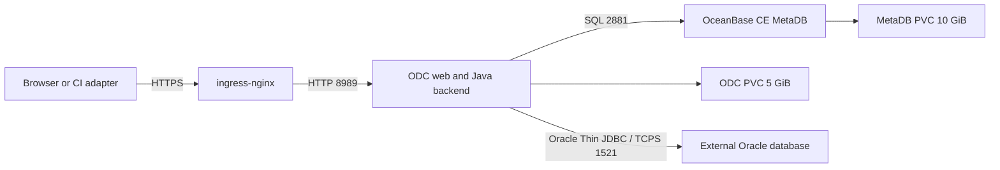

# OceanBase ODC deployment and Oracle evaluation

Research and inspection date: 2026-10-03.

**ODC is deployed and remains the first platform evaluation candidate.**
Its Platform Fit is HIGH. Its Migration Engine Fit is LOW.
Deployment checks passed. On 2026-10-04, Oracle TCPS connection and one metadata SELECT succeeded through a local wrapper.
API/UI SQL and permission probes have results. Migration reliability has failures; CI runners and recovery remain unverified.
See [connection setup and evidence](ODC-CONNECTION-POC.md).
The [main report](REPORT.md) retains the comparison and selection criteria.

## Products, licenses, and cost

ODC means OceanBase Developer Center. It provides a web console, database inventory, SQL development, approvals, and execution records.
OceanBase Database is a separate database engine. Oracle is another engine that ODC can connect to.
The OceanBase instance in this deployment stores ODC metadata. It does not replace the managed Oracle database.

| Product or service | Role | License or cost boundary |
|---|---|---|
| ODC backend and pinned frontend | Database development and change management | Apache-2.0 source. No paid user/instance gate identified in inspected project and batch paths. |
| OceanBase Community Edition | Internal ODC MetaDB in this deployment | Separate open-source database distribution. Its license must be assessed separately from ODC. |
| Oracle target | Existing business database managed through ODC | Oracle licensing and target infrastructure remain separate. |
| OceanBase commercial Database / OB Cloud | Commercial database distribution or hosted database service | The free-trial page offers commercial trials and cloud credit. These offers do not define ODC source rights. |
| Kubernetes, storage, maintenance, and support | Operation of the deployment | Infrastructure and service costs remain even when source use requires no license fee. |

The [official free-trial page](https://www.oceanbase.com/free-trial) distinguishes commercial database trials, cloud credit, and Community Edition.
The [Apache-2.0 terms](https://www.apache.org/licenses/LICENSE-2.0) permit commercial distribution and paid support.
Preserve required license and notice information when redistributing source or binaries.
ODC's Apache license does not cover every bundled dependency or grant Oracle database licenses.
The [license audit](LICENSE-AUDIT.md) records the inspected scope. A complete image dependency audit remains outstanding.

Source: [P-ODC-LICENSE, P-ODC-CLIENT-L](PRODUCT-EVIDENCE.md#source-references).

## Current deployment architecture

Public URL: [https://oceanbase.apps.drgdevlab.com](https://oceanbase.apps.drgdevlab.com).
Kubernetes context: `k8s-admin-public`. Namespace: `oceanbase-odc`.



Datasource `oracle-cloud` is connected through a local TCPS wrapper on 2026-10-04.
This wrapper is specific to the pinned image. It does not establish upstream TCPS support.

| Component | Implementation and purpose | Persistence |
|---|---|---|
| ODC | One Deployment with strategy Recreate. Java backend serves the web application and APIs on port 8989. | `odc-data`, 5 GiB, mounted at `/opt/odc/data`. Logs use temporary storage. |
| MetaDB | One StatefulSet. OceanBase CE observer starts through OceanBase Deployer (OBD). | `data-oceanbase-metadb-10gi`, 10 GiB. |
| Metadata tenant and schema | OceanBase MySQL tenant `test`, schema `odc_metadb`, connection user `odc@test`. Stores ODC application state. | MetaDB volume. |
| Storage | StorageClass `longhorn-workers`. Configured volume replication provides storage redundancy. | It does not provide database or application high availability. |
| Oracle business target | Existing Oracle listener reached directly from the ODC pod through JDBC. | Data stays in the external Oracle database. |

ODC image: `oceanbase/odc:4.4.1_bp1`.
Digest: `sha256:ee8ee48edea2907b1b2c11eac54c8603e554bdcc570eb11b0b1f9cef2ead040d`.
The live info API reports `4.4.1-20260116`.

MetaDB image: `oceanbase/oceanbase-ce:4.3.5-lts`.
Digest: `sha256:31086a6900c21c479c2bcd942b6a28c53b17a51f4e9b9eb8eafcc596adfcd2e3`.
Both workloads had one ready replica during inspection. Both volumes were Bound.
This deployment has no application or database high availability.
The older deployment guide documents multiple ODC nodes. That configuration was not deployed or verified here.
Backup, restore, performance, and failure recovery were not verified.
Source: [P-ODC-HA-DOC](PRODUCT-EVIDENCE.md#source-references).

Deployment sources: [manifests and overview](../k8s-namepsace-chart/oceanbase-odc/README.md),
[ODC resources](../k8s-namepsace-chart/oceanbase-odc/odc.yaml), and
[MetaDB resources](../k8s-namepsace-chart/oceanbase-odc/metadb.yaml).
The [sanitized runtime record](evidence/product-model/odc-runtime-20261003.json) records images, readiness, volumes, APIs, and Oracle plugin files.

Kubernetes is one deployment choice. The [official repository](https://github.com/oceanbase/odc) documents local Docker deployment with a MetaDB.
Backend development uses Java. Frontend development uses Node tooling.
An npm frontend process alone does not provide the ODC backend or MetaDB.
Source: [P-ODC-DEPLOY, P-ODC-DEVELOPER-GUIDE](PRODUCT-EVIDENCE.md#source-references).

## Mapping to Bytebase

These mappings describe product concepts. They do not assert complete behavioral equivalence or identical free-edition limits.

| Bytebase concept | ODC concept | Established scope and remaining gap |
|---|---|---|
| Workspace and administrator | Team Workspace, system roles, users | Central user and resource administration. |
| Project | Project with members and databases | Existing project ownership and estate organization. |
| Instance | Datasource with engine, host, listener, and credentials | Oracle SID/service identifies the target. No complete Oracle estate discovery was tested. |
| Database/schema | Physical or logical database attached to a project | Oracle schema discovery and cross-schema isolation remain unverified. |
| Environment | Environment object and target labels | Labels and ordered batch groups exist. Enforced release prerequisites remain unverified. |
| Plan / issue | SQL change ticket and approval flow | SQL checks, risk rules, approval, and execution records exist. |
| Rollout stages | Ordered multi-database batch groups | Concurrent targets within a group. Manual or automatic continuation between groups. |
| Immutable release | Ticket identity and SQL files | Immutable versioned release and checksum binding are not established. |
| Revision / target state | Central parent and child task results | No target migration version/checksum ledger found in the inspected execution path. |
| GitOps / CI integration | Project repository association and REST flow APIs | Native merge-to-deploy behavior is not established. An external adapter needs verification. |

Sources: [PRODUCT-MODEL.md](PRODUCT-MODEL.md),
[P-ODC-PROJECT, P-ODC-ENV, P-ODC-DATABASE, P-ODC-BATCH-EXEC, P-ODC-GIT-API](PRODUCT-EVIDENCE.md#source-references).

## Oracle integration procedure

The running image contains separate Oracle connection, schema, and task plugins.
Its server archive contains `BOOT-INF/lib/ojdbc8-21.1.0.0.jar`.
Plugin and driver presence does not prove successful Oracle execution.
The driver filename does not certify Oracle 19c or 21c compatibility.

Required inputs: reachable host, listener port, SID or service name, Oracle version, environment, project, and connection credentials.
For a pluggable database (PDB), use the DBA-provided service name.
The account needs session access and the object privileges required by the planned evaluation.

1. Log in and select Team Workspace.
2. Open Data Sources and create a datasource with type `Oracle`.
3. Enter the target host and port. Oracle listeners commonly use `1521`.
4. Select SID or service name. Enter the target value supplied by the Oracle DBA.
5. Use the Normal role, API value `NORMAL`, for the evaluation account. Enter its username and password.
6. Select the environment. Use Test Connection after network access is available.
7. Discover databases/schemas and add the selected records to a project.
8. Add project members and assign roles that match the required access scope.
9. Open the SQL console and evaluate a read-only statement such as `SELECT USER FROM DUAL`.
10. Execute the [Oracle acceptance plan](poc/ORACLE-POC.md) only against an authorized evaluation target.

Connection examples from the inspected plugin:

```text
Service name: jdbc:oracle:thin:@//<host>:<port>/<serviceName>
SID:          jdbc:oracle:thin:@<host>:<port>:<sid>
```

Possible failures include blocked pod-to-listener traffic, incorrect SID/service, rejected credentials, and missing Oracle privileges.
Resolve connection failures before creating change tickets.
Package, trigger, delimiter, invalid-compilation, and committed-DDL recovery behavior remain unverified.
ODC's reviewed task path uses JDBC. A general SQLPlus script interpreter was not established.
The pinned schema comparison guide lists OceanBase tenants and MySQL. It does not list native Oracle database comparison.
Do not infer native Oracle schema diff support from an OceanBase Oracle tenant example.
Source: [P-ODC-SCHEMA-DIFF-DOC](PRODUCT-EVIDENCE.md#source-references).

Sources: [P-ODC-ORACLE, P-ODC-ORACLE-UI, P-ODC-DATASOURCE-API](PRODUCT-EVIDENCE.md#source-references).

## User administration and inherited permissions

ODC has system users and roles, project membership, and application database grants.
The [official Team Workspace guide](https://www.oceanbase.com/en/docs/common-odc-1000000004382970) explains default project access.

| Actor or project role | ODC access scope |
|---|---|
| System administrator | Global user, role, and resource administration. |
| Project administrator (`OWNER`) | All databases in the project. Can administer membership and database grants. |
| DBA | All project databases. Can administer database grants. |
| Developer | Inherits access to all project databases. This role does not restrict access to one selected schema. |
| Security Administrator / Participant | No default project database access. Requires an explicit database grant for database operations. |

Use Participant with explicit grants when evaluating access limited to selected database/schema records.
The permission service supports `QUERY`, `CHANGE`, `EXPORT`, and `ACCESS`, with expiration dates.
Only project OWNER or DBA can grant or revoke these permissions in the inspected service.
ODC stores these grants in its metadata. Grant creation does not execute native Oracle `GRANT` statements.
Oracle still enforces the privileges of the datasource connection account.

Acceptance must verify allowed access, denied cross-schema access, expiry, audit actors, and approval/execution duties on the real Oracle target.
Do not infer isolation from a role label or from permission records alone.
Sources: [P-ODC-ROLE-INHERITANCE, P-ODC-DB-PERMISSION-SERVICE, P-ODC-DB-PERMISSION-TYPES](PRODUCT-EVIDENCE.md#source-references).

## API integration and CI/CD boundary

Datasource creation through an API registers a connection. It does not create an Oracle instance or provision an Oracle database.
The following routes come from the pinned backend source. Live GET observations cover only the routes listed in the runtime record.
Datasource configuration writes and one metadata SELECT succeeded on 2026-10-04.
Flow approval and SQL writes were executed. Immutable promotion and migration reliability remain incomplete.

| Purpose | Method and route | Evidence scope |
|---|---|---|
| List datasources | `GET /api/v2/datasource/datasources` | Authenticated 200. Zero items at inspection. |
| Register / update a datasource | `POST /api/v2/datasource/datasources`; `PUT /api/v2/datasource/datasources/{id}` | Source controller. Body uses `ConnectionConfig`. |
| Register several datasources | `POST /api/v2/datasource/datasources/batchCreate` | Source controller. |
| List / sync schema records | `GET /api/v2/datasource/datasources/{id}/databases`; `POST /api/v2/datasource/datasources/{id}/sync` | Sync reads schema metadata. It does not provision a database. |
| List projects | `GET /api/v2/collaboration/projects` | Authenticated 200. Zero items at inspection. |
| Create a change flow | `POST /api/v2/flow/flowInstances/` | Source controller. `ASYNC` and `MULTIPLE_ASYNC` cover change task types. |
| Approve / execute | `POST /api/v2/flow/flowInstances/{id}/approve`; `POST /api/v2/flow/flowInstances/{id}/tasks/execute` | Source controller. Service permissions and workflow state apply. |
| Read status / results / logs | `GET /api/v2/flow/flowInstances/{id}`; `GET /api/v2/flow/flowInstances/{id}/tasks/result`; `GET /api/v2/flow/flowInstances/{id}/tasks/log` | Source controller. |
| Associate Git repositories | `/api/v2/collaboration/projects/{projectId}/gitRepos` | Source provides repository list/create/update/delete. No native pipeline trigger established. |
| Grant / revoke database permissions | `POST /api/v2/collaboration/projects/{projectId}/databasePermissions/batchCreate`; `DELETE /api/v2/collaboration/projects/{projectId}/databasePermissions/batchRevoke` | Source controller and permission service. |

The inspected login uses `/api/v2/encryption/publicKey`, RSA-encrypted credentials, and form POST `/api/v2/iam/login`.
Requests retain session cookies and organization context, such as `currentOrganizationId=1`.
Write requests also require the session's CSRF token, sent as `X-XSRF-TOKEN`.
Simple HTTP Basic authentication was not available in the inspected deployment.
Use a dedicated automation identity and Secret storage when implementing the adapter.
Credentials, cookies, keys, and datasource passwords are excluded from this evidence pack.

Proposed pipeline flow, not an implemented pipeline:

```text
GitLab/Jenkins -> authenticate -> resolve registered target -> submit ticket
              -> await required approval -> execute permitted task -> collect status and logs
```

`CreateFlowInstanceReq` includes `databaseId`, `taskType`, `executionStrategy`, `description`, and task-specific `parameters`.
Source: [P-ODC-FLOW-REQUEST](PRODUCT-EVIDENCE.md#source-references).
Verify each payload and its authorization against the running version before adopting a pipeline contract.
Ticket existence and central success records do not guarantee idempotent DDL replay.
Generic rollback routes do not establish an Oracle DDL rollback capability.

Sources: [P-ODC-DATASOURCE-API, P-ODC-FLOW-API, P-ODC-GIT-API, P-ODC-DB-PERMISSION-API](PRODUCT-EVIDENCE.md#source-references).

The [ODC 4.5.0 release note](https://www.oceanbase.com/docs/common-odc-1000000006663615) announces OpenAPI for some functions and MCP interfaces.
That version was released on 2026-07-31. The inspected deployment remains 4.4.1.
The release note also reports package delimiter and large batch fixes.
These fixes strengthen the need for version-specific Oracle and scale verification.
No upgrade, supported 4.5 API coverage review, or MCP integration was performed.

## API help and English interface

The user initially reported a 404 at `/swagger-ui.html`.
The latest authenticated GET returned HTML with status 200, but `/swagger-resources` returned 404.
`/v2/api-docs` returned configuration-shaped JSON without `swagger`, `openapi`, or `paths`.
The response is not an API specification. Do not publish or archive its configuration values.
The cause of the earlier HTML 404 remains unresolved.
The current deployment does not provide a working Swagger API catalog through those routes.
Use commit-pinned controllers and browser request inspection for 4.4.1 API discovery.
Source: [P-ODC-SWAGGER](PRODUCT-EVIDENCE.md#source-references). Live observations: [runtime record](evidence/product-model/odc-runtime-20261003.json).

Select English through the language selector in the web interface.
The inspected frontend reads `localStorage.umi_locale`, then the browser language, then falls back to `en-US`.
The selection applies to that browser. A deployment-wide English default was not configured.
Source: [P-ODC-LOCALE](PRODUCT-EVIDENCE.md#source-references).

After login, open [Data Sources](https://oceanbase.apps.drgdevlab.com/index.html#/datasource),
[Projects](https://oceanbase.apps.drgdevlab.com/index.html#/project), or
[Tickets](https://oceanbase.apps.drgdevlab.com/index.html#/task).
These links open application pages. A login session is required.

## Acceptance and evidence limits

| Acceptance item | Status |
|---|---|
| Running ODC version, ready replicas, image digests, and 5/10 GiB volumes | Observed on 2026-10-03. |
| Administrator login and selected datasource/project GET routes | Observed HTTP 200. One Oracle datasource is present on 2026-10-04; its transport settings were updated. |
| Oracle plugin and JDBC driver packaging | Present in the running image. Complete dependency license audit outstanding. |
| Oracle target connection and metadata SELECT | PASS on 2026-10-04 through the local TCPS wrapper. See the connection POC evidence. |
| Schema discovery, grants, and SQL change flow | API/UI POC executed. See the result report for limits. |
| API-triggered writes and approval | Executed locally. Requester can execute after approval. GitLab/Jenkins runners remain NOT_RUN. |
| Oracle recovery, backup/restore, high availability, and estate scale | NOT RUN. Current topology has single replicas. |

The pinned backend source dates from June 2025. Its frontend dates from May 2025.
The running image is newer. Source inspection does not certify every live route or behavior.
The 45 original criteria now have per-case results. See [API/UI results](ODC-ORACLE-POC-RESULTS.md).
Use an authorized dedicated Oracle evaluation schema before executing those cases.
The [review record](REVIEW-CHECKS.md) records document verification separately from application tests.
