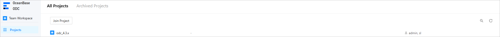
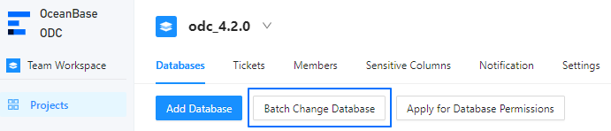
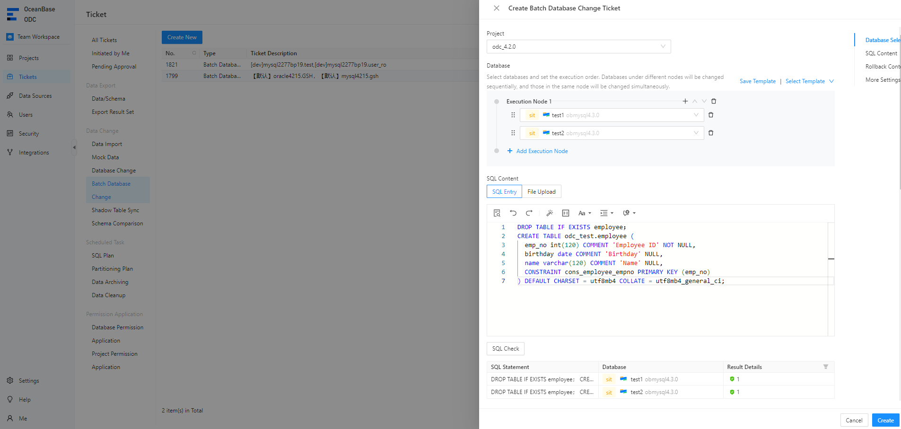
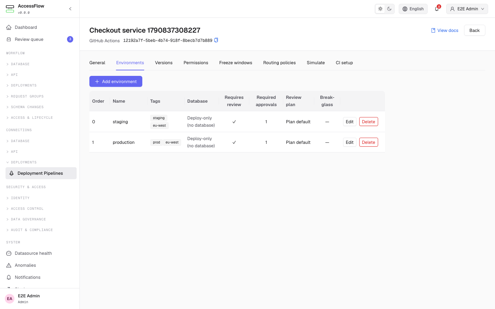
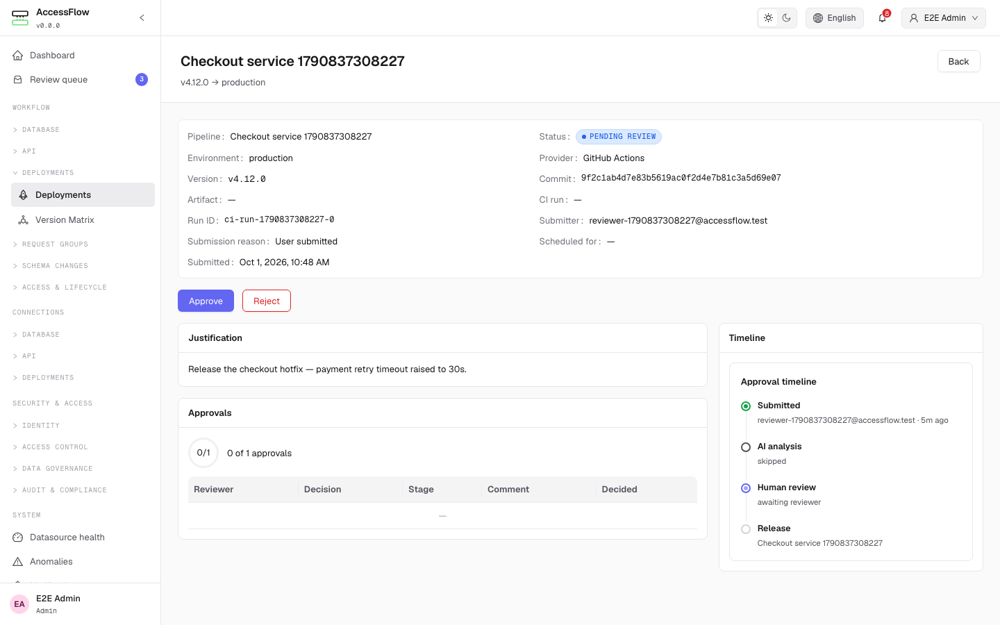
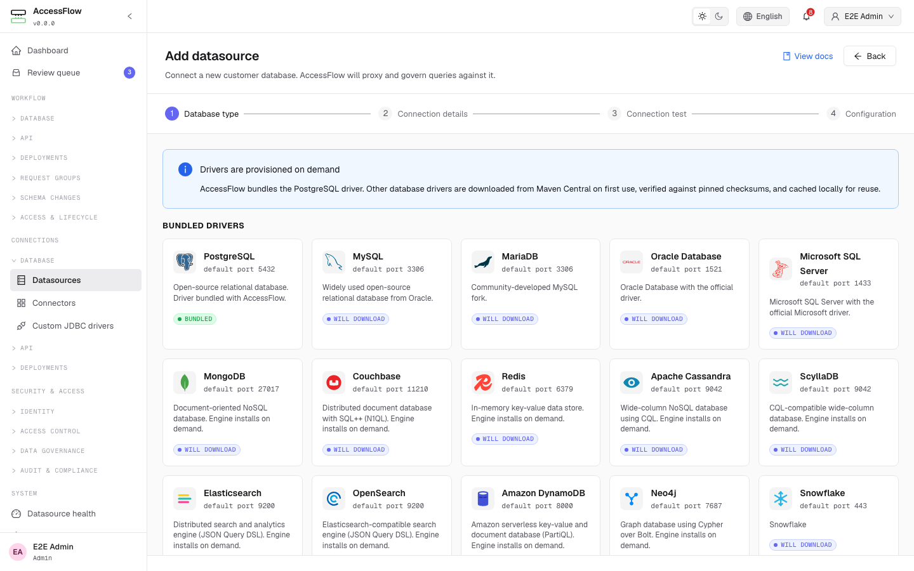

# Frontend and screenshot evidence

**Both shortlisted platforms have an inspected frontend.**
The review used registered routes, navigation components, page components, and official images.
It did not rely on a README Web UI label.
The original frontend review used source and official images. No screenshot was captured from a research installation.
ODC is now deployed. The [ODC evaluation](ODC-EVALUATION.md) records live GET checks and the English language setting.
The screenshots below remain official examples. They do not prove Oracle execution on the deployed instance.

Research date: 2026-10-03.
The source commits are recorded in [PRODUCT-EVIDENCE.md](PRODUCT-EVIDENCE.md).
A page's existence does not prove runtime correctness or free-edition availability.

## Bytebase reference

The frontend uses React and TypeScript.
`frontend/src/app/router/routes/dashboard.tsx` registers workspace projects, instances, databases, environments, audit, users, and roles.
Project routes contain issues, plans, releases, GitOps, and plan rollout stages and tasks.
`frontend/src/components/ProjectSidebar.tsx` organizes project issues and CI/CD pages.
`CONTEXT.md` defines the corresponding backend operating model.
These resources establish the reference model. Enterprise route presence does not grant free usage.

Evidence: [P-BB-MODEL, P-BB-ROUTES, P-BB-NAV](PRODUCT-EVIDENCE.md#source-references).

## OceanBase ODC

The frontend uses React, TypeScript, Umi routes, and Ant Design.
The backend records the frontend as a Git submodule.
The inspected frontend commit matches that submodule exactly.
The standalone frontend enables Oracle batch tasks. Its embedded OceanBase Cloud Platform (OCP) mode removes the Oracle option.

Main navigation contains Team Workspace, Projects, Tickets, Data Sources, Users, Security, and Integrations.
Project tabs contain Databases, Tickets, Members, Sensitive Columns, Notifications, and Settings.
Security tabs include environments, risk rules, approval, SQL rules, and operation records.

Routes: [config/routes.js](https://github.com/oceanbase/odc-client/blob/273fa3c4cc7d87f942ade231ce9220b98fa595e2/config/routes.js).

Navigation: [src/layout/SpaceContainer/Sider/index.tsx](https://github.com/oceanbase/odc-client/blob/273fa3c4cc7d87f942ade231ce9220b98fa595e2/src/layout/SpaceContainer/Sider/index.tsx).

### ODC pages

| Required page | Finding | Route or UI location | Source component |
|---|---|---|---|
| Projects | YES | `/project` | [src/page/Project/Project/index.tsx](https://github.com/oceanbase/odc-client/blob/273fa3c4cc7d87f942ade231ce9220b98fa595e2/src/page/Project/Project/index.tsx) |
| Database Instances | YES. Datasources are registered connections | `/datasource` | [src/page/Datasource/Datasource/index.tsx](https://github.com/oceanbase/odc-client/blob/273fa3c4cc7d87f942ade231ce9220b98fa595e2/src/page/Datasource/Datasource/index.tsx) |
| Databases | YES. Separate project database records | `/project/:id/database` | [src/page/Project/Database/index.tsx](https://github.com/oceanbase/odc-client/blob/273fa3c4cc7d87f942ade231ce9220b98fa595e2/src/page/Project/Database/index.tsx) |
| Environments | YES. Security configuration | `/secure/env` | [src/page/Secure/Env/index.tsx](https://github.com/oceanbase/odc-client/blob/273fa3c4cc7d87f942ade231ce9220b98fa595e2/src/page/Secure/Env/index.tsx) |
| Changes/Releases | PARTIAL. Change tickets, no separate immutable release page established | `/project/:id/task and /task` | [src/component/Task/MutipleAsyncTask/CreateModal/index.tsx](https://github.com/oceanbase/odc-client/blob/273fa3c4cc7d87f942ade231ce9220b98fa595e2/src/component/Task/MutipleAsyncTask/CreateModal/index.tsx) |
| Review/Approval | YES. Ticket process and approval configuration | `/task and /secure/approval` | [src/component/Task/component/CommonDetailModal/TaskFlow.tsx](https://github.com/oceanbase/odc-client/blob/273fa3c4cc7d87f942ade231ce9220b98fa595e2/src/component/Task/component/CommonDetailModal/TaskFlow.tsx) |
| Deployment/Rollout | YES. Batch execution modal. No independent rollout resource page established | `Ticket detail and execution records` | [src/component/Task/MutipleAsyncTask/DetailContent/index.tsx](https://github.com/oceanbase/odc-client/blob/273fa3c4cc7d87f942ade231ce9220b98fa595e2/src/component/Task/MutipleAsyncTask/DetailContent/index.tsx) |
| History | YES. Ticket execution and operation records | `Ticket detail` | [src/component/Task/component/CommonDetailModal/TaskExecuteRecord.tsx](https://github.com/oceanbase/odc-client/blob/273fa3c4cc7d87f942ade231ce9220b98fa595e2/src/component/Task/component/CommonDetailModal/TaskExecuteRecord.tsx) |
| Audit | YES. Operation records | `/secure/record` | [src/page/Secure/components/RecordPage/index.tsx](https://github.com/oceanbase/odc-client/blob/273fa3c4cc7d87f942ade231ce9220b98fa595e2/src/page/Secure/components/RecordPage/index.tsx) |
| Users/Roles | YES | `/auth/user and /auth/role` | [src/page/Auth/Role/index.tsx](https://github.com/oceanbase/odc-client/blob/273fa3c4cc7d87f942ade231ce9220b98fa595e2/src/page/Auth/Role/index.tsx) |

## AccessFlow

The frontend uses React, TypeScript, React Router, and Ant Design.
Main navigation separates Workflow, Connections, Security and Access, and System.
Workflow includes SQL requests, deployments, request groups, schema change sets, and schema drift.
Pipeline settings contain environments, versions, permissions, freeze windows, and CI setup.
Datasource settings contain configuration, schema, permissions, masking, row security, diagrams, and activity.

The generic deployment workflow can approve an external application CI run.
The schema change-set workflow executes database requests and supplies the relevant database promotion evidence.
A generic deployment screenshot alone cannot prove that database workflow.

Routes: [frontend/src/App.tsx](https://github.com/bablsoft/accessflow/blob/55c209a4d9e4ba09a6c089f90e68a8b16b3f2133/frontend/src/App.tsx).

Navigation: [frontend/src/components/common/Sidebar.tsx](https://github.com/bablsoft/accessflow/blob/55c209a4d9e4ba09a6c089f90e68a8b16b3f2133/frontend/src/components/common/Sidebar.tsx).

### AccessFlow pages

| Required page | Finding | Route or UI location | Source component |
|---|---|---|---|
| Projects | NO first-class project estate. Organization and pipeline configuration exist | `/admin/organizations and /admin/deployment-pipelines` | [frontend/src/pages/admin/deployments/DeploymentPipelineSettingsPage.tsx](https://github.com/bablsoft/accessflow/blob/55c209a4d9e4ba09a6c089f90e68a8b16b3f2133/frontend/src/pages/admin/deployments/DeploymentPipelineSettingsPage.tsx) |
| Database Instances | PARTIAL. Datasources combine connection and database identity | `/datasources` | [frontend/src/pages/datasources/DatasourceListPage.tsx](https://github.com/bablsoft/accessflow/blob/55c209a4d9e4ba09a6c089f90e68a8b16b3f2133/frontend/src/pages/datasources/DatasourceListPage.tsx) |
| Databases | PARTIAL. Per-connection schema/object view | `/datasources/:id/settings` | [frontend/src/pages/datasources/DatasourceSettingsPage.tsx](https://github.com/bablsoft/accessflow/blob/55c209a4d9e4ba09a6c089f90e68a8b16b3f2133/frontend/src/pages/datasources/DatasourceSettingsPage.tsx) |
| Environments | YES. Pipeline environment tab | `/admin/deployment-pipelines/:id` | [frontend/src/components/deployments/PipelineEnvironmentsTab.tsx](https://github.com/bablsoft/accessflow/blob/55c209a4d9e4ba09a6c089f90e68a8b16b3f2133/frontend/src/components/deployments/PipelineEnvironmentsTab.tsx) |
| Changes/Releases | YES. Schema change sets. Generic deployment versions are a separate workflow | `/schema-change-sets and /schema-change-sets/:id` | [frontend/src/pages/schemaChange/SchemaChangeSetListPage.tsx](https://github.com/bablsoft/accessflow/blob/55c209a4d9e4ba09a6c089f90e68a8b16b3f2133/frontend/src/pages/schemaChange/SchemaChangeSetListPage.tsx) |
| Review/Approval | YES. Request-group and SQL review queues | `/request-groups/reviews and /reviews` | [frontend/src/pages/requestGroups/RequestGroupReviewQueuePage.tsx](https://github.com/bablsoft/accessflow/blob/55c209a4d9e4ba09a6c089f90e68a8b16b3f2133/frontend/src/pages/requestGroups/RequestGroupReviewQueuePage.tsx) |
| Deployment/Rollout | YES. Schema change-set ladder and Promote action | `/schema-change-sets/:id` | [frontend/src/pages/schemaChange/SchemaChangeSetDetailPage.tsx](https://github.com/bablsoft/accessflow/blob/55c209a4d9e4ba09a6c089f90e68a8b16b3f2133/frontend/src/pages/schemaChange/SchemaChangeSetDetailPage.tsx) |
| History | YES. Environment, status, timestamps, and request-group link | `/schema-change-sets/:id` | [frontend/src/pages/schemaChange/SchemaChangeSetDetailPage.tsx](https://github.com/bablsoft/accessflow/blob/55c209a4d9e4ba09a6c089f90e68a8b16b3f2133/frontend/src/pages/schemaChange/SchemaChangeSetDetailPage.tsx) |
| Audit | YES | `/admin/audit-log` | [frontend/src/pages/admin/AuditLogPage.tsx](https://github.com/bablsoft/accessflow/blob/55c209a4d9e4ba09a6c089f90e68a8b16b3f2133/frontend/src/pages/admin/AuditLogPage.tsx) |
| Users/Roles | YES | `/admin/users and /admin/roles` | [frontend/src/App.tsx](https://github.com/bablsoft/accessflow/blob/55c209a4d9e4ba09a6c089f90e68a8b16b3f2133/frontend/src/App.tsx) |

## Official screenshots

ODC screenshots come from the official documentation repository's V4.3.3 branch.
They show Projects, project database tabs, and the batch change panel.
The batch example uses OceanBase MySQL targets. It does not prove Oracle execution.
The Oracle source configuration separately enables `MULTIPLE_ASYNC` for actual Oracle connections.

Sources: [P-ODC-PROJECT-DOC, P-ODC-BATCH-DOC, P-ODC-ORACLE-UI](PRODUCT-EVIDENCE.md#source-references).

AccessFlow screenshots come from its official repository at the inspected source commit.
They contain demonstration fixture data and a `v0.0.0` label.
They establish navigation and visible controls. They do not establish a production deployment.
The environment example says `Deploy-only (no database)`.
The source environment form separately supports a datasource binding.
A dedicated schema change-set screenshot was not found in the inspected image directory.
The actual change-set page and promotion-history component supply that evidence.

Source directory: [official repository screenshots](https://github.com/bablsoft/accessflow/blob/55c209a4d9e4ba09a6c089f90e68a8b16b3f2133/website/images/docs).

## Comparative frontend checks

Archery uses Django templates and URL registration.
Its navigation includes SQL review, SQL queries, instances, databases, resource groups, and users.
No immutable release page or environment promotion page was established.
Evidence: [P-AR-NAV, P-AR-ROUTES](PRODUCT-EVIDENCE.md#source-references).

Open Migration uses Nuxt components and pages.
Its main navigation contains Dashboard, Databases, and Settings.
Its database pages display file migrations. Project, environment, review, and rollout pages were not established.
Evidence: [P-OM-NAV](PRODUCT-EVIDENCE.md#source-references).

SchemaPilot's React application switches between Scripts and History around the current connection.
That interface does not establish an estate release model.
Evidence: [P-SP-UI](PRODUCT-EVIDENCE.md#source-references).

SQLE and DMS reference a separate `dms-ui` build directory.
The public frontend location was not accessible during this review.
Frontend claims therefore remain limited. Free version-release rejection is established directly in the backend controller.
Evidence: [P-DMS-FRONTEND, P-SQLE-CE](PRODUCT-EVIDENCE.md#source-references).

## Screenshot provenance

The table records original locations and local hashes.
ODC overview and change-review images are diagrams, not UI screenshots.
The older ODC change-task image is supplemental. It does not establish the current project workflow.

| Local image | Original location | Local SHA-256 |
|---|---|---|
| [accessflow-audit-log-light.webp](evidence/product-model/screenshots/accessflow-audit-log-light.webp) | [Official source](https://github.com/bablsoft/accessflow/blob/55c209a4d9e4ba09a6c089f90e68a8b16b3f2133/website/images/docs/audit-log-light.webp) | `ec687822466ffbe20df32dac144236aa6488b854623184785925af460a7c77a0` |
| [accessflow-datasources-create-light.webp](evidence/product-model/screenshots/accessflow-datasources-create-light.webp) | [Official source](https://github.com/bablsoft/accessflow/blob/55c209a4d9e4ba09a6c089f90e68a8b16b3f2133/website/images/docs/datasources-create-light.webp) | `8132a8ad4965d87f3aa76018d71c47964efe6697dc24f8e15d9d34a894851b89` |
| [accessflow-deployment-detail-light.webp](evidence/product-model/screenshots/accessflow-deployment-detail-light.webp) | [Official source](https://github.com/bablsoft/accessflow/blob/55c209a4d9e4ba09a6c089f90e68a8b16b3f2133/website/images/docs/deployment-detail-light.webp) | `668cda35ca4adf3d3d4e39c47b786226978088684034c5cf8d8f2fe9ad0f6a61` |
| [accessflow-deployment-pipeline-environments-light.webp](evidence/product-model/screenshots/accessflow-deployment-pipeline-environments-light.webp) | [Official source](https://github.com/bablsoft/accessflow/blob/55c209a4d9e4ba09a6c089f90e68a8b16b3f2133/website/images/docs/deployment-pipeline-environments-light.webp) | `3eacd8f29bedcd73789857677badcbfed82d7710c47027b9910cea76a9720682` |
| [accessflow-deployment-pipelines-list-light.webp](evidence/product-model/screenshots/accessflow-deployment-pipelines-list-light.webp) | [Official source](https://github.com/bablsoft/accessflow/blob/55c209a4d9e4ba09a6c089f90e68a8b16b3f2133/website/images/docs/deployment-pipelines-list-light.webp) | `b42a2a434b3f7187c812a407ec1878075d97e7a5e2630cd12cb1f7d6460c3909` |
| [odc-batch-change.png](evidence/product-model/screenshots/odc-batch-change.png) | [Official source](https://obbusiness-private.oss-cn-shanghai.aliyuncs.com/doc/img/odc/430/700.database-change-management/650.multiple-database-change/6EN.png) | `f547e40ecbba8b6781c9ae6be43f09eace99dd9aa5b8b05a01a30731fa62939f` |
| [odc-change-review.png](evidence/product-model/screenshots/odc-change-review.png) | [Official source](https://github.com/oceanbase/odc/assets/15030999/ac55b51b-28e2-42e6-977a-7eeb7c3f11fa) | `7d222a73aa32afae6e5d9f59d240aa6c4d2f2cb60b3730712cb9ac90f341ba40` |
| [odc-change-task.png](evidence/product-model/screenshots/odc-change-task.png) | [Official source](https://help-static-aliyun-doc.aliyuncs.com/assets/img/en-US/6378659361/p293273.png) | `28e5ea9fd1e9b40e3d9e6293ca19b5cf60e2c75e3707eee792a4664bf6377d05` |
| [odc-overview.png](evidence/product-model/screenshots/odc-overview.png) | [Official source](https://github.com/oceanbase/odc/assets/15030999/e8f1afaf-26da-4de2-b634-e2061ec565d5) | `88ece5c475c97bcff81f1b3c1172bef9683b3bf0b2a1bc9834c9ff273668b4d8` |
| [odc-project-databases.png](evidence/product-model/screenshots/odc-project-databases.png) | [Official source](https://obbusiness-private.oss-cn-shanghai.aliyuncs.com/doc/img/odc/430/700.database-change-management/650.multiple-database-change/3EN.png) | `48234fd8bf3eff8f8f5ac0c09639f52bd091d781091d34a9c6c70702186b1edf` |
| [odc-projects.png](evidence/product-model/screenshots/odc-projects.png) | [Official source](https://obbusiness-private.oss-cn-shanghai.aliyuncs.com/doc/img/odc/433/700.database-change-management/200.project-collaborative-management/project5EN.png) | `a278a7edb849ebb7bb5e0cfff402f4440568f977c96961ec6a1e2de411b77222` |

## Bytebase API/UI POC, 04/10/2026

[Bytebase mới: 45 kết quả](BYTEBASE-ORACLE-POC-RESULTS.md) và [đối chiếu ODC](BYTEBASE-ODC-COMPARISON.md).
Kết quả: 17 PASS, 14 PARTIAL, 4 FAIL, 3 BLOCKED, 7 NOT_RUN. Runtime 3.22.1/FREE, Oracle 26ai.
Native version/replay và execution-role separation có bằng chứng tốt hơn ODC.
Procedure INVALID, SQL Review ERROR và early mockPROD vẫn là các lỗi cần xử lý.
Approval/audit bị giới hạn FREE; chưa đánh giá Enterprise hoặc controlled recovery.
Có 11 ảnh Selenium thật, API evidence và Oracle Thin hậu kiểm tại [portal](https://db-poc.apps.drgdevlab.com/).
Bằng chứng mới dùng `evidence/bytebase-poc-*.json`. Lịch sử P03/P04 vẫn FAIL, được giữ riêng.
