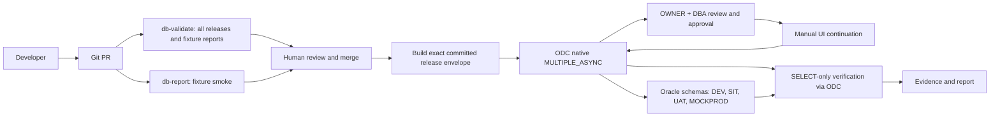

# Demo phát hành migration Oracle qua GitHub và ODC

Đây là demo có kiểm soát cho `customer-profile`: PR chạy kiểm tra tĩnh và fixture smoke; payload release tái tạo từ source commit; ODC điều phối execution, còn người vận hành xem xét và tiếp tục từng môi trường trong UI. Run actor/ID provenance có thể thay đổi theo lần build. SQL chỉ tạo đối tượng `DM_CP_*` trên bốn schema POC cô lập, dùng chung một Oracle database. `MOCKPROD` là schema mô phỏng, không phải production.

Client automation không phê duyệt hay thực thi migration. ODC có thể gom execution thủ công kiểu DBeaver, chọn target, approval, rollout và logs vào một luồng native. Batch singleton theo thứ tự `DEV → SIT → UAT → MOCKPROD`, `ABORT`, retry 0; operator có thẩm quyền tiếp tục trong ODC UI. ODC không thay Git, Oracle DBA, backup, thiết kế schema, migration version ledger hay recovery. Không có Flyway executor/bridge.

Các hướng dẫn vận hành và chi tiết kịch bản nằm trong [customer-profile](customer-profile/README.md). Báo cáo mẫu: [migration report](customer-profile/reports/sample-migration-report.md) và [JSON](customer-profile/reports/sample-migration-report.json). Báo cáo fixture không chứng minh đã chạy trên Oracle hoặc ODC.

## Trạng thái bằng chứng

Mỗi evidence ghi rõ `FIXTURE`, `LIVE` hoặc `NOT_AVAILABLE`. Chỉ receipt thu từ ODC/Oracle trong run tương ứng mới có thể được trình bày là bằng chứng live. Trạng thái trong report giữ riêng trạng thái native ODC, kết quả kiểm tra Oracle và trạng thái tổng hợp; một release chỉ được xác nhận thành công khi các kiểm tra đối tượng, compile error, dữ liệu và function đều đạt. Xem [quy trình phát hành](customer-profile/docs/release-process.md) và [hướng dẫn vận hành](customer-profile/docs/operator-guide.md).

## Thiết lập

Yêu cầu Python 3.11 trở lên, `PyYAML==6.0.3` và `openssl` cho login live. `db-validate` kiểm tra cả ba release và đóng gói fixture reports; `db-report` chạy fixture smoke trong PR. Live workflow `db-release` chỉ dispatch từ `refs/heads/main`, cần protected environment `odc-demo` cùng deployment branches/reviewers do authorized operator cấu hình. Workflow phải ở main trước khi dispatch live. Tác vụ live cần secrets `ODC_BASE_URL`, `ODC_USERNAME`, `ODC_PASSWORD` và runner có label `self-hosted`, `linux`, `odc-demo`; runner chưa được triển khai. Không suy diễn network readiness từ việc thiếu secrets/runner.

ODC retention của lab đã được khôi phục về baseline. Trước pilot phải áp dụng cấu hình GitOps trong [khuyến nghị retention](../evidence/odc-retention-experiment-20261007/permanent-gitops-recommendation.yaml); demo này không tự thay đổi cấu hình lab.
