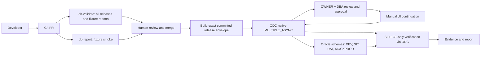

# Demo phát hành migration Oracle qua GitHub và ODC

## [Open Visual POC](dashboard/index.html)

Mở dashboard trực tiếp trong browser; không cần server, npm hay database. [HTML migration report](dashboard/migration-report.html) có thể in PDF. [Hướng dẫn demo và refresh data](dashboard/README.md).

Snapshot ngày 8 October 2026: PR #1 **MERGED**, GitHub validation/report/CodeQL **PASS**; happy batch **2000015 / APPROVING**, đang chờ approval, chưa migration execution/Oracle acceptance. Failure/correction là **FIXTURE DEMONSTRATION**. Retention là historical **LIVE PASS** với current configuration verified; production **NOT APPROVED**.

Đây là demo có kiểm soát cho `customer-profile`: PR chạy kiểm tra tĩnh và fixture smoke; payload release tái tạo từ source commit; ODC điều phối execution, còn người vận hành xem xét và tiếp tục từng môi trường trong UI. Run actor/ID provenance có thể thay đổi theo lần build. SQL chỉ tạo đối tượng `DM_CP_*` trên bốn schema POC cô lập, dùng chung một Oracle database. `MOCKPROD` là schema mô phỏng, không phải production.



Client automation không phê duyệt hay thực thi migration. ODC có thể gom execution thủ công kiểu DBeaver, chọn target, approval, rollout và logs vào một luồng native. Batch singleton theo thứ tự `DEV → SIT → UAT → MOCKPROD`, `ABORT`, retry 0; operator có thẩm quyền tiếp tục trong ODC UI. ODC không thay Git, Oracle DBA, backup, thiết kế schema, migration version ledger hay recovery. Không có Flyway executor/bridge.

Các hướng dẫn vận hành và chi tiết kịch bản nằm trong [customer-profile](customer-profile/README.md). Báo cáo mẫu: [migration report](customer-profile/reports/sample-migration-report.md) và [JSON](customer-profile/reports/sample-migration-report.json). Báo cáo fixture không chứng minh đã chạy trên Oracle hoặc ODC.

## Nội dung và ba kịch bản

`customer-profile/migrations/` giữ manifest và SQL cho ba release; `environments/` giữ target allowlist; `policies/` giữ SQL policy; `reports/` giữ fixtures và sample reports; `docs/` giữ hướng dẫn operator. CLI nằm ở `scripts/db_demo/`, workflows ở `.github/workflows/db-*.yml`, evidence mới ở `evidence/github-odc-demo-20261008/`.

| Kịch bản | Hành vi cần chứng minh trong ODC |
| --- | --- |
| `REL-2026.10-DEMO01` | Tạo bảng, sequence, index, function, view, ba dòng dữ liệu; verify từng stage trước khi operator tiếp tục. |
| `REL-2026.10-DEMO02-FAIL` | DEV thành công, SIT phát sinh ORA-20042; giữ UAT/MOCKPROD chờ và cancel batch lỗi. |
| `REL-2026.10-DEMO02-FIX` | Release mới với hash/approval mới, tham chiếu FAIL; giữ index đã có tại DEV và bổ sung ở stage còn thiếu. |

| Workflow | Phạm vi |
| --- | --- |
| `db-validate` | PR: manifest, hashes, static policy, unit tests, package cả ba release, fixture reports và network probe không authentication. |
| `db-release` | Dispatch: prepare, tạo batch MANUAL hoặc đọc trạng thái; không approve/Execute. |
| `db-report` | PR: fixture report; dispatch LIVE: thu ODC receipt, SELECT-only Oracle checks, Markdown/JSON và artifact. |

## Trạng thái bằng chứng

Mỗi evidence ghi rõ `FIXTURE`, `LIVE` hoặc `NOT_AVAILABLE`. Chỉ receipt thu từ ODC/Oracle trong run tương ứng mới có thể được trình bày là bằng chứng live. Trạng thái trong report giữ riêng trạng thái native ODC, kết quả kiểm tra Oracle và trạng thái tổng hợp; một release chỉ được xác nhận thành công khi các kiểm tra đối tượng, compile error, dữ liệu và function đều đạt. Xem [quy trình phát hành](customer-profile/docs/release-process.md) và [hướng dẫn vận hành](customer-profile/docs/operator-guide.md).

[PR #1](https://github.com/devsecopslonghn/DB-Research/pull/1) đã chạy validation và fixture report thành công. Local CLI đã tạo batch ODC **2000015**, native `APPROVING`; chưa có approval hay migration execution. Oracle preflight chỉ xác nhận owner và namespace trống. [Evaluation](../evaluation/github-odc-migration-demo.md) ghi run/job/artifact, live report và các blocker cụ thể.

## Thiết lập

Yêu cầu Python 3.11 trở lên, `PyYAML==6.0.3` và `openssl` cho login live. `db-validate` kiểm tra cả ba release và đóng gói fixture reports; `db-report` chạy fixture smoke trong PR. Live workflow `db-release` chỉ dispatch từ `refs/heads/main`, cần protected environment `odc-demo` cùng deployment branches/reviewers do authorized operator cấu hình. Workflow phải ở main trước khi dispatch live. Tác vụ live cần secrets `ODC_BASE_URL`, `ODC_USERNAME`, `ODC_PASSWORD` và runner có label `self-hosted`, `linux`, `odc-demo`; runner chưa được triển khai. Không suy diễn network readiness từ việc thiếu secrets/runner.

Probe Actions đã nhận HTTP 200 từ endpoint hiện có; authentication không được thử trên runner hosted. Workflow live dùng runner lab để giữ credentials và execution context trong ranh giới vận hành đã chọn. Không cần mở endpoint mới. Sau khi được phép merge và cấu hình prerequisites, dispatch `db-release` với release ID/operation; dùng `db-report` LIVE sau mỗi stage thành công.

Chạy fixture demo từ repository root, với output directory mới:

```bash
python3 -m pip install -r scripts/db_demo/requirements.txt
python3 -m unittest discover -s scripts/db_demo/tests -v
python3 -m scripts.db_demo.validate_manifest --output /tmp/db-demo-validation
python3 -m scripts.db_demo.build_release --release-id REL-2026.10-DEMO01 --output /tmp/db-demo-release
python3 -m scripts.db_demo.collect_evidence --bundle /tmp/db-demo-release --source FIXTURE --output /tmp/db-demo-release/evidence.json
python3 -m scripts.db_demo.generate_report --evidence /tmp/db-demo-release/evidence.json --output /tmp/db-demo-release/reports
```

ODC retention của lab đã được khôi phục về baseline. Trước pilot phải áp dụng cấu hình GitOps trong [khuyến nghị retention](../evidence/odc-retention-experiment-20261007/permanent-gitops-recommendation.yaml); demo này không tự thay đổi cấu hình lab.

Giới hạn: lexical SQL policy không phải Oracle parser; fixture không phải runtime proof; bốn stage cùng một Oracle service không chứng minh scale/HA; native MANUAL không cấm một operator quyết định tiếp tục sau lỗi. Applied-version ledger, replay, rollback DDL, effort measurement và production hardening vẫn cần quy trình riêng. Xem [trước/sau DBeaver](customer-profile/docs/before-after.md) và [failure/correction](customer-profile/docs/failure-and-correction.md).
