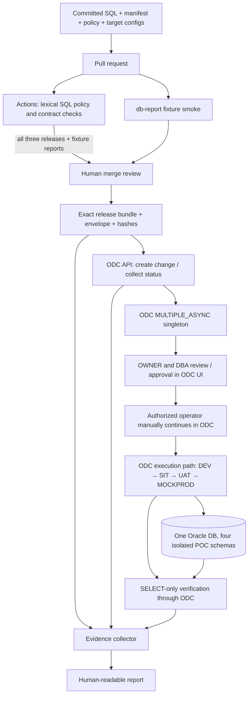

# Kiến trúc demo

## Luồng và ranh giới

Static validation là kiểm tra lexical và contract, không phải Oracle parser, kiểm tra quyền đầy đủ hay thực thi SQL. Package chỉ gồm release đã commit, manifest, SQL, policy và bốn cấu hình allowlist. Envelope ghi commit, provenance, SHA-256, target, thứ tự rollout, yêu cầu approval và hợp đồng verification. Artifact được tạo trong thư mục output mới; không ghi đè artifact hiện có.

Workflow `db-validate` kiểm tra cả ba release và package fixture reports; `db-report` chạy PR fixture smoke. Live workflow `db-release` yêu cầu `refs/heads/main` và protected GitHub environment `odc-demo`, trong đó authorized operator cấu hình deployment branches và reviewers. Chưa có workflow trên main thì chưa thể dispatch live. Fixture smoke không phải Oracle/ODC runtime.

ODC là đường thực thi duy nhất trong demo. Mỗi request là batch `MULTIPLE_ASYNC` gồm đúng một change, `ABORT`, retry 0 và thứ tự stage `DEV`, `SIT`, `UAT`, `MOCKPROD`. Logical stages map tới native environment `1/dev`, `2/sit`, `1000021/POCUAT`, `1000022/POCPROD` và bốn schema POC riêng. Client chỉ tạo change hoặc đọc status; không có API approve/execute. OWNER/DBA review/approve và operator manual continuation diễn ra trong ODC UI. Verifier cũng gửi SELECT-only queries qua ODC.

Mỗi stage là một ranh giới operator: sau DEV xem xét status và verification rồi mới tiếp tục SIT; lặp lại tương tự trước UAT và MOCKPROD. Workflow không tự promotion stage. SQL policy chặn `ALTER SYSTEM`, `ALTER USER`, `CREATE USER`, `DROP USER`, `GRANT DBA` và `GRANT ANY ...`; dynamic SQL qua `EXECUTE IMMEDIATE`/`DBMS_SQL` luôn yêu cầu DBA review.

Payload bytes reproducible từ commit, nhưng run actor/ID provenance có thể khác giữa các lần build. `created_at` là timestamp commit source, không phải thời lượng build/release. Status collection tự tải handoff artifact mới nhất còn hạn cho đúng release và commit; workflow không nhận ticket tùy ý.

Có hai mode vận hành: **ODC-led**, dùng ODC điều phối execution thủ công; và **version-disciplined Git + ODC**, trong đó repo giữ release bất biến, manifest và reviewed references tới bản đã áp dụng. Mode thứ hai không phải Flyway executor/bridge; ghi nhận applied release và reconciliation vẫn thuộc quy trình đã review.

| Thành phần | Trách nhiệm | Không chứng minh |
| --- | --- | --- |
| GitHub Actions | Kiểm tra source thay đổi trong PR; đóng gói release khi dispatch workflow `db-release`. | SQL chạy được trên Oracle hoặc kết nối ODC thành công. |
| Release envelope | Gắn kết release, commit, target, cấu hình, policy và hash. | Bằng chứng release đã được approve hay execute. |
| ODC | Có thể tập trung execution kiểu DBeaver, target selection, approval, rollout và logs; cung cấp native status. | Không thay Git, Oracle DBA, backup, schema design, Flyway version ledger hoặc recovery. |
| Operator + OWNER/DBA | Xem xét, phê duyệt, tiếp tục thủ công; xác nhận receipt. | Rollback tự động hoặc triển khai production. |
| Oracle verifier | Gửi `SELECT` qua ODC để kiểm tra trạng thái object, compile errors, số dòng, dữ liệu active và giá trị function. | Lịch sử migration bền vững hay khả năng replay của Flyway. |
| Evidence/report | Giữ nguồn `LIVE`, `FIXTURE`, `NOT_AVAILABLE`, native status và kết quả verification riêng. | Fixture tương đương lần chạy live. |

Các schema `ODC_POC_20261004_DEV`, `..._SIT`, `..._UAT`, `..._MOCKPROD` được map trong `environments/` cùng native environment IDs/names ở trên. Chúng cô lập theo schema nhưng dùng cùng một database POC; không phải bốn database và không gồm production.

## Credential và kết nối

Live ODC dùng GitHub secrets `ODC_BASE_URL`, `ODC_USERNAME`, `ODC_PASSWORD` trên runner `self-hosted`, `linux`, `odc-demo`; module dùng `openssl` để xử lý thông tin đăng nhập. Không cần mật khẩu database vì execution do ODC quản lý. Probe thực trong PR nhận HTTP 200 từ endpoint hiện có, authentication NOT_ATTEMPTED. Repo chưa có live secrets/runner; chọn runner lab để giữ credentials trong ranh giới vận hành, không mở endpoint mới. Xem [evaluation](../../../evaluation/github-odc-migration-demo.md) cho evidence và blockers.

Lab ODC hiện ở baseline retention; khuyến nghị cấu hình lâu dài ở `evidence/odc-retention-experiment-20261007/permanent-gitops-recommendation.yaml`. Cần áp dụng và xác minh cấu hình đó trước pilot; tài liệu demo không coi khuyến nghị là cấu hình đã áp dụng. Không suy ra unreachable từ thiếu secrets/runner.
