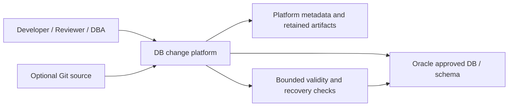

# Architecture reassessment: Oracle change management with Jenkins and Flyway optional

Decision refinement, **07 October 2026**. Scope: approximately **50 Oracle instances and 20 users**. This report changes research priority, not execution authorization. No implementation, deployment, SQL, candidate process, vendor contact or new runtime test was performed. Historical evidence and acceptance expectations remain unchanged.

## 1. Executive conclusion

**The simplest desirable operating model is one database change platform with native Oracle execution, one authoritative workflow, and bounded verification/recovery procedures. Jenkins and Flyway are optional. No reviewed OSS platform is yet proven to deliver that model safely for this estate.**

Stop treating S6's technical feasibility as the architecture decision. Its five owned modules include authorization, durable dispatch, Oracle verification and recovery; that is substantial database-governance software even without a new dashboard or database server. A native platform deserves comparison against that complete burden, rather than against Flyway's engine features alone.

**ODC native is the best conditional OSS integrated candidate**, because historical execution already covers representative Oracle PL/SQL and its inventory, approval and batch workflow could remove daily CI orchestration. It is **not eligible for a new native runtime POC on current evidence**: duplicate releases, checksum identity, requester execution and uncertain recovery remain serious gaps, with no established supported bounded closure. Do not rerun the unchanged historical build or begin constructing its missing control plane. Reopen native feasibility only for a concrete supported build/configuration/extension delta.

**AccessFlow's supported deployment-gate API plus a restricted migration-engine runner is the best composed OSS reserve.** This uses its external-deployment workflow, separately from its incompatible native schema-change parser. The API supplies review, admission confirmation and outcome reporting, but not Oracle dispatch uniqueness or verified promotion. It still needs the five owned safety/integration modules identified below and adds platform services; it is not established as simpler than S6.

**Bytebase EE is the commercial simplicity benchmark and the recommended next integrated runtime POC, conditional on a viable self-hosted quote and access to the exact licensed build.** It has the smallest documented custom-governance scope; a native Oracle regression must establish whether that advantage survives the hard requirements. FREE runtime failures do not establish EE failure or EE success. **S6 remains the CI fallback**, with its custom burden counted in full. No architecture is approved for production by its matrix score, and no runtime POC is currently authorized.

The revised priority supersedes the automatic S6-first recommendation in [decision-gates.md](decision-gates.md), not its historical findings or the STOP on the ODC-to-Flyway handoff. The other inputs were read before reassessment: [catalog](tool-feature-catalog.md), [solution shortlist](solution-shortlist.md), [reference architecture](reference-architecture.md), [POC plan](poc-plan.md) and [design validation](poc-design-validation.md).

## 2. Why Jenkins/Flyway assumptions were challenged

The required chain is: **change request → SQL/schema change → review → approval → selected Oracle DB/schema → controlled execution → verification → history/audit/recovery**. Targets can be proposed before approval, but any later change to the selected DB, schema, route, SQL or options must receive a new bound approval before execution. A 50-instance estate need not execute on all 50 endpoints at once.

Flyway solves versioned SQL execution and history; Jenkins supplies jobs, inputs and credentials. Neither supplies the entire database operating model. [The previous minimum S6 design](decision-gates.md#3-jenkinsflyway-feasibility) explicitly owns inventory/envelopes, identity/promotion policy, durable admission/events, verification/reconciliation and reporting. Removing Jenkins's new UI or PostgreSQL does not remove those correctness obligations.

The reassessment uses these hard requirements, equally for native and composed execution:

| Requirement | Sufficient outcome; implementation may differ |
| --- | --- |
| Migration identity and artifact binding | Stable release/version, ordered SQL bytes and digest, approved execution options and physical target/schema; altered bytes or routing invalidate approval |
| Independent authorization | Authenticated requester/reviewer/approver/executor identities, enforced separation and controlled privileged exceptions across UI/API/scheduler/console |
| Rerun and concurrency prevention | Durable admission rejects duplicate dispatch and changed-content reuse; all aliases/streams touching the same schema serialize |
| Oracle correctness | Required DML/PL/SQL parsing, partial-DDL awareness, object validity including package body, diagnostics and semantic postconditions |
| Rollout and failure | Per-target outcomes; lower-stage verified results before promotion; stop new dispatch on partial, invalid or unknown outcome |
| Cancellation and recovery | Cancellation does not imply rollback or a stopped Oracle session; unknown outcome remains HOLD until evidence and a DBA decision resolve it |
| Audit and durability | Approved SQL/targets/actors, every attempt and recovery decision survive restart, retention and restore; misleading success is rejected |

**A target-side Flyway-style ledger is not itself mandatory.** A platform-owned immutable release/target ledger can satisfy identity and replay requirements if admission, backup/restore and reconciliation with Oracle are demonstrated. Oracle DDL and the platform's metadata are not one atomic transaction. A unique ticket ID, checksum label, workflow lock or human checklist alone does not establish safe replay prevention. Oracle commits around DDL are a shared constraint for every candidate. [Oracle transaction documentation](https://docs.oracle.com/en/database/oracle/oracle-database/19/tdddg/committing-transactions.html).

Compared with DBeaver/manual SQL, the useful improvement is one reviewed request with bound target selection, controlled execution and retained per-target results. Compared with Git + Flyway CLI, the improvement is centralized inventory, independent human authorization, rollout visibility and recovery ownership without operators selecting endpoints and reconstructing release status themselves. A platform or composition qualifies only if it provides those operating improvements and passes the safety gates; no time or cost saving is measured here.

The original [45 cases](../poc/ORACLE-POC.md) and [14 workload hashes](workloads/manifest.json) remain the regression references. This round permits alternative implementations of the operating model; it does not delete DML/PL/SQL workloads, rewrite expected outcomes, require automatic rollback, or promise exactly-once arbitrary Oracle DDL.

## 3. Architecture A: integrated platform



This is a product topology, not an assertion that the product is one process. Metadata, workers, cache/queue and retained file storage still count. An external verifier can be a command or approved SQL check; it does not require Jenkins, a new API or a daemon. A post-check must veto promotion and final verified success, not merely produce an advisory report after the next target starts.

| Native candidate | What it already contributes | Main obstacle to the complete safe model | Disposition |
| --- | --- | --- | --- |
| ODC | Inventory, project roles, tickets, approval, Oracle execution with historical PL/SQL evidence, ordered batch model | Release identity/dedup, requester execution, verified promotion and recovery admission | HOLD until a concrete supported bounded delta; no adoption yet |
| AccessFlow schema-change path | Datasource governance, checksum, change sets, review, lower-environment APPLIED gate | Required DML and ordinary Oracle PL/SQL conflict with the authoring gate | STOP native full-workload POC on reviewed code |
| Archery | Oracle inventory, SQL tickets, review/approval/execute, limited INVALID detection | Version identity, ordered promotion, multi-target admission and recovery; parser/compile coverage untested | Reserve DBA portal; a release ledger is not sufficient by itself |
| SQLE + DMS | Official inventory/access plus SQL ticket/review/execution combination | Oracle edition/plugin rights and multi-target commercial gates; release recovery not established | HOLD licensed option; not a verified OSS Oracle stack |
| CloudDM v4.3.0 | Inventory, approval, audit, Git intake and Oracle JDBC | Compile default-off plus native target-state/locking/reconciliation gaps | Keep STOP for native release executor |
| Bytebase EE | Integrated inventory, change/release/rollout, approvals and audit according to product/edition evidence | Quote/entitlement and exact licensed-build Oracle enforcement/recovery regression | Commercial benchmark, HOLD |

Current [Bytebase pricing](https://www.bytebase.com/pricing/) lists Community at 20 users/10 instances, Pro at 10 instances, and Enterprise with custom users/instances. Approval workflow, full audit and external secret-manager features have EE boundaries. Twenty users fitting Community does not solve the 50-instance limit. Obtain a suitable actual self-hosted quote rather than assuming an unlisted price or unlimited EE entitlement. The [historical 3.22.1/FREE results](../BYTEBASE-ORACLE-POC-RESULTS.md) include INVALID, premature promotion and enforcement gaps; they remain regression triggers, not an EE verdict.

No additional product discovery was needed. Already-cataloged NineData Community has a 10-datasource limit; the larger estate is commercial. OEM/DBmaestro/Harness remain cataloged commercial alternatives, not new POCs. Workbenches and package managers do not cover the required request/approval/recovery chain. See the corresponding [existing catalog profiles](tool-feature-catalog.md).

## 4. Architecture B: platform + engine

The useful test is whether a supported extension/API **actually supplies the external execution boundary**, rather than merely advertising CI integration or containing Flyway for its own metadata upgrades.

| Platform/control plane | Supported route evidenced | Does it invoke/orchestrate an Oracle engine itself? | Bridge verdict |
| --- | --- | --- | --- |
| ODC + external engine | Ticket/detail/approval/notification and MANUAL wait | No supported replacement of native task execution/completion established | STOP old S2; swapping Flyway for Liquibase does not close it |
| AccessFlow external deployment governance | Submit → request-specific gate → confirm-execution → outcome API, with API-key authentication | **External runner invokes engine**; platform supplies supported authorization/result protocol, not a native Flyway launcher | Best bounded composed reserve; no platform fork needed for those calls |
| Archery + engine | Native ticket execution/API | No supported engine-replacement/result contract established | Do not add an engine through direct metadata writes or executor fork |
| SQLE/DMS + engine | OpenAPI/DevOps review and native publish workflow | A supported engine invocation and target receipt contract remain unproven | HOLD; Oracle licensing still applies |
| CloudDM + engine | Git/HTTP actions and approval workflow | Earlier review did not establish a cleaner approved external-result contract | Keep STOP S3 |
| AWX + engine | Supported job/workflow templates execute playbook/command in execution environment | Yes, an engine CLI can be an ordinary controlled job | Credible technical reserve if already operated; not a new deployment recommendation |
| Rundeck CE + engine | Supported jobs/commands/API | Yes for CLI execution; complete independent approval binding not established in CE | Additional approval authority erodes simplicity |

AccessFlow's [generic integration](https://github.com/bablsoft/accessflow/blob/c8bb247637df76ce36e52f47b45899823409495e/ci-templates/examples/generic-curl-deployment.md) is a product-supported external-deployment API, unlike the unclosed ODC handoff. Its database-specific safety limitations are examined in section 7. AWX's [workflow templates](https://docs.ansible.com/projects/awx/en/24.6.1/userguide/workflow_templates.html) and [RBAC](https://docs.ansible.com/projects/awx/en/24.6.1/userguide/rbac.html) leave DB/schema mapping and independent-actor binding to owned policy. The [current upstream README](https://github.com/ansible/awx/blob/33a9eb7d15aedca7222354b68cde834480415913/README.md) still says releases are paused during refactoring, with the last release on 2 July 2024. Adding its operator/controller/metadata/execution environment solely for this project is a poor simplicity trade.

For the composed reserve, the proposed shape is:

```text
Git SQL + immutable release bundle
  → AccessFlow deployment request / review / approval API
  → restricted runner: admission + approved target binding
  → migration engine
  → Oracle
  → verifier / retained attempt evidence / correlated outcome
```

Jenkins is absent. A runner is still needed because AccessFlow's deployment API does not run SQL. A protected CLI job using an existing scheduler can suffice; a permanently polling custom daemon, new UI or new public API is not justified. That dispatcher remains owned code. Platform datasource inventory is the inventory authority; Git stores an immutable exported target snapshot, never a separately editable catalog.

| Engine | Independent suitability for this boundary | Decision impact |
| --- | --- | --- |
| Flyway Community | Version/history/checksum/validate and Oracle JDBC; team familiarity | Reference engine only; still needs INVALID gate and partial/unknown recovery |
| Liquibase 4.33 | Apache-2.0 changesets, checksums and lock table; Oracle JDBC | Reasonable substitute when changeset/precondition authoring helps; older-line maintenance must be owned |
| Liquibase 5.x | License changed to FSL; source available is not the same OSS constraint | Cannot silently substitute into an OSS proposal |
| Sqitch | MIT plan/deploy/revert/verify, Oracle through SQL*Plus/DBD::Oracle | Useful for explicit verification/dependencies; client and authored recovery burden remain |
| Oracle SQLcl Project | Oracle-first artifacts/PLSQL toolchain, Oracle terms, not an OSS governance platform | Candidate when native Oracle tooling or SQL*Plus directives are required; still needs fleet authorization/admission |

Engine evidence and primary references are in [the existing engine comparison](solution-shortlist.md#11-engine-oracle-và-cicd) and [Flyway compatibility review](decision-gates.md#6-flyway-community-oracle-compatibility). Nothing here establishes a shipped AccessFlow integration with any named engine. Its supported generic API can surround an external tool; choosing the engine does not remove platform/Oracle recovery obligations. Deep task-engine, scheduler or status-store forks are rejected for all B variants.

## 5. Architecture C: CI composition

Retain **S6: Git + Jenkins + Flyway** as the documented fallback. [The prior design](decision-gates.md#3-jenkinsflyway-feasibility) uses supported Pipeline/Input/credential/lock/publish interfaces and an owned durable state location; it does not require PostgreSQL, OpenBao or an independent report server by default.

Its advantages are known CLI boundaries, a familiar migration history model and fewer dependencies on undocumented database-platform hooks. Its costs are explicit: Git review plus Jenkins deployment approval, trusted code and identity policy, target inventory selection, protected durable admission/HOLD, canonical schema locking, verified promotion, Oracle post-check, reconciliation and audit presentation. Build success and engine history success are not database release verification.

The five modules from [the previous custom-code ceiling](decision-gates.md#phase-1-ui-and-owned-code-ceiling) remain mandatory. A directory of protected durable records is still an authoritative state store with concurrency, backup and restore obligations. Pipeline persistence, archiveArtifacts and a lock plugin do not provide that protocol.

GitLab CI can replace Jenkins if existing entitlements provide enforceable deployment approvals and protected environments; GitLab Free manual jobs do not prove equivalent approval/identity controls. Engine substitution is similarly possible. These substitutions change packaging and familiarity, not the need for database-governance ownership. No S6 component is retained merely because it appeared in the previous diagram.

## 6. ODC native reassessment

### Historical execution facts

[ODC's historical results](../ODC-ORACLE-POC-RESULTS.md) are **12 PASS / 20 PARTIAL / 5 FAIL / 8 NOT_RUN**, on **4.4.1-20260116** and Oracle **26ai 23.26.4.1.0**. Four environment schemas shared one Oracle instance. Procedure/function/package/trigger/anonymous block, slash and Oracle literals had relevant execution PASS results. These are stronger Oracle execution evidence than a connector declaration.

The reviewed source remains `d517c0f27971642fb0cd7565fd61ab2309875ec3` at the read-only HEAD check this round. It is **not source-mapped to that runtime image**. A source finding or newer documentation cannot resolve the old runtime FAIL. [Source survey and manifest](research-round-2/coordinator/odc-source-survey-20261006.md).

### Precisely what failed, and how large is the mitigation?

The primary class names below follow the requested classification. A second possible class describes a conditional mitigation, not a verified fix.

| Gap / case | Historical fact | Primary classification | Smallest plausible mitigation and limit |
| --- | --- | --- | --- |
| INVALID / SQL-11 | Ticket 1000011 reported EXECUTION_SUCCEEDED; procedure remained INVALID with PLS-00201 | **Small external verification** | Approved end-of-script validity assertion or read-only verifier with enforced promotion veto; inspect owner/type, package body, ALL_ERRORS and new/dependent invalid objects. No generic native completion hook established |
| Replay / REC-02 | New ticket 1000024 reran prior INSERT; ORA-00001 | **Major architectural deficiency** in the reviewed native release model | A bounded platform/target admission ledger may close it, but must enforce release/version identity before every write path; disabling Retry is insufficient |
| Checksum / REC-08 | Changed SQL with the same case ID was accepted as a new ticket | **Major architectural deficiency** in release identity | Immutable approved release/target digest plus pre-dispatch rejection; a hash in description or a client check does not enforce it |
| Dedup / REC-10 | Tickets 1000026/1000027 produced two marker rows | **Major architectural deficiency** in request admission | Durable unique release/target claim and duplicate handling. Re-executing the completed ticket was rejected, which does not deduplicate newly created tickets |
| Requester/executor / GOV-03 | Requester Execute after OWNER→DBA approval returned 200 | **Small patch/plugin**, conditional; security-critical | Creator authorization is explicit in reviewed source. A supported policy or narrow upstream authorization change might close it; ordinary role names do not. Every execution path and real initiating human must be checked |
| Promotion / MODEL-07, GOV-04 | Same bytes/hash reached four schemas; external runner enforced order | **Unknown** for complete native semantics | Native ordered/manual batches exist. Configure serial/manual stop-on-error, then prove verified predecessor plus separate stage authorization. Native task SUCCESS alone cannot advance an INVALID result |
| Log durability / MODEL-10, GOV-09 | Some task logs became unreadable after restart; four old attachment downloads returned HTTP 500 | **Unknown** root cause; configuration/export are plausible | Persistent paths plus backup/retention and supported export may suffice; do not declare a configuration fix without restart/restore/download evidence |
| Retry / REC-04 and source | DDL committed before subsequent failure; source supports statement retry | **Configuration issue** for automatic retries; recovery remains separate | retryTimes=0, ABORT/stop-on-error and no automatic repair. This prevents blind retry, not later duplicate release dispatch |
| Concurrency / REC-09 | Two same-target tickets both completed; serialization not instrumented | **Unknown** | Prove canonical schema locking across jobs, aliases and streams; preserve unresolved HOLD after worker/session interruption |
| Crash, cancellation, restore / REC-05/06/07/11/12 | NOT_RUN | **Unknown**; recovery-critical | Native task/attempt records, Oracle effect/session inspection and durable no-redispatch state; no assumption that timeout/cancel undoes DDL |

[The permission helper](https://github.com/oceanbase/odc/blob/d517c0f27971642fb0cd7565fd61ab2309875ec3/server/odc-service/src/main/java/com/oceanbase/odc/service/flow/FlowPermissionHelper.java#L83-L100) allows the creator, otherwise OWNER/DBA. [The worker](https://github.com/oceanbase/odc/blob/d517c0f27971642fb0cd7565fd61ab2309875ec3/server/odc-service/src/main/java/com/oceanbase/odc/service/flow/task/DatabaseChangeThread.java#L141-L280) executes supplied statements and retries by configured count. Its target path does not establish version/checksum/recovery admission. These are scoped source findings, not claims about every ODC version.

### Native batch deserves credit, with real boundaries

The [pinned official guide](https://github.com/oceanbase/odc-doc/blob/40dc7c03522fef1968bd11b2b051bc216091e60d/en-US/700.database-change-management/650.multiple-database-change.md) documents 2–100 target tasks, same project, serial/parallel waves and manual continuation. It also limits abort while change processes are running. This is neither a 100-instance license cap nor an atomic fleet transaction.

[The batch worker](https://github.com/oceanbase/odc/blob/d517c0f27971642fb0cd7565fd61ab2309875ec3/server/odc-service/src/main/java/com/oceanbase/odc/service/flow/task/MultipleDatabaseChangeRuntimeFlowableTask.java#L122-L188) creates AUTO child tasks without separate approval nodes and waits on their native terminal status. A parent's ordered list is therefore not evidence of a fresh PROD approval or external-verification veto. Use manual stage boundaries unless a build proves equivalent enforced controls. Already-dispatched children may continue after stop; capture all outcomes.

The [file manager](https://github.com/oceanbase/odc/blob/d517c0f27971642fb0cd7565fd61ab2309875ec3/server/odc-service/src/main/java/com/oceanbase/odc/service/datatransfer/DefaultLocalFileManager.java#L111-L129) has a configurable file.storage.dir fallback to ./data. That supports investigating persistence settings; it does not explain or fix every lost historical task log. A selected plugin-API inspection found connection/schema/datatransfer/partition extension points, not an established generic release admission/completion contract. A plugin framework alone is not proof that the needed safety hook is supported.

### Is native mitigation cheaper than S6?

**Possibly in workflow and UI scope; not yet established in safety-code scope.** ODC already supplies inventory, review/approval screens, native task history, parsing and batch selection. It can remove Jenkins, Flyway, the external-task mapper, CI approval UI and much report generation. A validity assertion, durable file configuration or narrow authorization correction may each be small.

Replay/checksum/dedup/uncertain outcome are one coupled admission/recovery problem. A verifier cannot fix it. A wrapper that controls all native dispatch, stores releases and attempts, vetoes promotion and reconciles Oracle becomes owned correctness software. The honest current provisional decomposition is **five owned modules**, not "two fixes"; unsupported native coupling can expand that scope. No person-day saving is established against S6; previous external-bridge estimates cannot price this different native architecture.

ODC wins only if a supported bounded change supplies those missing invariants while retaining native workflow/execution. If that requires a parallel release controller, an undocumented MetaDB writer or deep Flowable/executor changes, its proposed simplicity advantage is gone. **Current unchanged build: no-go for adoption; eligibility for a native runtime POC remains unclosed.**

## 7. AccessFlow reassessment

### Native schema-change execution

AccessFlow is a real native change-workflow candidate: datasource governance, change sets, SHA-256, review groups, environment promotion and audit are present in reviewed source. Reassessment must nevertheless distinguish that path from generic deployment approval.

The old pin is `55c209a4d9e4ba09a6c089f90e68a8b16b3f2133`; current HEAD checked this round is **c8bb247637df76ce36e52f47b45899823409495e**, dated 6 October 2026. **Nineteen selected files** spanning schema scanner/gate/checksum/promotion, review/execution, deployment API/services/docs and compose topology were fetched read-only at the new pin and compared with the preserved snapshot: **all byte-identical**. This narrows current source uncertainty without asserting whole-build equivalence, image mapping or runtime success.

| Native issue | Evidence and consequence | Bounded addition sufficient? |
| --- | --- | --- |
| Oracle PL/SQL and splitting | Scanner treats leading BEGIN as transaction envelope and internal semicolon followed by more content as multiple statements; gate rejects these before JDBC | **No ledger-only fix.** Ordinary procedural units need Oracle-aware authoring/statement handling, then regression |
| DML scope | Schema-change gate rejects recognized SELECT/INSERT/UPDATE/DELETE; OTHER is admitted | Required DML cannot simply be removed or passed through raw-query governance to claim native migration support |
| Checksum | Promotion recomputes normalized central statement checksum before submit | Useful binding evidence; not applied-version history at Oracle or a guarantee about postapproval byte/target mutation |
| Environment and target | Previous rung must be APPLIED; environment maps a datasource; review plan enforced | Real advantage, but one selected datasource per promotion is not 50-target safe rollout proof |
| Failure | Schema promotion uses continueOnError=false; group records FAILED/PARTIALLY_EXECUTED and skipped items | Useful visible partial status; central status does not prove safe retry after Oracle commit |
| Concurrency/replay | Central optimistic/repository/scheduler locks and approved-state guards exist | Do not claim "no locks". Their scope does not establish canonical Oracle schema fencing, version dedup or crash/restore recovery |
| Verification/audit | Central promotion/group/audit records exist; reviewed JDBC non-select path returns affected count | Oracle validity/diagnostics and verified stage veto require more; no Oracle migration runtime evidence |

The original [deep source trace](research-round-2/coordinator/oracle-governance-source.md#accessflow-native-release-path-có-giới-hạn-xác-định-được-từ-source) and [candidate report](candidates/accessflow/source-review.md) supply the historical provenance. The [current scanner](https://github.com/bablsoft/accessflow/blob/c8bb247637df76ce36e52f47b45899823409495e/backend/src/main/java/com/bablsoft/accessflow/schemachange/internal/SchemaChangeStatementScanner.java#L22-L66) preserves the incompatibility. Runtime remains NOT_RUN; the rejection conclusion is a source inference from explicit pre-parser conditions.

Missing target-ledger/recovery could be bounded **if the workload were already executable and a safe admission hook existed**. Here the required native DML/PLSQL path also needs change. Minimum safety work is five modules plus authoring/parser/execution compatibility, at least **six**, with correctness and upgrade coupling. **STOP native full-workload Oracle POC on this code.** Simple DDL-only governance is a narrower product use case, not this mission's replacement.

### Supported external deployment API: composed reserve

The reviewed external path is materially clearer than ODC's external-engine handoff:

| Step | Concrete supported surface | Database-specific limit |
| --- | --- | --- |
| Request | POST /api/v1/deployment-requests with pipeline/environment/version, optional commit_sha/artifact_ref/metadata/external_run_id | SQL bytes, checksum and approved schema set are not mandatory typed fields |
| Gate | GET /api/v1/deployment-gate?request_id=... includes decisions and releasability | Always use request ID; a version/environment tuple can resolve to the newest request |
| Confirm | POST .../{id}/confirm-execution re-evaluates freeze/schedule; repeated EXECUTED returns existing request | Confirmation is not an exclusive Oracle-dispatch claim or proof of completed SQL |
| Outcome | POST .../{id}/outcome supports SUCCEEDED/FAILED/ROLLED_BACK; repeat same outcome idempotent, conflicting outcome rejected | No per-target PARTIAL/UNKNOWN database protocol; retained runner evidence must carry it |

The native integration guide demonstrates those calls; the read source establishes their implementation. [Request creation/replay lookup](https://github.com/bablsoft/accessflow/blob/c8bb247637df76ce36e52f47b45899823409495e/backend/src/main/java/com/bablsoft/accessflow/deploygov/internal/DefaultDeploymentRequestService.java#L91-L165), [confirm/gate service](https://github.com/bablsoft/accessflow/blob/c8bb247637df76ce36e52f47b45899823409495e/backend/src/main/java/com/bablsoft/accessflow/deploygov/internal/DefaultDeploymentGateService.java#L99-L135), [outcome service](https://github.com/bablsoft/accessflow/blob/c8bb247637df76ce36e52f47b45899823409495e/backend/src/main/java/com/bablsoft/accessflow/deploygov/internal/DefaultDeploymentOutcomeService.java#L45-L103).

Idempotency keys include pipeline, environment, **version and external_run_id**. A new run ID permits another request, and replay lookup returns an existing row without establishing changed payload rejection. The documented wrapper permits deployment after an already-EXECUTED confirmation. For Oracle, duplicate/restarted workers must instead consult durable admission/history and HOLD unresolved effects; platform confirmation alone must never dispatch again.

The source review service checks both submitter and on-behalf-of human identities; correct service-account attribution and approved reviewer eligibility still need exact-build negative tests. Generic deployment review is single-stage/quorum, so a mandatory reviewer-then-DBA policy needs explicit bound policy rather than assuming quorum supplies order. [Review guards](https://github.com/bablsoft/accessflow/blob/c8bb247637df76ce36e52f47b45899823409495e/backend/src/main/java/com/bablsoft/accessflow/deploygov/internal/DefaultDeploymentReviewService.java#L150-L181).

The generic deployment gate evaluates approval, freezes and scheduling; **it does not read the environment's datasource binding or enforce the schema-change predecessor invariant**. Environment-version inventory is a projection, not authorization to promote. The dispatcher must enforce approved target identity and verified lower-stage results. See [deployment module documentation](https://github.com/bablsoft/accessflow/blob/c8bb247637df76ce36e52f47b45899823409495e/docs/18-deployment-governance.md#1-pipelines-environments--trigger-grants) and the confirm/gate implementation above.

This is a **supported external gate, not native Oracle execution or a shipped Flyway adapter**. It avoids a deep platform fork, but five owned modules and a retained attempt authority remain. Retain as composed reserve; do not choose it merely because an API demo is easy.

## 8. Archery reassessment

Archery can be a practical centralized DBA/change portal with Git as source. At pin **ccc7134f48d0e261f9e3ffa0d445dcec48adb790** it has Oracle connection, SQL tickets, review/approval permissions, native execution/results and a genuine named-object INVALID check. Historical source and release comparison remain in [the candidate review](candidates/archery/source-review.md) and [coordinator trace](research-round-2/coordinator/oracle-governance-source.md#archery-compile-check-có-phạm-vi-hẹp-hơn-nhãn-hỗ-trợ-plsql). No Oracle runtime has been established.

| Question | Reassessment |
| --- | --- |
| Immutable Git commit | Store full commit and approved SQL digest via supported ticket import/readback. Execution reads saved review_content, but a URL/description alone does not bind bytes or prove edit invalidation |
| DEV/SIT/UAT/PROD promotion | Separate tickets can reference one immutable release. No native verified predecessor policy established; copied tickets alone do not enforce promotion |
| Multi-target control | Resource groups and execution permission help access. Safe per-target serial admission, duplicate protection and unresolved HOLD require a release guard |
| Per-statement commit severity | Oracle DDL is already non-atomic; do not reject solely for DDL commits. For DML it also removes whole-script transaction behavior: later failure leaves earlier committed changes. Required explicit multi-statement transaction semantics are a gate |
| PL/SQL validity | Check exists but fetchone on object name without OBJECT_TYPE can accept a VALID package spec while body is INVALID; source inference, not a reproduced runtime failure |
| Lightweight version ledger | Can provide release/version/hash and target-ticket mapping, but must gate before native writes, lock canonical schema, hold uncertainty and enforce promotion. Posthoc history indexing cannot prevent replay |
| Less custom than S6? | May save inventory and ticket UI/reporting. Five safe-completion modules remain; unsupported pre-dispatch hooks or executor rewrites erase the advantage |

[Native Oracle executor](https://github.com/hhyo/Archery/blob/ccc7134f48d0e261f9e3ffa0d445dcec48adb790/sql/engines/oracle.py#L1108-L1215) commits each statement and checks named PLSQL objects. Retain separate package/body/type diagnostics and touched/dependent object validity. The generic/custom delimiter parser has Oracle-oriented logic, but coverage for required bodies, quoting and SQL*Plus remains NOT_RUN. It is inaccurate to call it merely a generic SQL splitter or to declare all PL/SQL broken.

Release v1.14.0 and reviewed HEAD have different Oracle drivers; source equality in selected executor/splitter regions does not establish equal image behavior. Removing requester sql_execute permission is a plausible configuration mitigation, with API/queue/console negative tests. Deeply replacing the executor to make Archery a migration engine is rejected. **Reserve for native SQL-ticket governance; no new full release POC until supported admission and required transaction/parser semantics are demonstrated.**

## 9. SQLE/DMS reassessment

DMS inventory/access plus SQLE SQL review/ticket/execution is an official two-component control-plane arrangement, not an invented bridge. It could be usable for centralized governance in an appropriately licensed package. Current evidence does not qualify it as the OSS Oracle winner.

| Area | Evidence checked and decision boundary |
| --- | --- |
| Oracle edition | Current v4 comparison places Oracle outside Community, with Professional/Enterprise checkmarks; narrative says non-MySQL sources are Enterprise. Exact Oracle SKU is therefore unresolved, but **CE Oracle eligibility is not supported** |
| Multi-datasource | v3 ticket docs say CE one datasource per ticket, Enterprise several/same-SQL fanout; current v4 table gates multi-source publish/review commercially |
| Oracle plugin | Public plugin HEAD remains 41355b4948e4e69500e5d4369a668ec0a994c272, 18 March 2022. Root tree has no LICENSE; old raw LICENSE paths were 404. Core MPL-2.0 does not grant plugin rights |
| Maintenance | Old standalone plugin and modern SQLE release have no demonstrated compatible artifact mapping; stale source does not prove abandonment, but maintenance/support is unestablished |
| SQL workflow/API | Ticket review/publish, OpenAPI and DevOps SQL review are documented; those are genuine strengths |
| Oracle file mode | Ticket docs explicitly include Oracle file execution mode; deserves regression, not an assumption that every PL/SQL script is split incorrectly |
| Rollout/promotion | Docs describe publishing a ticket to other sources; immutable release, ordered verified promotion, alias locking and recovery remain unproved |
| History/audit | Ticket/history/export and edition-gated audit exist; no established central-to-Oracle uncertain-commit protocol |

Primary sources: [current feature/edition table](https://actiontech.github.io/sqle-docs/docs/support/compare/), [ticket/fanout/file-mode guide](https://actiontech.github.io/sqle-docs/docs/v3/user-manual/project/workflow/create-workflow/), [public Oracle plugin](https://github.com/actiontech/sqle-oracle-plugin/tree/41355b4948e4e69500e5d4369a668ec0a994c272). Exact core/DMS pins and license evidence remain in [the existing profile](tool-feature-catalog.md#tool-sqle). No numerical 50-instance/20-user cap or licensed bundle quote is established.

**Blocker for the OSS branch: Oracle edition availability plus unestablished standalone plugin license and current compatibility.** Do not treat a publicly readable plugin as a licensed, supported Oracle product. A licensed bundle could reopen a commercial comparison, but adds two coupled services and still needs Oracle execution/recovery regression. No plugin fork or deployment is justified in this round.

## 10. CloudDM status

Keep the existing **CloudDM v4.3.0 native STOP**. The [exact-artifact review](research-round-2/coordinator/clouddm-v430-artifact-review-20261007.md) already established the compile-default issue and scoped absence of target version/checksum admission, locking and uncertain-commit reconciliation. Its internal Flyway upgrades MetaDB, not customer Oracle migration state.

Enabling useCompile on the correct ticket path might be a narrow change, subject to object-type/owner/diagnostic coverage. It does not close replay, partial DDL, locking, dispatch or recovery. The combination requires **major executor/control-state redesign or substantial new correctness modules**, not a demonstrated configuration/small extension. Full runtime remains NOT_RUN.

Apache application rights and removal of the old selected-path 10/5 cap are credited; licensing is not the current STOP reason. Do not reopen broad source/image research, rerun unchanged native failures, or infer a supported external executor from HttpCall. Reopen only for a concrete upstream-supported native control-state/recovery delta.

## 11. State-authority comparison

**Authority means the record or actor whose decision is authoritative for that state, not every copy, process or database.** Runtime effects are always observed at Oracle; a platform/engine's SUCCESS is a separate claim. Protected artifact storage can belong to the platform's authority without being an independent approval system. A migration engine writes history in Oracle and does not need an additional central database to count as an execution owner.

The first table describes native product baselines. `GAP` means the required release-level authority is not established; it must not be silently assigned to a human checklist. SQL in a ticket is the native source authority here. If Git is added, Git becomes source authority and the platform retains an approved, digest-bound snapshot. Git does not become a second deployment-approval authority.

| State | ODC native | AccessFlow native schema changes | Archery native | SQLE + DMS native | CloudDM native |
| --- | --- | --- | --- | --- | --- |
| SQL source | ODC ticket/file bytes | AccessFlow change-set statements | Archery saved review_content | SQLE ticket/file | CloudDM change/ticket attachment |
| DB inventory | ODC datasource/database | AccessFlow datasource | Archery instance/group | DMS datasource | CloudDM datasource |
| Target selection | ODC ticket/ordered batch parameters | AccessFlow promotion datasource/environment | Archery ticket instance/schema | SQLE ticket's DMS datasource reference | CloudDM flow/ticket target |
| Change request | ODC flow | AccessFlow promotion/request group | Archery workflow ticket | SQLE workflow | CloudDM flow/approval ticket |
| Review | ODC review findings and human nodes | AccessFlow request-group review | Archery SQL review/workflow | SQLE audit/workflow review | CloudDM SQL audit/ticket review |
| Approval | ODC required approval nodes | AccessFlow review decisions | Archery workflow approval | SQLE workflow approval, edition-specific | CloudDM approval process |
| Execution | ODC native worker | AccessFlow group/JDBC executor | Archery queued Oracle executor | SQLE native publish/plugin path, package unverified | CloudDM ticket executor |
| Migration version | GAP: flow ID is not applied release identity | AccessFlow change-set/checksum; applied-target identity GAP | GAP: ticket history is not applied version ledger | SQL-version feature/package-specific; Oracle applied identity GAP | GAP: Git receipt is not Oracle applied identity |
| Runtime status | ODC task/result; Oracle effects independent | AccessFlow promotion/group/item status; Oracle effects independent | Archery workflow/result; Oracle effects independent | SQLE task/result; Oracle effects independent | CloudDM job/ticket status; Oracle effects independent |
| Verification | GAP for authoritative Oracle validity; external check required | GAP for Oracle validity/effects | Archery limited named-object check; full validity GAP | Oracle completion/validity coverage unproved | Compile path exists but off by default; full validity GAP |
| Audit | ODC audit/nodes/files; durability regression open | AccessFlow audit/promotion/group records | Archery ticket/results; release correlation GAP | SQLE/DMS product events; centralized audit edition-specific | CloudDM audit/flow/ticket records |
| Recovery decision | DBA; release HOLD/admission record GAP | DBA; target recovery/HOLD authority unproved | DBA; release recovery/HOLD authority GAP | DBA; Oracle release recovery protocol unproved | DBA; target recovery/HOLD authority GAP |

Those gaps are not extra authorities yet: **a missing authority is an incomplete architecture**, not a simplicity benefit. If a native platform closes them through supported native records, workflow/release authority remains in that platform. If an external release guard is needed, it becomes a third authority: the guard owns release/version admission, verified release state, promotion authorization and durable HOLD/recovery records; the platform still owns its original request/approval/native task. It must not rewrite native SUCCESS to impersonate a native verification result.

The final shortlist and principal composed counterexample have these explicit intended owners. `Guard` is proposed owned durable code/state, not an existing product capability. `Verifier` supplies evidence to the owner of verified release state. DBA decides recovery; its signed decision is recorded before a held target is released.

| State | ODC native with bounded closure | AccessFlow API + engine | Bytebase EE | S6 Git/Jenkins/Flyway | ODC + external engine, stopped |
| --- | --- | --- | --- | --- | --- |
| SQL source | ODC approved bytes; Git optional changes this owner | Git immutable release bundle | Bytebase approved artifact; optional Git snapshot | Git immutable bundle | Git immutable bundle |
| DB inventory | ODC | AccessFlow datasource; exported snapshot read-only | Bytebase | Reviewed Git registry | ODC intended catalog; guard consumes frozen snapshot |
| Target selection | ODC approved ticket/batch snapshot | Guard freezes AccessFlow target snapshot in request envelope | Bytebase approved plan/rollout | Guard freezes Git inventory in Jenkins envelope | Guard freezes ODC snapshot in ticket envelope |
| Change request | ODC | AccessFlow deployment request | Bytebase issue/change request | Git MR/change ID | ODC flow |
| Review | ODC required human review | Git SQL review; AccessFlow release-context review has a distinct role | Bytebase human/policy review | Git SQL review; Jenkins deployment reviewer | Git SQL review plus ODC configured review |
| Approval | ODC nodes; supported actor separation required | AccessFlow decisions on exact bound request | Bytebase configured approval | Jenkins authenticated inputs on exact envelope | ODC nodes, authenticated readback |
| Execution | ODC sole SQL executor | Restricted runner/engine; AccessFlow native writes disabled for managed stream | Bytebase sole executor | Restricted Jenkins runner/Flyway | Restricted runner/engine; ODC native writes disabled |
| Migration version | ODC supported release records if proved; otherwise Guard | Oracle engine history, written by engine; Guard release-to-history mapping | Bytebase central revisions, subject to Oracle reconciliation | Oracle Flyway history, written by Flyway; Guard mapping | Oracle engine history; Guard mapping |
| Runtime status | ODC native task; Guard verified/HOLD state if needed | Guard per-target attempts; AccessFlow confirmation/outcome is a projection of external work | Bytebase task/revision; Oracle effects independently verified | Guard attempts; Jenkins build and Flyway exit are evidence | Guard attempts; ODC native pending state is separate |
| Verification | Verifier evidence; ODC verified gate if supported, otherwise Guard | Verifier evidence → Guard verified state | Verifier evidence → enforced Bytebase release gate | Verifier evidence → Guard verified state | Verifier evidence → Guard verified state |
| Audit | ODC retained native evidence; Guard correlation if external state introduced | Guard correlated export referencing Git/AccessFlow/engine evidence | Bytebase audit/export plus verification evidence | Guard correlated export referencing Git/Jenkins/history | Guard correlated export referencing Git/ODC/engine |
| Recovery decision | DBA → supported ODC recovery record or Guard HOLD record | DBA → Guard HOLD/recovery record | DBA → Bytebase recovery/task record; adequacy must pass regression | DBA → Guard HOLD/recovery record | DBA → Guard HOLD/recovery record |

There is exactly one inventory owner per proposed architecture. Earlier S2 used a Git-owned registry with ODC as projection; either model is possible, but mixing both editable models is prohibited. No stopped S2 conclusion is rescued by changing this inventory assumption.

For completeness, the reserve compositions below have explicit owners too. These are DESIGN boundaries, not claims that their release guards have been implemented or that native job/ticket features already meet the invariants. Rundeck's external approval authority is Jenkins in this particular reference variant.

| State | Archery + Git release guard | AWX + engine | Rundeck CE + engine + Jenkins approval |
| --- | --- | --- | --- |
| SQL source | Git immutable bundle; Archery approved snapshot | Git immutable bundle | Git immutable bundle |
| DB inventory | Archery instance/group; exported snapshot | AWX mapped DB/schema inventory, with versioned mapping | Rundeck mapped node inventory, with versioned DB/schema mapping |
| Target selection | Guard freezes Archery target snapshot into ticket | Guard freezes AWX target/mapping snapshot | Guard freezes Rundeck target/mapping snapshot |
| Change request | Archery workflow linked to release | AWX workflow request linked to Git change | Git change linked to approved Jenkins deployment request |
| Review | Git SQL review and Archery ticket review, distinct roles | Git SQL review | Git SQL review |
| Approval | Archery required workflow actors on frozen ticket | AWX approval nodes plus owned actor/envelope policy | Jenkins authenticated inputs on frozen envelope |
| Execution | Archery sole Oracle executor after enforced Guard admission | Restricted AWX job/engine | Restricted Rundeck job/engine |
| Migration version | Guard version/hash/target records; native Oracle effect evidence | Oracle engine history; Guard release mapping | Oracle engine history; Guard release mapping |
| Runtime status | Archery native result; Guard verified/HOLD state | AWX job status; Guard verified/HOLD state | Rundeck run status; Guard verified/HOLD state |
| Verification | Verifier evidence to Guard; native check supplementary | Verifier evidence to Guard | Verifier evidence to Guard |
| Audit | Guard correlated Git/Archery/Oracle retained export | Guard correlated Git/AWX/history retained export | Guard correlated Git/Jenkins/Rundeck/history retained export |
| Recovery decision | DBA decision in Guard HOLD/recovery record | DBA decision in Guard HOLD/recovery record | DBA decision in Guard HOLD/recovery record |

| Architecture | Persisted authority domains that a release must reconcile | Decision/evidence owners and divergence risk |
| --- | --- | --- |
| ODC native minimum | **2**: ODC workflow/artifact records, Oracle effects | ODC + Oracle; add Git = 3. Native replay/recovery gaps prevent adoption |
| ODC native with external Guard | **3**: ODC, Guard, Oracle; optional Git = 4 | Native task success versus Guard verified/HOLD; count this increment before claiming simplicity |
| AccessFlow native | **2**: AccessFlow, Oracle | Central APPLIED/checksum versus actual Oracle effects; required workload incompatible |
| Archery + Git release guard | **4**: Git, Archery, Guard, Oracle | Ticket result versus applied release/version/HOLD; Git binding and dispatch path unproved |
| SQLE/DMS native | **3 logical domains**: DMS inventory/access, SQLE workflow, Oracle | Shared physical MetaDB, if used, does not merge DMS/SQLE decision ownership; add Git/Guard if release controls are external |
| CloudDM native | **2**: CloudDM, Oracle | Git receipt/native result versus actual applied release; absent safety controls are not a saving |
| AccessFlow API + engine | **4**: Git, AccessFlow, Guard, Oracle history/effects | **5 owners** counting engine as history writer; EXECUTED confirmation can precede actual SQL success |
| Bytebase EE minimum | **2**: Bytebase, Oracle; optional Git = 3 | Central revision versus actual effects/verification; external verification becomes extra authority only if a separate verified-release ledger is required |
| S6 | **4**: Git, Jenkins approval records, Guard, Oracle history/effects | **5 owners** including Flyway; must reconcile input approval, durable admission, engine history and actual Oracle effects |
| ODC + external engine | **4**: Git, ODC, Guard, Oracle history/effects | **5 owners** including engine, plus native/external lifecycle mismatch; replacing CI does not remove them |
| AWX + engine | **4**: Git, AWX workflow, Guard, Oracle history/effects | Same engine/writer split as S6; host inventory and DB identity need mapping |
| Rundeck CE + engine + external approval | **5 minimum**: Git, approval authority, Rundeck runs, Guard, Oracle | More independent run/approval authorities than S6; not shortlisted |

Oracle history and Oracle effects share storage but can disagree after DDL commits without a successful history write. Multiple per-schema histories multiply reconciliation scope: let **N** be selected service/PDB/schema/stream targets, not necessarily 50. Neither "two authorities" nor "one platform" means one backup or one Oracle ledger. These counts separate logical authority from physical deployment/storage counts in section 13.

## 12. Custom-code comparison

Counts below are **functional package estimates**, not LOC measurements, implementations or person-day commitments. The granularity is consistent: a package has an independently testable invariant and owner. One script may implement several packages. Native products may retire packages after proving equivalent supported controls; until then they cannot be priced as zero custom work. No estimate licenses a source fork.

S6's existing five-package boundary is the comparison baseline:

| Package | Required responsibility | Classification |
| --- | --- | --- |
| M1 | Immutable bundle, approved target/options/inventory binding and allowed routing | **Security-critical; Correctness-critical** |
| M2 | Trusted execution policy, actual human/service attribution, required actor/approval gates and verified-stage promotion | **Security-critical; Correctness-critical** |
| M3 | Durable unique admission, canonical schema serialization, attempt/events, no redispatch after uncertain outcome | **Correctness-critical; Recovery-critical** |
| M4 | Oracle owner/type/diagnostics/effect verification and read-only reconciliation feeding an approved recovery decision | **Correctness-critical; Recovery-critical** |
| M5 | Correlated inventory/release/history display, retained evidence/export and integrity/redaction checks | **Operational**; UI formatting alone is **Convenience** |

| Architecture | Estimated owned packages for safe completion | Actual functionality behind count | Upgrade/criticality assessment |
| --- | ---: | --- | --- |
| ODC native bounded closure | **5 provisional** | N1 release/target binding + separated authorized dispatch/promotion; N2 version/checksum/dedup/schema-lock/HOLD admission; N3 Oracle validity gate; N4 read-only reconciliation/recovery record; N5 retained audit/export | N1 security/correctness, N2 correctness/recovery, N3 correctness, N4 recovery, N5 operational. Lower UI/inventory breadth than S6, but supported hook and source/image boundaries unresolved |
| AccessFlow native | **6 or more** | Five corresponding release-safety packages plus required DML/Oracle-PLSQL authoring/parser compatibility | Additional package correctness-critical, with native gate/executor coupling; not a bounded ledger-only enhancement |
| Archery + Git release guard | **5 provisional**, plus parser fix if tests require it | Git/ticket byte binding; actor/promotion/multi-target policy; version/checksum/lock/admission; full verifier/reconciler; release-correlated retained history | Four critical packages like S6. Limited native INVALID detection reduces some verifier work, not the entire package |
| SQLE/DMS with full release controls | **At least 5 provisionally**, after resolving license/package | Artifact/target binder; release/promotion policy; target admission; Oracle verifier/reconciler; cross-product audit correlation | Low confidence: native licensed controls could retire some. Oracle rights are a gate, not a module to recreate |
| CloudDM native | **6 or more; major redesign risk** | Five release-safety packages plus native executor/compile-completion integration across unsupported target-state lifecycle | Correctness/recovery-critical native coupling. Count does not make this a recommended implementation |
| AccessFlow deployment API + engine | **5** | M1 supported API intake/readback + digest/target binder; M2 runner identity/verified promotion/native-writer suppression; M3 durable admission/locks; M4 verifier/reconciler; M5 per-target evidence/export/outcome mapping | Supported HTTP/CLI reduces product-fork coupling. Platform already supplies approval/SoD/quorum UI, but service-human attribution and DB outcomes still need owned controls |
| AWX + engine | **5** | M1–M5 plus host-to-schema configuration within M1 | CLI/workflow surfaces supported; product refactoring and execution-environment operations remain |
| Bytebase EE | **1 conditional**, **2 if extra export code is needed** | Oracle validity/effect gate; optional external export/correlation | One correctness-critical module can veto promotion only through a supported product path. Native admission/recovery must pass regression; failure may expand scope or stop adoption |
| S6 | **5** | M1–M5 as previously specified; configuration/plugins do not replace their invariants | Four critical packages; owned store protocol, trusted pipeline and generated history UX. Supported boundaries do not imply small total ownership |
| ODC + external engine, link-only | **6 minimum** | S6-equivalent five functions plus ODC approval/readback/human/lifecycle adapter | Extra security-critical binding authority; not simpler than native or S6 |
| ODC + external native-status replacement | **7 or more / excluded** | Previous six plus native task-engine/completion changes | Deep source fork / VERY HIGH coupling; reject |
| Rundeck CE + engine | **6 minimum** | Five database-safety functions plus binding an external approval authority to Rundeck launch/result | Additional security integration and controller; not shortlisted |

The ODC count does not claim that five independently deployed modules are necessary: the smallest implementation could reuse native metadata and a few commands. Conversely, merging release admission, verifier and recovery into one file does not change their criticality. A "small version ledger" with automatic replay on a missing success row is an unsafe executor protocol regardless of its line count.

The shared safety work explains why **ODC native may save infrastructure and workflow/UI maintenance without saving all critical code**, and why **AccessFlow + engine is supported composition without demonstrated lower burden**. Only proof that a product already owns a package safely permits removing it. The existing S6 no-DB estimates and CloudDM enhancement estimates describe different scopes; do not subtract them to manufacture a native saving.

## 13. Operational simplicity comparison

The relative complexity scale is **VERY LOW, LOW, MEDIUM, HIGH, VERY HIGH; lower is better**. None earns VERY LOW for the full Oracle/governance scope. Deployed-component counts below are chosen minimum shapes or documented lower bounds, **excluding existing Oracle targets and an optional/common existing Git/SSO/secret/backup service**. Reused services still create trust/integration and upgrade obligations.

| Architecture | Deployed components / persistent stores outside Oracle | Safe-completion complexity | Why |
| --- | --- | --- | --- |
| ODC native | ODC app/workers + supported MetaDB: **2 minimum** deployment units; MetaDB + retained SQL/log files: **2** stores. External Guard adds a protected state store; optional Git adds source store | **MEDIUM native operation → HIGH if external Guard owns admission/promotion** | Fewer controllers/UI, substantial native Oracle evidence; recovery/authorization extension coupling unresolved |
| AccessFlow native | Reviewed compose: backend, frontend, PostgreSQL, Redis: **4** units; PostgreSQL, Redis, retained artifacts: **3** stores assumed for comparison | **HIGH → VERY HIGH** for full required workload | Parser/gate changes plus release recovery; no Oracle runtime proof |
| Archery + Git guard | App/worker, MySQL, Redis: **3 minimum** units, with qcluster worker process inside app deployment; metadata, queue, retained files, guard records: **4** stores, plus Git | **HIGH** | Real ticket portal but same critical release controls; mixed native/guard states |
| SQLE/DMS native | SQLE, DMS and metadata: **at least 3** units; separate Oracle plugin/service and exact storage topology unverified | **HIGH**, low confidence | Two product authorities, edition/plugin matching and incomplete Oracle release proof |
| CloudDM native | Standalone packaging can combine processes in one unit; console + metadata are still distinct runtime functions; exact full-safe topology not established | **VERY HIGH** if made safe through owned redesign | Compile switch alone does not close target identity/dispatch/recovery; smallest container count is not lowest maintenance |
| AccessFlow API + engine | Four platform units + one restricted runner/state host: **5 minimum**; platform PostgreSQL/Redis + immutable evidence + guarded attempts: **4** stores, plus Git | **HIGH**; greenfield setup may be **VERY HIGH** | No Jenkins, but native/external outcome ambiguity and owned DB safety remain |
| AWX + engine | Controller/web/task, metadata, execution environment and operator-managed dependencies; **at least 4 functional components**, exact installation variable; plus protected attempt/evidence stores | **HIGH if already owned; VERY HIGH greenfield** | Host/schema mapping and paused release line; native workflow does not supply DB admission |
| Bytebase EE | Choose app + supported metadata service: **2** units; metadata + retained artifacts/evidence: **2** stores, plus optional Git | **LOW**, conditional exact-build gates | Single workflow/release authority and minimal expected custom code; edition/support and Oracle recovery still require proof |
| S6 | Jenkins controller + restricted runner/state host: **2** units; Jenkins home, protected attempt records, immutable evidence: **3** stores, plus Git | **HIGH** | Low new-service count can coexist with high correctness/security ownership and multiple decision owners |
| ODC + external engine | ODC + MetaDB + runner: **3 minimum**, or **4** with CI controller; workflow metadata/files, attempt records, evidence, Git | **VERY HIGH** | Native and external task lifecycles plus the complete composed safety burden |

Counts are logical storage locations with distinct lifecycle/retention obligations, not a prescription for separate database servers. Attempts and evidence can share one protected volume but retain separate integrity rules. Redis is a runtime store even when it is not a release authority. The [AccessFlow compose](https://github.com/bablsoft/accessflow/blob/c8bb247637df76ce36e52f47b45899823409495e/docker-compose.yml), [Archery compose](https://github.com/hhyo/Archery/blob/ccc7134f48d0e261f9e3ffa0d445dcec48adb790/src/docker-compose/docker-compose.yml) and [worker settings](https://github.com/hhyo/Archery/blob/ccc7134f48d0e261f9e3ffa0d445dcec48adb790/archery/settings.py#L253-L268) justify those candidate topologies. Example compose credentials/old dependencies are not deployment recommendations.

The remaining requested simplicity dimensions compare the four final candidates explicitly. **N** is the number of configured service/schema credential scopes; **R** is the number of retained target attempts. Neither equals "20 users" or necessarily "50 instances".

| Dimension | ODC native bounded closure | AccessFlow API + engine | Bytebase EE | S6 |
| --- | --- | --- | --- | --- |
| Custom volume / criticality | Five provisional packages; less inventory/UI code; native admission hook highest uncertainty | Five packages; native approval UI/guards reduce policy/UI code, not target admission | One verifier/gate conditional; export may add operational package | Five packages, four critical; owns inventory, workflow policy and release presentation |
| Upgrade coupling | App/MetaDB/driver; bounded native extension plus mapped build. Deep fork is STOP | Backend/frontend/schema/Redis + API/runner/engine/driver; generic gate semantics pinned | Vendor app/metadata/driver + verifier contract; support/edition regression | Controller/auth/lock/publish plugins + trusted library/store format + engine/driver |
| Integrations | Human identity → ODC; ODC → MetaDB/Oracle; retained files/export; verifier → Oracle; Guard if needed | Git artifact → API; API approval → runner; inventory → frozen targets; runner → engine/Oracle; verifier/evidence → API outcome | Identity/source → platform; platform → metadata/Oracle; verifier/export | Git → Jenkins; authenticated inputs → durable envelope; locks/secret → runner; engine → Oracle; verifier/state → report/export |
| Credentials / trust | N native deploy scopes; metadata credential; restricted observer/export identities. Scoped native writer rights must satisfy SoD | N engine deploy scopes plus RO platform datasource scopes; API service key, PostgreSQL/Redis auth, observer/evidence identities; two execution domains require native-write suppression | N platform deploy scopes plus metadata and observer/export identities; EE secret provider if entitled/required | N runner deploy scopes; Git webhook/read access, Jenkins auth/credential trust, observer/state/evidence write identities |
| User interfaces | One native platform; second retained-result view only if Guard cannot surface verified status. Optional Git adds review UI | Git + AccessFlow + external per-target evidence view; native EXECUTED cannot substitute for the latter | One platform; optional Git review; verification evidence linked | Git + Jenkins + generated DB inventory/release/history views |
| Failure-state ambiguity | Native success versus invalid/partial/unknown; must be held before manual continuation | EXECUTED means confirm accepted; separate outcome and Guard per-target truth | Central revision/task versus actual Oracle effects; licensed regressions decide adequacy | Build/engine history versus durable verified/HOLD; R retained attempts require reconciliation |
| Maintenance ownership | Platform/MetaDB owner + DBA validity/recovery + bounded extension owner; no presumed staffed owner | Platform owner + trusted runner/state/engine owner + DBA recovery; UI/native and external protocol both owned | Vendor-supported product operations + DBA verifier/recovery owner; commercial agreement needed | DevOps owns governance code/plugins/state/reports; DBA owns effects, baselines and recovery |

### Explicit architecture deletion test

| Final architecture | Remove while preserving the required model | Cannot remove without equivalent proven control |
| --- | --- | --- |
| ODC native | Jenkins, Flyway, engine-handoff adapter, CI approval UI, separate dashboard/API, extra inventory database; Git optional if approved artifacts retained | Supported MetaDB/files, artifact/target identity, replay/concurrency/HOLD control, enforced actor separation, validity/promotion veto, durable audit/recovery |
| AccessFlow API + engine | Jenkins, engine-specific platform fork, new public API, custom interactive UI, new secret manager if existing suitable storage exists | Restricted runner, supported gate/readback, durable admission, one inventory owner, verified promotion, engine history and Oracle reconciliation; platform backend/metadata/UI/queue are not presumed removable |
| Bytebase EE | Jenkins, Flyway, separate approval authority, owned dispatch/state service if native gates pass; new custom UI/API | Licensed platform/metadata, native admission/recovery proof, Oracle validity/effect gate and retained audit |
| S6 | ODC/AccessFlow/AWX, adapter daemon, new PostgreSQL/object-store/secret-manager services when existing storage suffices, interactive portal | Trusted CI authorization, inventory/envelope, durable admission/HOLD, canonical locks, engine, Oracle verifier/reconciler and retained readable results |

Archery's Oracle-only portal can omit MySQL-specific review/backup auxiliaries such as goInception when the supported Oracle workflow proves independence. It still needs its metadata, configured queue/worker and release controls; deleting Redis/worker is not established by the reviewed configuration. SQLE/DMS cannot assume one app's inventory/approval role disappears without a supported replacement. No architecture needs HA, 50-way fanout or a custom controller solely because there are 50 instances; start serial and expand only after correctness and actual operating needs are demonstrated.

## 14. Revised decision matrix

This is **fit/readiness judgment, not acceptance or measured performance**. Hard gates are assessed first. Scores are 0–5: **0** unavailable/incompatible for selected edition/workload; **1** large unresolved gap/custom burden; **2** partial evidence or substantial required integration; **3** credible documented/source fit with unresolved runtime; **4** strong relevant native evidence or comparatively favorable license/simplicity judgment; **5** complete scope proved. No score 5 is awarded. For simplicity/custom burden, higher score means **less complexity/owned work**. Their combined weight is **18**, equal to Oracle correctness; a broad feature list cannot compensate for a failed gate.

Weighted score = sum(weight × score / 5). Licensing includes rights and 50-instance/20-user viability; source license/no cap found is not load or complete artifact entitlement. Unknown commercial quote lowers confidence, not Oracle scalability. AccessFlow native and external API are scored separately.

| Criterion | Weight | ODC native | AF native | Archery + Git guard | SQLE/DMS CE Oracle | CloudDM native | AF API + engine | ODC + engine | AWX + engine | Bytebase EE | S6 |
| --- | --- | --- | --- | --- | --- | --- | --- | --- | --- | --- | --- |
| Oracle execution correctness | 18 | 2 | 0 | 2 | 1 | 1 | 3 | 3 | 3 | 3 | 3 |
| License / ~50 DB viability | 15 | 4 | 4 | 4 | 0 | 4 | 4 | 4 | 4 | 2 | 4 |
| Workflow review/approval | 10 | 3 | 3 | 3 | 2 | 3 | 3 | 2 | 2 | 3 | 2 |
| Central inventory | 8 | 4 | 3 | 3 | 3 | 3 | 3 | 4 | 2 | 3 | 1 |
| Multi-environment rollout | 8 | 3 | 3 | 1 | 1 | 1 | 2 | 2 | 2 | 3 | 2 |
| Audit/traceability | 8 | 2 | 3 | 2 | 1 | 2 | 3 | 2 | 2 | 3 | 2 |
| Failure/recovery | 10 | 1 | 2 | 1 | 1 | 1 | 2 | 2 | 2 | 2 | 2 |
| Operational simplicity | 10 | 2 | 1 | 2 | 1 | 1 | 1 | 1 | 1 | 4 | 2 |
| Custom-code burden | 8 | 2 | 1 | 1 | 1 | 1 | 1 | 1 | 1 | 4 | 1 |
| Git/API integration | 3 | 2 | 3 | 1 | 2 | 3 | 3 | 2 | 3 | 3 | 3 |
| UI/UX | 2 | 4 | 3 | 3 | 3 | 3 | 3 | 4 | 3 | 3 | 2 |
| **Weighted / 100** | **100** | **51.6** | **43.0** | **44.2** | **23.6** | **39.8** | **52.2** | **50.0** | **47.0** | **58.6** | **47.0** |

| Architecture | Why these scores are warranted; hard-gate result |
| --- | --- |
| ODC native | Historical parsing/inventory/UI strengths; known INVALID/replay/SoD failures, recovery untested. Simplicity=2 counts a possible external guard, not an unsafe platform-only diagram. Native feasibility gate open; no adoption |
| AccessFlow native | Native review/checksum/ladder are real, but required DML/PLSQL incompatible at source. Correctness=0 overrides useful feature scores. STOP |
| Archery + Git guard | Portal and limited INVALID source useful; release guard/promotion/ledger remain design, Oracle parsing/recovery untested. Reserve only |
| SQLE/DMS CE | Oracle rights/edition unqualified for CE; plugin license unestablished. Inventory/API merits do not clear licensing. HOLD; licensed bundle would need a different row |
| CloudDM native | Apache/current selected cap evidence credited; default compile and target-state gaps imply redesign. STOP |
| AccessFlow API + engine | Supported approval/confirmation/outcome API plus engine Oracle docs earn component fit, not stack runtime. Five owned modules/extra services penalize simplicity and custom scope. Conditional reserve |
| ODC + engine | Oracle engine fit survives; weak external lifecycle/second authority remains. STOP old S2 despite similar numerical total |
| AWX + engine | Supported command/workflow interfaces, generic inventory and DB safety mapping; paused releases/greenfield overhead penalized. No new POC |
| Bytebase EE | Integrated product/edition fit; unknown quote/license, exact EE correctness/recovery NOT_RUN. Low expected custom scope produces strongest simplicity result. HOLD |
| S6 | Supported engine/CI surfaces; custom inventory, actor policy, admission and results, recovery NOT_RUN. Feasibility reference; fallback only |

The 0.6-point difference between ODC native and AccessFlow composition is not decisive. ODC has stronger native Oracle runtime and a chance to delete a controller/engine/bridge, but **its current admission/recovery gate remains unclosed**. Bytebase EE has the best documented simplicity and custom-code profile; that, rather than its feature count, makes its conditional native regression the next runtime POC. A failed license or correctness gate eliminates a path regardless of points.

Sensitivity: a suitable Bytebase quote that improves license 2→4 adds **6.0 points**, without changing correctness. Confirmed existing S6 operations might improve simplicity 2→3, adding **2.0**, not eliminating its custom safety packages. Confirmed AccessFlow reuse could improve simplicity 1→2, also adding **2.0**. Demonstrated native ODC admission/recovery would require a new evidence-based score; do not award prospective points now. No weighted total establishes budget savings or annual maintenance effort.

## 15. Final shortlist

| Role | Final architecture | Why retained / boundary |
| --- | --- | --- |
| Best OSS integrated candidate | **ODC native with supported bounded safety closure** | Best existing native Oracle evidence plus centralized workflow/batch; must prove closure without an owned parallel platform |
| Best OSS composed candidate | **AccessFlow deployment-gate API + restricted engine runner**; Flyway Community is reference | Supported external authorization/result surface without Jenkins or task-engine fork; database safety still custom, not proven simpler than S6 |
| Commercial benchmark | **Bytebase EE native** | Smallest documented custom-governance footprint; quote and exact-build regression decide availability |
| CI fallback/reference | **Git + Jenkins + Flyway (S6)** | Supported interfaces and known design boundary; five owned modules, no production/POC acceptance yet |

These are four **decision options**, not four runnable approved architectures. ODC + Flyway remains stopped; Archery remains a smaller SQL-ticket use-case reserve, not an automatic migration POC. AWX/Rundeck offer no demonstrated simplicity gain sufficient to add their control planes; required commercial SQLE rights make it a separate future budgeted comparison.

If ODC cannot pass native feasibility, the honest result is **no qualifying integrated OSS solution demonstrated**, not permission to build a migration platform inside ODC. AccessFlow composition must then justify its UI/workflow value and total ownership against S6 and the commercial benchmark. If paid software is acceptable and a suitable quote/build is available, Bytebase EE is the recommended next runtime regression; do not wait for or fund an OSS fork merely to preserve the previous shortlist order.

## 16. Recommended next POC

**POC NEXT: Bytebase EE native Oracle correctness/governance/recovery regression, conditional on commercial viability and access to one exact licensed build.** This is the architecture most likely to reduce owned authorization/dispatch/state/UI code. It is a recommendation for a future authorized task, not a purchase, trial registration, deployment or SQL authorization. Until the entry gate passes, **no new runtime POC is eligible**.

| Future stage | Exact decision evidence required | Continue / stop |
| --- | --- | --- |
| C0: commercial/build entry gate | Actual self-host quote or existing entitlement for the real instance/service/PDB and user/service-account counts; mandatory approval/audit/secret features, support and licensed evaluation access; exact build/image/driver mapping | HOLD today. If rights/budget/build access are unsuitable, do not deploy a FREE substitute or infer that EE passes |
| C1: integrated product workflow | After C0 and separate authorization, 50 synthetic inventory entries and approximately 20 role identities; exact SQL/target preview; independent human review/DBA approval; enforced UI/API/scheduler/console boundaries and retained results | Fixtures prove UI/policy scope, not live Oracle scale. Actual identity/SoD tests require authenticated actors; source or screenshots cannot count as enforcement |
| C2: single-target Oracle regression | Authorized isolated actual-version target; original DML/PLSQL cases, SQL-11 INVALID and package-body diagnostics, REC-02/08/10 replay/checksum/dedup, GOV-02/03 binding/separation and the historical extra SQL-review enforcement failure | Must demonstrate a concrete edition/build/policy change relative to old FREE, rather than hoping an unchanged trial behaves differently. Invalid/altered/duplicate changes must not be falsely verified |
| C3: native promotion/recovery | DEV→SIT→UAT→MOCKPROD on frozen SQL and target set, serial dispatch; GOV-04/early-PROD negatives; instrumentation for partial DDL, commit-before-revision/result, lost acknowledgement, cancellation/live session, restore and stale HOLD | Require verified predecessors and stage-specific authorization. Reconcile central revisions with Oracle without replay. Four schemas on one service must be labeled as such |
| C4: maintainability/deletion review | Demonstrate no Jenkins, Flyway, external dispatch/state controller or custom portal; verify one bounded Oracle gate, retained audit, restore and named platform/DBA owners | GO only if native state/recovery is sufficient. If the product needs S6-equivalent owned admission/promotion/recovery modules, reject the assumed simplicity advantage and reconsider the quote |

No automatic concurrent POCs are recommended. This sequence replaces S6-first allocation because a native platform can remove the governance layer that S6 asks the team to own. A commercial quote is an unresolved input, not a reason to declare the technically feasible OSS composition cheapest. If the commercial option is ruled out, record that constraint and choose one bounded OSS probe using the branches below.

**ODC native remains the conditional integrated OSS branch.** Its reopening gate **F0** requires a selectable supported build/source/image mapping and a concrete documented configuration, supported extension or narrow upstream fix covering artifact/target binding, actor separation, version/dedup/concurrency/HOLD and verified continuation on every managed UI/API/worker write path. Current F0 is **unclosed**; the unchanged reviewed worker and permission helper are not that delta. A generic plugin framework, posthoc verifier, unique ticket or retry switch cannot close it. A deep executor/Flowable fork, direct MetaDB writer or parallel custom release controller means STOP before implementation/runtime. Do not repeat broad source surveys while waiting for a materially different supported contract/build.

If an actual F0 delta appears and can retire critical packages, authorize a focused native ODC regression separately: SQL-11, REC-02/04/08/09/10, GOV-02/03/04, old log/attachment restart failures and instrumented unknown-outcome recovery. Start one target, then serial manual-stage rollout; retain unchanged historical results and the original workloads. Native operation is preferable only if its observed code/authority/upgrade burden is smaller than the complete fallback.

**AccessFlow API + engine is the composed reserve if no integrated option qualifies.** Its future contract probe must independently test request-ID readback, modified artifact/targets under the same idempotency tuple, two confirm callers, restart after confirmation/Oracle commit, lost outcome acknowledgement, service/on-behalf human separation and premature PROD. Require explicit per-target HOLD and external evidence; native EXECUTED/current-version display must not be accepted as Oracle verified success. Its supported API improves integration credibility, not the five-module safety burden. If the UI/workflow benefit does not outweigh extra services and state owners compared with S6, use the already-maintained control plane rather than adding AccessFlow.

## 17. Stop / Go criteria

| Gate | GO evidence | STOP / HOLD trigger |
| --- | --- | --- |
| Artifact/target authorization | Actual approved bytes/digests/options, immutable canonical physical target/schema snapshot; all required actor decisions rechecked before write | Mutable branch/file/DSN, unauthenticated actor field, changed bytes/routing, self-approval or missing stage authorization |
| Version and duplicate admission | Same release/target replay returns retained decision; changed-content reuse rejected; no two admission winners across UI/API/scheduler/aliases | New ticket/run ID permits repeating migration; only posthoc history; wrapper can be bypassed by native writer |
| Oracle validity | Required original workloads parse/execute; package spec/body and touched/dependent object status/ALL_ERRORS/effects verified; invalid blocks every next stage | Native/engine SUCCESS with invalid objects, unsupported required transaction/script semantics, advisory-only verifier |
| Partial/unknown recovery | Durable intent before dispatch, visible per-target partial/unknown HOLD, live-session inspection, read-only reconciliation and separately approved DBA decision | Blind retry/repair, assumed rollback, released lease with live Oracle session, missing result treated as no effect |
| Cancellation and rollout | Stop new wave dispatch; preserve/collect already-started targets; no promotion before verified lower stages and fresh stage-specific approval | Claim of atomic cancellation, ignored child errors, parent SUCCESS used to bypass stage approval |
| Durable audit/restore | Approved SQL/actor/target chain, every attempt, diagnostic/effect evidence and recovery record readable after restart/restore with no silent redispatch | Lost historical logs/attachments, short-lived CI artifacts as sole audit, restored metadata behind Oracle without HOLD |
| Supported bounded ownership | Owned packages and authority count demonstrably smaller/narrower than fallback; named platform/DBA/extension operators; no deep source fork | Admission/promotion becomes another custom controller, unsupported native status writes, unowned state/upgrade protocol |
| License and actual estate | Selected platform/image/plugin/driver rights, actual instance/service/schema and user/service-account counting, suitable paid entitlement where needed | CE/proprietary feature ambiguity, unlicensed Oracle plugin, assumed unlimited entitlement/load from an OSS README |

For native ODC, a small post-check can earn GO for validity, a supported narrow authorization fix can earn GO for actor separation, and persistence settings can earn GO for logs **independently**. None of those grants the replay/recovery gates. The critical admission mechanism must run on every managed write route. For Bytebase EE, the equivalent gates include the old FREE SQL-review/console/promotion/INVALID regressions on the actual licensed build. An EE label is not a passing result.

An owned exception process may handle privileged DBA emergency access outside the ordinary release workflow, with immutable recovery/exception evidence. It must not become a routine bypass around the workflow's replay and approval controls. No recovery action here is automatic SQL, kill-session, restore or destructive data work.

## 18. Remaining unknowns

| Unknown | Why it matters / bounded resolution |
| --- | --- |
| Native ODC supported admission/completion delta | Decides whether the architecture can stay integrated. Current reviewed APIs/plugins do not establish it; F0 must identify the actual route or stop |
| ODC exact source/image and Oracle connection build | Public source and old runtime image are not mapped; historical TCPS wrapper is not stock-product proof |
| Actual Oracle versions, editions and topology | 50 instances may contain several services/PDBs/schemas/streams; no 19c/21c certification inferred from the 26ai lab |
| Mandatory script/transaction forms | Required workload includes DML/PLSQL. Confirm SQL*Plus directives, explicit transaction boundaries and cross-schema dependencies before choosing engine/product |
| Native logs/export persistence root cause | Existing restart/attachment failures unresolved; retained SQL, logs, metadata and restored target alignment must all be tested |
| AccessFlow artifact/target/human binding on actual package | Supported generic deployment fields are not an Oracle approval envelope; current source assertions need negative runtime evidence |
| AccessFlow platform inventory and native-write suppression | Composed runner must use one canonical inventory snapshot, separate read-only native credentials and approved engine writer scopes |
| SQLE Oracle SKU/plugin rights/support | Public edition table has a Professional/Enterprise wording inconsistency; no root license or current artifact mapping established for standalone plugin |
| Bytebase quote and licensed-build regression | Request actual ~50-instance/~20-user self-host entitlement, service-account/PDB counting, mandatory approval/audit/secret features, support and renewal scope; do not buy or contact vendor in this round |
| Existing Git/CI/platform/SSO/secrets/storage and operators | Reuse changes setup cost; a preexisting Jenkins/AWX/AccessFlow or suitable Bytebase contract is not assumed |
| Retention, maintenance capacity and recovery ownership | No SLA/RTO/RPO, person-day saving or annual budget invented. Actual owners choose and prove operating policy |
| Live scale, session budget and concurrency | Synthetic50 and 20 role fixtures are not a load test; native multi-task caps are not estate license caps |

Evidence boundaries: historical ODC/Bytebase results remain RUNTIME only at their recorded editions/builds/topologies. Candidate sources/docs are SOURCE/DOC, all new architecture behavior DESIGN/NOT_RUN. Primary online checks this round were narrowly limited to existing candidates: current HEAD metadata for ODC/AccessFlow/Archery/Oracle plugin/AWX, AccessFlow's selected 19-file equality, official SQLE edition/ticket docs, Bytebase pricing and Oracle DDL semantics. No new catalog, candidate clone, registry image download, lab access or credential read was needed. The AccessFlow source equality does not map its image or validate all current files.

Documentation checks passed: the existing research verifier checked **38 source snapshots, 183 source references, 11 screenshots and 45 authoritative criteria**, with no errors. The report's **18 required sections, local links/anchors, code fences, final decision fields and all weighted totals** were checked separately; **24 unique external source URLs returned HTTP 200**. URL reachability is not capability validation. The repository-wide metadata baseline covers **68,916 pre-existing files**; only the two entry indexes changed and this report was added. No historical results, expected criteria, workloads or source evidence changed. No candidate/application/Oracle tests were run under this research-only scope. The directory has no Git metadata, so review used the baseline and unified index diffs rather than git diff.

| Architecture | Verdict | Main reason |
| --- | --- | --- |
| Integrated OSS #1 — ODC native | **HOLD: concrete bounded native delta required** | Native workflow/Oracle evidence are strong, but replay/SoD/recovery closure is not established; unchanged native POC is ineligible |
| Composed OSS #1 — AccessFlow deployment API + engine | **RESERVE / HOLD** | Supported external authorization/result API avoids deep fork; five owned database-safety modules and extra services prevent a proven simplicity win |
| Bytebase EE | **NEXT NATIVE POC, conditional; commercial HOLD now** | Smallest documented governance-code burden; suitable quote/build access then exact licensed-build Oracle regression required |
| Jenkins/Flyway fallback — S6 | **FALLBACK, feasibility only** | Supported interfaces remain viable; owned authorization/admission/verification/recovery/reporting make it a governance-software investment |

```text
POC NEXT = Bytebase EE native Oracle regression, after a viable self-hosted ~50-instance/~20-user quote/entitlement and exact licensed-build access. No runtime POC is eligible today.
WHY = One native platform has the strongest documented chance to remove owned approval/dispatch/state/UI code, Jenkins, an external migration engine and handoff reconciliation.
DO NOT POC = Unchanged ODC native failure cases; AccessFlow native full DML/PLSQL on reviewed code; CloudDM native; unlicensed SQLE Oracle; deep executor forks; old ODC/CloudDM external-engine bridges. Archery/AWX/Rundeck are reserves, not automatic new POCs.
FALLBACK = S6 Git/Jenkins/Flyway with all five owned modules counted if integrated licensing/correctness gates fail; AccessFlow external API + engine remains a supported composed reserve, not a proven cheaper option.
COMMERCIAL BENCHMARK = Bytebase EE self-host for actual ~50-instance/~20-user entitlement, followed by exact-build Oracle enforcement/recovery regression.
```
