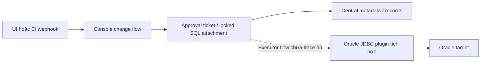

# Rà soát source CloudDM

**Cập nhật nghiên cứu sâu 2026-10-04:** đọc [source trace mới](../../research-round-2/clouddm/deep-source-review.md), [license/release](../../research-round-2/licensing/licensing-review.md) và [shortlist hiện tại](../../shortlist.md). Phần dưới giữ snapshot T03 đầu; kết luận mới được ghi riêng, runtime mới vẫn NOT_RUN.

Ngày rà soát: 2026-10-04. Source pin: `ClouGence/open-cdm@a9f16e78b8288c9a4158ee9df4378ee16b80021e`. GitHub API cho biết `main` cùng SHA tại thời điểm rà soát. Đây là head chính thức quan sát được lúc đó. Không build, deploy, chạy test, kết nối database hoặc thực thi SQL.

## Nhãn bằng chứng

- **DOC**: tài liệu CloudDM hoặc README mô tả hành vi hay chức năng.
- **SOURCE**: cấu trúc mã tĩnh tại commit đã pin. Điều này không chứng minh hành vi chạy thành công.
- **RUNTIME**: chạy trên nền tảng đã triển khai và Oracle đích. Mọi trạng thái runtime của CloudDM hiện là **NOT_RUN**.

## Tính toàn vẹn source và tham chiếu cố định

[Manifest hiện có](../../../evidence/additional-platform-20261004/clouddm-source-manifest.json) lưu URL raw, kích thước byte và SHA-256 của từng tệp source được giữ lại. Các hash liên quan:

| Tệp tại commit đã pin | SHA-256 |
| --- | --- |
| `README.md` | `685c2fa243092f6e2e6b648d32ff698f819991b82ac6fe0d90f39b6525829fd9` |
| `LICENSE.txt` | `a714b40a28d8cefd070eb0b62e976edf3e85f3304ff4097971453da778ef7844` |
| `docs/guides/gitlab-cicd.en.md` | `20bf0f66ae4eff7144137e96a476da1e2592d50dfeabb8ca81bf1b21b46f1138` |
| `.../DmChangeFlowWebhookController.java` | `a6af7ca5fb3fbf2ebb35848a87cf41c4f6f6ded90bcdf757f5e7844fc4a83833` |
| `.../ChangeSqlServiceImpl.java` | `75db8638dfa7776f2a26d1d6b1fb51bc0b2f78d367296d4a910768d9106212fa` |
| `.../ChangeActionForApproval.java` | `68dba484a7781739a3864eb23e04e07338a69ecc63cb2fdb8f0baa09ef6a2c08` |
| `.../OracleDsFactory.java` | `27e677bd74b51910853da5a8ad558af51daddca720fe7f2f460501363b2e2a12` |

Đường dẫn Java rút gọn ở trên nằm dưới đúng đường dẫn đầy đủ trong manifest. Liên kết GitHub dưới đây dùng commit SHA đủ 40 ký tự, không dùng `main`:

- [README đã pin](https://github.com/ClouGence/open-cdm/blob/a9f16e78b8288c9a4158ee9df4378ee16b80021e/README.md)
- [License đã pin](https://github.com/ClouGence/open-cdm/blob/a9f16e78b8288c9a4158ee9df4378ee16b80021e/LICENSE.txt)
- [Hướng dẫn GitLab CI/CD đã pin](https://github.com/ClouGence/open-cdm/blob/a9f16e78b8288c9a4158ee9df4378ee16b80021e/docs/guides/gitlab-cicd.en.md)
- [Webhook controller đã pin](https://github.com/ClouGence/open-cdm/blob/a9f16e78b8288c9a4158ee9df4378ee16b80021e/backend/clouddm-platform/cgdm-console/src/main/java/com/clougence/clouddm/console/web/controller/cicd/DmChangeFlowWebhookController.java)
- [Dịch vụ artifact SQL đã pin](https://github.com/ClouGence/open-cdm/blob/a9f16e78b8288c9a4158ee9df4378ee16b80021e/backend/clouddm-platform/cgdm-console/src/main/java/com/clougence/clouddm/console/web/component/cicd/impl/ChangeSqlServiceImpl.java)
- [Approval action đã pin](https://github.com/ClouGence/open-cdm/blob/a9f16e78b8288c9a4158ee9df4378ee16b80021e/backend/clouddm-platform/cgdm-console/src/main/java/com/clougence/clouddm/console/web/component/cicd/action/ChangeActionForApproval.java)
- [Oracle connection factory đã pin](https://github.com/ClouGence/open-cdm/blob/a9f16e78b8288c9a4158ee9df4378ee16b80021e/backend/clouddm-plugins/clouddm-ds/dsc-common-oracle/src/main/java/com/clougence/clouddm/dsfamily/oracle/execute/dsfactory/OracleDsFactory.java)

Manifest không lưu SHA của mọi tệp trong toàn bộ repository. Các nhận định dưới đây chỉ dựa trên tệp đã liệt kê, Git tree đã pin và tài liệu nguồn chính thức.

## License và điều kiện bản miễn phí

**DOC/SOURCE:** README nêu Apache License 2.0 (README đã pin, dòng 27–37 và 184–186). `LICENSE.txt` tại commit cũng chứa điều khoản Apache-2.0. Nhận định này áp dụng cho các tệp repository open-cdm thuộc phạm vi license đó.

**Chưa xác minh:** License repository không xác định license của mọi dependency đóng gói, plugin tải riêng, JDBC driver, installer hoặc container image đã phát hành. README mô tả image standalone và Console + Sidecar, cho biết cluster image có MySQL, và repository có tài liệu package/license riêng. Tài liệu không cung cấp SBOM image hoặc kết luận license đầy đủ cho từng layer và driver. Trước khi dùng, cần rà notices, digest/SBOM của release đã chọn, điều khoản phân phối Oracle JDBC và từng workflow/driver plugin tùy chọn. Không suy ra mọi thành phần đóng gói đều theo Apache-2.0 chỉ từ license repository.

**Khác biệt thông tin gói miễn phí:** Một kết quả tìm kiếm pricing cũ trong cache được cho là nêu giới hạn Community: 10 instance và 5 tài khoản. Kết quả cache này không được lưu thành bằng chứng nguồn chính trong bộ hiện tại. Bản trả về trực tiếp của trang pricing đã lưu tại [`clouddm-pricing.txt`](../../../evidence/additional-platform-20261004/clouddm-pricing.txt) lại ghi “CloudDM 已全面开源” và không nêu giới hạn số lượng. README đã pin cũng gọi nền tảng là miễn phí và mã nguồn mở. Các nguồn khác thời điểm và provenance; không nguồn nào chứng minh điều khoản hiện hành hoặc không có feature gate. Giới hạn và ranh giới entitlement hiện **chưa xác minh**. Cần xác nhận với nhà cung cấp và kiểm tra license check của đúng release/image trước khi quyết định POC.

## Kiến trúc và mô hình sản phẩm

**DOC:** README dòng 34–37 và deployment guide mô tả chế độ standalone và cụm Console + Sidecar. README dòng 43–79 mô tả datasource, quyền tài nguyên/chức năng, nhóm environment/cluster, SQL audit và workflow.

**SOURCE:** Oracle connectivity nằm trong plugin database-family (`backend/clouddm-plugins/.../dsc-common-oracle/.../OracleDsFactory.java`), tách với phần CI/CD và approval của Console (`backend/clouddm-platform/cgdm-console/...`). Đây là control plane CloudDM cùng Oracle connector/plugin được tích hợp trong sản phẩm. Đây không phải bằng chứng migration semantics của Oracle được cài trong shared control plane. Cây source cũng có UI datasource và environment.

**Project, environment và inventory:** README đã pin dòng 50–61 mô tả database object, nhóm environment/cluster, và quyền ở cấp instance/database/schema/table. Frontend tree có `frontend/src/views/dataSource/DataSource.vue`, `frontend/src/views/dataSource/AddDataSource.vue` và `frontend/src/views/system/datasource/components/DmDsParamsPanel.vue`. Tài liệu environment chính thức hiện tại mô tả security rule, ticket workflow và read-only policy theo environment. Tài liệu và source đã rà cho thấy inventory theo datasource/instance và environment. Chúng chưa chứng minh mô hình application/project như Bytebase, ánh xạ target theo project, hay promotion DEV→SIT→UAT→PROD thành quy tắc hạng nhất. Change flow có thể trỏ đến target path và environment. Bằng chứng đó hẹp hơn một mô hình release project/environment đầy đủ.

**UI route:** Static tree và README cho thấy frontend module, nhưng chưa chứng minh từng route truy cập được với license/role cụ thể hoặc trang hoạt động. Chưa kiểm tra route trên trình duyệt/runtime. Trạng thái truy cập UI là **NOT_RUN**.

## Bằng chứng Oracle và migration

**Oracle connection — SOURCE:** `OracleDsFactory.java` gọi Oracle JDBC `OracleDriver.connect` (dòng 63–109). URL builder xử lý custom URL, SID, service name, PDB và TNS (dòng 153–217). Mã chọn `tcps` khi cấu hình `oracle.net.authentication_services` có `TCPS` (dòng 159–168, 182–207). Đây là bằng chứng có code path dựng TCPS URL. Nó không chứng minh TLS handshake, cấu hình wallet/trust-store, tương thích Autonomous Database hoặc xác thực certificate. Runtime vẫn **NOT_RUN**.

**Oracle parser/execution — GAP:** Oracle connector đã rà là connection factory. Các tệp này chưa chứng minh khả năng parse script Oracle-aware như SQL*Plus, slash delimiter, anonymous PL/SQL, q-quoting, thứ tự package/body, lấy lỗi compile từ `ALL_ERRORS`, hoặc xử lý implicit DDL commit của Oracle. SQL editor và hỗ trợ object chung trong README không chứng minh các thuộc tính migration này. Khả năng PL/SQL còn **chưa rõ**, cần lần theo source liên quan và chạy ca mục tiêu.

**Change artifact và webhook — SOURCE/DOC:** `DmChangeFlowWebhookController.java` khai báo POST `/cicd/webhook/event` và route trigger (dòng 56–80, 129–145, từ 194 trở đi). Mã xác thực flow/provider, commit SHA của event và delivery identifier. Hướng dẫn GitLab nói execution dùng commit SHA bất biến và loại trùng theo delivery/idempotency key cũng như flow + commit SHA (dòng 32–44). Đây là khả năng được tài liệu mô tả, có entry point tương ứng trong source. Nó chưa chứng minh exactly-once trên Oracle. Đây là loại trùng request webhook, không phải bằng chứng ledger migration ở target.

**Approval — SOURCE:** `ChangeActionForApproval.java` tạo ticket gồm target path, applicant, environment và trạng thái `PRE_INIT_WAIT`; lưu SQL artifact thành locked attachment và khởi chạy approval process (dòng 144–203). Caller chuyển change sang `WAIT` (dòng 90–129). Đây là bằng chứng tích cực về approval workflow và artifact đính kèm. Nó chưa chứng minh mọi quyết định approval gắn với nội dung bất biến cùng toàn bộ target, tách requester/approver/executor, hoặc không thể bypass approval. Cần kiểm tra authorization và runtime.

**Ledger, replay, checksum, lock — GAP:** `ChangeSqlServiceImpl.java` cache hoặc dựng lại SQL file từ review content qua file tạm và atomic move khi filesystem hỗ trợ (dòng 32–74). Cơ chế này chuẩn bị artifact cục bộ. Nó không phải target execution ledger, so checksum artifact, chống replay hoặc distributed lock. Các tệp trong manifest chưa chứng minh migration history lâu dài theo từng target, chặn checksum mismatch, retry/reconciliation sau partial DDL, crash recovery hoặc lock semantics. Không tính webhook dedup là đáp ứng các yêu cầu này.

**Promotion — GAP:** Có hỗ trợ workflow và target path theo environment. Source đã kiểm tra chưa cho thấy promotion artifact bất biến qua các stage có thứ tự, prerequisite được enforce và cơ chế stop/resume. Cần xác minh workflow sản phẩm độc lập với webhook dedup.

**API/CI — DOC/SOURCE:** README và tài liệu sản phẩm mô tả trigger Git Push, Web Hook và HttpCall. Webhook route có trong source. API tồn tại cục bộ không chứng minh GitLab/Jenkins job runner hoạt động, pagination, vòng đời service account, retry/dedup đồng thời, hoặc licensing theo deployment. Runtime **NOT_RUN**.

## Kết luận và việc cần xác minh

CloudDM là ứng viên phù hợp để nghiên cứu platform fit về inventory tập trung, quản trị quyền, SQL workflow và kết nối Oracle. Oracle connector tích hợp cùng source CI/approval đủ lý do để làm POC tập trung. Bằng chứng hiện tại chưa đủ gọi CloudDM là nền tảng thay Bytebase cho Oracle migration. Giữ nguyên tiêu chí migration P0. Rủi ro cần xác minh gồm parser/executor Oracle, target ledger/replay/checksum/locking, promotion bất biến và enforcement quyền, cấu hình TCPS, cùng license gate của release/image/plugin/driver.

## Frontend source coordinator kiểm bổ sung

Coordinator tải có chọn lọc `frontend/src/router/index.js` và `frontend/src/views/dataSource/DataSource.vue` theo SHA đã ghim.
[Manifest bổ sung](../../reviews/additional-source-manifest.json) lưu URL và hash các tệp này.
[Router:44–110](https://github.com/ClouGence/open-cdm/blob/a9f16e78b8288c9a4158ee9df4378ee16b80021e/frontend/src/router/index.js#L44-L110) có SQL, CI/CD, release-flow creation, change-records, ticket/detail và ticket_create.
[DataSource.vue](https://github.com/ClouGence/open-cdm/blob/a9f16e78b8288c9a4158ee9df4378ee16b80021e/frontend/src/views/dataSource/DataSource.vue) triển khai trang datasource.
Các trang này là SOURCE về mô hình inventory/flow/ticket, không là bằng chứng enforced promotion hoặc project ownership tương đương Bytebase.
Không mở browser hoặc kiểm UI reachability. Runtime tiếp tục NOT_RUN.

## Đường đã trace và phần chưa trace

SOURCE xác nhận connector và approval flow. Cạnh đứt không là xác nhận executor/ledger correctness.
Không biến sơ đồ này thành runtime evidence. Console/Sidecar topology còn cần pin theo image được chọn.
