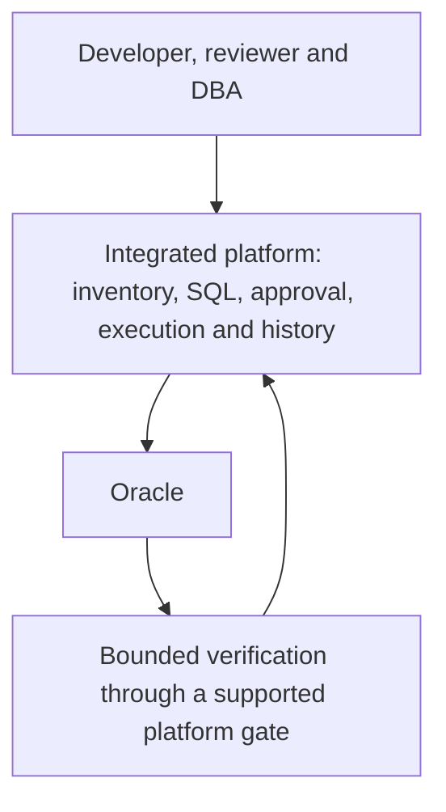

# Goal-aligned final assessment: Oracle database change management

Assessed **7 October 2026** against [current-baseline.md](current-baseline.md), the current decision authority. This is an assessment and a conditional POC design. Candidate statuses and historical results are preserved; no product deployment, Oracle execution, vendor contact or trial activation was performed.

**Decision: no qualifying OSS platform is currently demonstrated to meet the complete operating requirement with materially less custom correctness engineering than Git/Jenkins/Flyway. ODC native is the strongest conditional OSS platform candidate, not an adoption winner.** Its UI and Oracle workload evidence justify checking for a supported safety improvement; its unchanged failures do not justify another runtime POC. AccessFlow's external deployment API is a supported composition reserve, but it does not make the Oracle runner a small integration. Bytebase Enterprise remains the integrated commercial benchmark.

Evidence labels: **RUNTIME** = observed at the recorded build/topology; **SOURCE** = inspected code at a pin; **DOC** = published description; **DESIGN** = proposed behavior; **UNKNOWN/NOT_RUN** = unestablished/not executed. A visible screen, a completed ticket and a verified Oracle release are different facts.

## 1. Goal

Replace manual DBeaver execution and individually operated Flyway CLI with a centralized, self-hosted workflow for approximately **50 Oracle instances and 20 human users**. Optimize for fewer manual selections, credential distributions, terminal sessions and reconstructed release histories, while retaining bound review/approval, Oracle verification and controlled recovery.

Priority remains free OSS, self-hosting, native Oracle support, centralized inventory, a usable UI, minimal owned correctness code, then supported CI/CD integration. CI/CD compatibility does not require CI to become the user interface.

The question is whether an integrated OSS product, or a supported product plus a small runner, can supply most of Bytebase's operational value. The answer from the retained candidates is **not yet demonstrated**. This is a conclusion about the evidence and viable shortlist, not proof that no such product can ever exist.

## 2. Current pain

| Current action | Practical replacement | How success would be recognized |
| --- | --- | --- |
| Choose a DBeaver connection for each run | Search one managed database inventory | Environment, service/PDB, schema and owner are visible before approval/execution |
| Share Oracle credentials | Platform-owned restricted execution identities | Developers submit changes without receiving deploy passwords |
| Run Flyway separately per database | Submit one retained change and select approved targets | Users do not assemble separate CLI invocations |
| Review SQL outside the execution record | Exact SQL plus resolved targets in the request | Edited SQL, options or targets require renewed approval |
| Copy logs and reconstruct release state | Central request, attempt and result history | A DBA can find who changed what, where, when and with what outcome |
| Manually repeat the release in each environment | Promote the same approved artifact | A failed, invalid or uncertain predecessor prevents the next stage |
| Decide whether a failed run can be retried from terminal output | Held result with Oracle evidence and a recorded DBA decision | Committed DDL/DML is inspected before any approved recovery |

These are user-reported pain categories. Time savings and incident reductions have not been measured; neither is assigned a fabricated percentage or cost saving.

## 3. Desired user workflow

```text
Login → application/project → managed databases
→ create/select SQL change → review exact SQL and proposed targets
→ finalize targets/options → independent approval of that exact request
→ authorized execution → Oracle verification → retained result/history
→ promote the same artifact DEV → SIT → UAT → PROD
```

Developers should normally use one platform. Reviewers should see the SQL, target identity and relevant findings together. DBAs should see execution and verification separately, with a clear held state for partial or uncertain outcomes. Platform owners should configure inventory, credentials, roles, backups and upgrades through supported interfaces.

Target selection after an initial SQL review is acceptable. Execution approval must bind the final artifact, options and targets. A manual stage button is acceptable for the initial POC **if the server prevents premature or unauthorized use**. Human memory alone is not the promotion control.

Required verified outcomes are `VERIFIED`, `FAILED`, `INVALID`, `PARTIAL` and `UNKNOWN_OUTCOME`, or equivalent unambiguous product states. A successful JDBC return must not automatically mean a verified release.

## 4. Architecture preference



The preferred product owns the release decision and uses one executor. The verifier can be a command or an approved SQL check; it need not be another server. It must feed an enforced result/promotion gate.

| Preference | Shape | Acceptance boundary |
| --- | --- | --- |
| 1 | Integrated OSS platform → Oracle | Native request, approval, execution, release admission and recovery; bounded Oracle checks |
| 2 | OSS platform → supported runner/engine → Oracle | Supported authorization/result contract; limited integration and no internal task replacement |
| 3 | Git → existing CI → engine → Oracle | Fallback after integrated options fail; count the inventory, safety and results work explicitly |

Native central release records can satisfy the operating requirement without a Flyway-style target ledger. They must still prevent duplicate/replayed writes, bind applied content, survive restart/restore and reconcile with Oracle after partial commits. Lack of a particular ledger format is not itself a rejection; the recorded repeated effects and unclosed recovery behavior are.

## 5. Candidate reassessment

Only retained HOLD/RESERVE candidates relevant to this workflow receive detailed reconsideration. There are no ACTIVE candidates in the baseline.

| Candidate | Baseline status | Operational value already evidenced | Decision in this assessment |
| --- | --- | --- | --- |
| **ODC native** | HOLD | Project/database inventory, SQL tickets, manual approval/execution and substantial Oracle PL/SQL runtime evidence | Preferred **conditional OSS**; entry assessment only until a supported safety delta exists |
| **AccessFlow deployment API + restricted engine** | RESERVE | Datasource inventory, deployment approval UI, supported submit/gate/confirm/outcome protocol | Alternate **composed OSS reserve**; no demonstrated simplicity advantage over CI |
| **Archery native SQL-ticket portal** | RESERVE | Real inventory, SQL submission, review/approval, execution and ticket history in source | Useful narrower portal; not one of the final three for the full release/promotion requirement |
| **Bytebase EE self-hosted** | COMMERCIAL_CHECK | Integrated change/rollout/approval/audit model in product docs; FREE runtime supplies regression evidence | Commercial benchmark after exact entitlement/build and Oracle regression |

ODC's historical run used **4.4.1-20260116**, with OceanBase CE **4.3.5 as MetaDB**, against Oracle **26ai EE 23.26.4.1.0**. It yielded **12 PASS / 20 PARTIAL / 5 FAIL / 8 NOT_RUN** across the original 45 cases. Bytebase's run used **3.22.1/FREE**, commit `a85f6cb4195299995e8554303550d672d5093e1d`, on the same Oracle lab: **17 PASS / 14 PARTIAL / 4 FAIL / 3 BLOCKED / 7 NOT_RUN**. The extra SQL Review enforcement failure sits outside those totals. These are not acceptance percentages. [Baseline evidence rules](current-baseline.md#evidence-rules-and-completed-tests), [ODC results](../ODC-ORACLE-POC-RESULTS.md), [Bytebase FREE results](../BYTEBASE-ORACLE-POC-RESULTS.md).

Read-only upstream checks on 7 October returned the same already-reviewed heads: ODC `d517c0f27971642fb0cd7565fd61ab2309875ec3`, AccessFlow `c8bb247637df76ce36e52f47b45899823409495e`, Archery `ccc7134f48d0e261f9e3ffa0d445dcec48adb790`. ODC's GitHub latest-release API returned `v4.3.4_bp2`, published 6 June **2025**; this is not the lab's 4.4.1 image. Later version labels in vendor documentation do not establish a source/image mapping or a fix. No new supported safety delta was established. [ODC head](https://api.github.com/repos/oceanbase/odc/commits/main), [ODC latest release](https://github.com/oceanbase/odc/releases/tag/v4.3.4_bp2), [AccessFlow head](https://api.github.com/repos/bablsoft/accessflow/commits/main), [Archery head](https://api.github.com/repos/hhyo/Archery/commits/master).

The [ODC source survey](research-round-2/coordinator/odc-source-survey-20261006.md) still identifies missing release admission, validity and independent execution controls in the inspected paths. AccessFlow offers a supported external API, but `EXECUTED` confirms permission to proceed; it does not attest to completed Oracle SQL. Its native schema-change path remains STOP for the required DML/ordinary PL/SQL workload. [Composition contract](architecture-reassessment.md#4-architecture-b-platform--engine), [native workload trace](research-round-2/coordinator/oracle-governance-source.md).

Other retained options do not introduce a credible OSS simplicity gain: SQLE/DMS licensed Oracle remains HOLD for exact package/rights and recovery; AWX/Rundeck remain CI reserves; NineData EE, DBmaestro, OEM, Octopus and Harness remain commercial/entitlement reserves. No STOP candidate is reopened. In particular, CloudDM's reviewed blocker is native safety, not its obsolete cached 10/5 claim, and old ODC/CloudDM external-engine bridges still lack an accepted completion contract. [Canonical statuses](current-baseline.md#canonical-candidate-status), [rejection register](rejection-register.md).

## 6. UI/workflow comparison

### ODC: the closest demonstrated OSS daily workflow

| Screen | User action and visible result | Evidence and limit |
| --- | --- | --- |
| 1. Login / Team Workspace | Sign in and enter the relevant project | Historical UI login; project routes in the inspected frontend |
| 2. Projects → Databases | Find the application's database; inspect datasource, environment and schema mapping | Inventory RUNTIME; `/project/:id/database` and `/datasource` SOURCE |
| 3. Tickets → Create → Database Change | Enter/upload SQL, choose target, execution mode and failure policy | Ticket creation/execution RUNTIME; SQL entry and file upload DOC/SOURCE |
| 4. Ticket detail / Task Process | Reviewer sees SQL and target; required actors approve or reject | OWNER→DBA approval RUNTIME; `/task` and `/secure/approval` SOURCE |
| 5. Approved ticket → Execute | Authorized operator starts the held manual task and watches progress | MANUAL wait and Execute RUNTIME; requester could also execute after approval, a recorded FAIL |
| 6. Result / SQL details / Tickets history | View statement results and the execution record | RUNTIME; old logs/attachments failed to reopen after restart |
| 7. Batch Database Change | Select databases in execution nodes and order environments | DOC/SOURCE; the old four-schema promotion was ordered by an external runner, not proved native enforcement |
| 8. Security → Operation Records | Search actor/action history | Audit listing RUNTIME; complete export/retention remains unaccepted |

Routes/components and their pins are in [frontend evidence](../UI-EVIDENCE.md#oceanbase-odc); [official change-workflow documentation](https://en.oceanbase.com/docs/common-odc-10000000002418128) and [official batch documentation](https://en.oceanbase.com/docs/common-odc-10000000001510652) describe submission and task-process screens. The native Oracle frontend enables batch tasks in standalone mode; embedded OCP mode removes the Oracle option. This POC requires the standalone web product.


These existing official screenshots were visually inspected. The batch form shows target nodes, SQL entry/upload and SQL checks; its example targets are OceanBase/MySQL. Native Oracle execution is supported by the separately recorded lab results, not by the screenshot. [Image provenance and hashes](../evidence/product-model/screenshots.json).

### AccessFlow external deployment composition: approval UI with separate SQL and execution

| Screen | Actual/proposed action | Evidence and limit |
| --- | --- | --- |
| 1. Login → Datasources | Find the registered Oracle datasource | SOURCE and official fixture image; not new Oracle runtime |
| 2. Git change/PR | Author SQL and review the exact file/diff | DESIGN for this external-engine architecture; SQL text editing is not established in its generic deployment detail |
| 3. Deployments list/detail | Open a request containing pipeline, environment, version, commit, artifact reference and run link | Existing frontend SOURCE; the runner submits through the supported API |
| 4. Review queue / Deployment detail | Approve/reject; inspect approval count and release eligibility | SOURCE/DOC; exact Oracle target/hash binding requires the proposed runner contract |
| 5. Existing runner/job UI | Runner confirms authorization, admits an attempt and invokes the engine | DESIGN; AccessFlow does not execute the SQL in this API branch |
| 6. Deployment detail + retained attempt result | See reported outcome; follow the run/evidence link for statement and per-target results | Generic outcome UI SOURCE; truthful Oracle partial/unknown states need additional owned evidence |
| 7. Version Matrix / Environment History | Compare environment versions and view deployment history | SOURCE; native version display is not an Oracle verified-promotion gate |

The inspected [deployment detail component](https://github.com/bablsoft/accessflow/blob/55c209a4d9e4ba09a6c089f90e68a8b16b3f2133/frontend/src/pages/deployments/DeploymentDetailPage.tsx) contains artifact/run references and approve/reject controls. It does not establish an inline Oracle SQL diff or a per-schema execution console. [Pinned supported API guide](https://github.com/bablsoft/accessflow/blob/c8bb247637df76ce36e52f47b45899823409495e/docs/18-deployment-governance.md), [generic integration example](https://github.com/bablsoft/accessflow/blob/c8bb247637df76ce36e52f47b45899823409495e/ci-templates/examples/generic-curl-deployment.md).


This screenshot shows a generic checkout-service approval, fixture identities and a `v0.0.0` label. It proves visible approval controls, not an Oracle release. Native schema-change screens must not be substituted for this composed workflow: that branch's required SQL incompatibility is already recorded.

### Archery: a credible SQL-ticket UI with no proved release continuation

| Screen | User action | Boundary |
| --- | --- | --- |
| 1. Login → Instances / Databases | Find a registered Oracle connection/database | SOURCE |
| 2. SQL submission (`submitsql/`) | Select instance/database and submit SQL for review | SOURCE |
| 3. SQL workflow/detail (`sqlworkflow/`, `detail/<workflow_id>/`) | View saved SQL, workflow target and review status | SOURCE |
| 4. Review/approval | Reviewer approves/rejects through the ticket workflow | SOURCE; independent actors and edit invalidation NOT_RUN |
| 5. Detail → Execute | Execute approved stored SQL and inspect results | SOURCE; Oracle parser/transaction/package-body regression NOT_RUN |
| 6. Workflow/audit history (`audit_sqlworkflow/`) | Find prior tickets and operations | SOURCE; immutable release identity, recovery and cross-environment history not established |

Primary UI evidence is [URL registration](https://github.com/hhyo/Archery/blob/ccc7134f48d0e261f9e3ffa0d445dcec48adb790/sql/urls.py), [submission template](https://github.com/hhyo/Archery/blob/ccc7134f48d0e261f9e3ffa0d445dcec48adb790/sql/templates/sqlsubmit.html), [detail template](https://github.com/hhyo/Archery/blob/ccc7134f48d0e261f9e3ffa0d445dcec48adb790/sql/templates/detail.html), and the [candidate source review](candidates/archery/source-review.md). The portal would reduce connection switching for individual tickets. Turning it into a release platform adds the controls counted in section 9.

### Bytebase Enterprise reference workflow

| Screen | User action | Evidence boundary |
| --- | --- | --- |
| 1. Login → Project / Instances / Databases | Find application and managed targets | Docs plus historical FREE UI/inventory evidence |
| 2. Project → CI/CD → Plans → New Plan | Choose databases and enter SQL | Official UI tutorial; historical FREE plan/execution evidence |
| 3. Plan checks / Ready for Review / linked Issue | Read SQL findings and submit for review | DOC; old FREE SQL Review ERROR was bypassed at execution |
| 4. Review | Required reviewers approve according to policy | EE DOC; FREE screenshots recorded skipped approval |
| 5. Rollout stages/tasks | Run selected authorized stage and inspect task progress/logs | DOC plus FREE execution evidence; EE enforcement NOT_RUN |
| 6. Revisions / change history / Audit | Inspect applied change record and actors | FREE revisions RUNTIME; licensed audit/retention regression NOT_RUN |

[Current UI tutorial](https://docs.bytebase.com/tutorials/first-schema-change), [custom approval documentation](https://docs.bytebase.com/change-database/approval), [workflow documentation](https://docs.bytebase.com/change-database/change-workflow), [historical browser manifest](../evidence/bytebase-poc-browser.json). The manifest's local screenshot directory is absent in this workspace, so this assessment uses the preserved capture descriptions and current official UI docs rather than displaying unavailable images. No EE UI acceptance is inferred from FREE captures.

### What each UI actually covers

| Capability | ODC native | AccessFlow API + engine | Archery native | Bytebase EE |
| --- | --- | --- | --- | --- |
| DB inventory | Native, lab RUNTIME | Native datasource inventory SOURCE | Native SOURCE | Native DOC; FREE RUNTIME |
| Change request | Native SQL ticket RUNTIME | Generic deployment request; SQL artifact external | Native SQL ticket SOURCE | Native Plan/Issue DOC; FREE RUNTIME |
| SQL viewing/review | Ticket SQL RUNTIME; schema diff not needed to qualify | Git/file review; generic detail shows reference | Saved SQL review SOURCE; full diff not proved | Plan SQL/checks DOC; FREE RUNTIME |
| Approval | Native RUNTIME with execution separation failure | Native SOURCE/DOC; DB binding owned | Native SOURCE, runtime NOT_RUN | EE DOC, runtime NOT_RUN |
| Execution | Native RUNTIME | External runner DESIGN | Native SOURCE, runtime NOT_RUN | Native DOC; FREE RUNTIME |
| Target selection | Native RUNTIME; mutation negatives incomplete | Pipeline/environment plus runner-owned frozen DB/schema targets | Native single-ticket target SOURCE | Native DOC; FREE RUNTIME |
| History | Native tickets/audit RUNTIME, durability gaps | Generic history SOURCE plus external results DESIGN | Ticket/audit SOURCE, release history gap | Native DOC; FREE revision RUNTIME |

### Daily usability by role and number of systems

Counts below are **DESIGN estimates of distinct interfaces a role must use**, not click counts or measured onboarding. Git is optional for native A; common identity/backup infrastructure is counted for owners when they must administer it.

| Candidate | Developer | Reviewer | DBA | DevOps/platform owner |
| --- | --- | --- | --- | --- |
| ODC | **1**: login, project/database, SQL ticket, submit | **1**: ticket SQL/target, approve/reject | **2 today**: ODC approve/execute/results plus Oracle verification; could reach 1 routinely only with enforced integrated checks; incidents use Oracle inspection | **2–4**: ODC admin, deployment/MetaDB administration, secret and backup tooling |
| AccessFlow composition | **2**: Git SQL/PR plus AccessFlow inventory/request | **2**: Git exact SQL/diff plus AccessFlow target/approval | **2–3**: AccessFlow, runner/evidence and Oracle recovery; database target verification spans the composition | **3–5**: AccessFlow admin, platform/runner deployment, Git integration, secrets/backups |
| Archery | **1 for tickets, 2 for releases**: portal plus Git if immutable bundles added | **1–2**: portal SQL/target plus release artifact review | **2–3**: portal, proposed release controls/evidence and Oracle recovery | **3–5**: portal admin, app/worker/database/cache operations, proposed guard, secrets/backups |
| Bytebase EE | **1**, or 2 with optional Git authoring | **1** in UI workflow; GitOps review lives in Git | **1–2**: native approve/rollout/results plus Oracle incident inspection; verification integration conditional | **2–3**: Bytebase admin, deployment/metadata operations, secrets/backups |
| CI fallback | **2**: Git plus CI target selection/job/results | **2**: Git SQL review plus authenticated CI deployment approval | **2–3**: CI/results, Git recovery change if needed, Oracle inspection | **3–5**: Git, CI/runner, owned safety store/UI, secrets/backups |

ODC has the best prospect of one normal operator interface among the eligible OSS platform candidates. AccessFlow improves deployment approval presentation but leaves routine SQL review and detailed execution in other systems. Archery's apparent simplicity applies to tickets; adding release semantics changes the comparison.

## 7. Oracle capability

The historical lab modeled four environments as schemas on **one Oracle database/service**. It does not certify Oracle 19c/21c, RAC, multiple real instances or production session/privilege limits. No new SQL was run.

| Required case | ODC native | AccessFlow API + engine | Archery native | Bytebase EE benchmark |
| --- | --- | --- | --- | --- |
| Normal DDL | CREATE/ALTER executed; original SQL-01/02 PARTIAL for full acceptance | Engine Oracle capability; composed workflow NOT_RUN | Executor SOURCE; NOT_RUN | FREE CREATE/ALTER executed, original PARTIAL; EE NOT_RUN |
| DML migration | Effects observed; SQL-03 PARTIAL because replay unsafe | Engine handles DML; composed authorization/recovery NOT_RUN | Oracle execution/review SOURCE; NOT_RUN | FREE SQL-03 PASS including replay; EE NOT_RUN |
| Procedure | SQL-04 PASS, VALID and invocation checked | Engine/parser/version-dependent; NOT_RUN composed | Named-object handling SOURCE; NOT_RUN | FREE PASS; EE NOT_RUN |
| Function | SQL-05 PASS, VALID and result checked | Same engine-dependent boundary | Named-object handling SOURCE; NOT_RUN | FREE PASS; EE NOT_RUN |
| Package | SQL-06 PASS including invocation | Engine-dependent; NOT_RUN composed | Parser/object check SOURCE, NOT_RUN | FREE PASS; EE NOT_RUN |
| Package body | SQL-06 valid body observed; invalid-body case NOT_RUN | Must verify BODY separately; NOT_RUN | SOURCE risk: name-only check/fetchone can miss invalid body; not a runtime FAIL | FREE valid body observed; invalid-body/EE NOT_RUN |
| Trigger | SQL-07 PASS with exactly one audited effect | Engine-dependent; NOT_RUN composed | Named-object handling SOURCE; NOT_RUN | FREE PASS; EE NOT_RUN |
| View | Dedicated native ticket/effect acceptance not established: NOT_RUN | Oracle engine supports SQL; composed fixture NOT_RUN | Dedicated fixture NOT_RUN | FREE supplementary UI view observed; dedicated/EE acceptance NOT_RUN |
| Sequence | Dedicated fixture NOT_RUN | Engine capability, composed fixture NOT_RUN | Dedicated fixture NOT_RUN | Dedicated/EE fixture NOT_RUN |
| Anonymous PL/SQL block | SQL-08 PASS | Engine Oracle parser dependent; NOT_RUN composed | Splitting SOURCE; NOT_RUN | FREE SQL-08 PASS; EE NOT_RUN |
| Multi-statement file | Existing mixed SQL/PLSQL and slash cases ran; not every script grammar | Engine-specific delimiter/transaction rules; composed NOT_RUN | Generic/custom splitter SOURCE; NOT_RUN | FREE mixed/slash cases ran; EE NOT_RUN |
| Partial DDL | REC-04 PARTIAL: CREATE committed before ALTER failed; replay fencing not proved | Engine reports failure; durable HOLD/reconciliation owned and NOT_RUN | Per-statement commits SOURCE; partial-state handling NOT_RUN | FREE REC-04 PARTIAL; EE fencing/recovery NOT_RUN |
| INVALID object | SQL-11 FAIL: successful ticket, invalid procedure | Engine exit alone insufficient; verifier/enforced promotion gate owned | Limited native check SOURCE; package-body coverage risk; NOT_RUN | FREE SQL-11 FAIL; EE NOT_RUN |
| Rerun/replay | REC-02 FAIL: DML executed again | Engine version/checksum helps; release admission/uncertainty handling still owned | Durable release replay control not established | FREE REC-02 PASS; altered content REC-08 FAIL; EE NOT_RUN |
| Duplicate release | REC-10 FAIL: two request IDs, two effects | API run-ID idempotency is not Oracle release uniqueness; NOT_RUN | Ticket ID not a proved unique target release; NOT_RUN | FREE REC-10 PARTIAL: one effect for duplicate task launch; EE full contract NOT_RUN |
| DB/schema target selection | Inventory and selected schema RUNTIME; complete alias/mutation negatives incomplete | Datasource plus frozen runner mapping DESIGN | Connection/database selection SOURCE; grant boundary NOT_RUN | FREE selected schema inventory RUNTIME; EE negatives NOT_RUN |

Sources: [ODC runtime cases](../evidence/oracle-poc-cases.json), [Bytebase FREE runtime cases](../evidence/bytebase-poc-cases.json), [Archery Oracle/source trace](research-round-2/coordinator/oracle-governance-source.md#archery-compile-check-có-phạm-vi-hẹp-hơn-nhãn-hỗ-trợ-plsql), [engine comparison](solution-shortlist.md#11-engine-oracle-và-cicd). Source compatibility does not become composed RUNTIME acceptance.

Oracle's DDL commits make partial execution a normal recovery concern. A package spec and package body share a name but have distinct object types/statuses. Verification must capture owner, name, type and diagnostics, and compare newly invalid/touched/dependent objects with the pre-run state. `ALL_ERRORS`/`USER_ERRORS` visibility must match the observer's actual grants. Effects must be checked as well as object status. [Oracle COMMIT semantics](https://docs.oracle.com/en/database/oracle/oracle-database/19/sqlrf/COMMIT.html), [ALL_OBJECTS](https://docs.oracle.com/en/database/oracle/oracle-database/19/refrn/ALL_OBJECTS.html).

Flyway Community is the reserve runner reference because the team already knows it; it is not mandatory for ODC. Its schema history/validation/locks do not independently enforce human approval, INVALID detection or safe recovery after uncertain Oracle commits. Pin the exact edition/version/Oracle support and drivers before any composed POC. [Existing compatibility review](decision-gates.md#6-flyway-community-oracle-compatibility), [official Oracle support](https://documentation.red-gate.com/flyway/reference/database-driver-reference/oracle-database).

## 8. Licensing

**No caps found in inspected OSS paths is not a verified unlimited binary entitlement.** Evaluate source, web frontend, selected images, plugins, drivers and metadata/cache dependencies separately. Oracle database licensing remains the owner's existing responsibility; application source licensing does not grant Oracle rights.

| Requirement | ODC native | AccessFlow API + engine | Archery native | Bytebase Community / Pro / Enterprise |
| --- | --- | --- | --- | --- |
| Product source | Backend/frontend Apache-2.0 | Apache-2.0; engine/dependencies separate | Apache-2.0 | Community-covered source and commercial exclusions must match selected build; EE requires entitlement |
| DB/schema count | No numeric product cap found in reviewed paths; binary UNKNOWN | No numeric cap found in reviewed paths; binary UNKNOWN | No numeric cap found in reviewed paths; binary UNKNOWN | Pricing counts instances; schema/PDB/connection mapping needs clarification |
| Instance count | No paid limit identified; actual capacity NOT_RUN | Same qualification | Same qualification | **10 / 10 / custom contracted** |
| Datasource count | No paid limit identified | No paid limit identified | No paid limit identified | No separate published datasource allowance established |
| Human/seat count | No paid limit identified | No paid limit identified; include service accounts in checks | No paid limit identified | **20 / custom / custom** |
| Oracle product/DB edition restriction | Native ORACLE connector; no paid Oracle boundary found; supported versions/editions need proof | Oracle connector; external engine/artifact rights separate | Oracle connector; release cx-Oracle/Instant Client differs from reviewed HEAD oracledb | Oracle advertised across Enterprise/Standard/Express and hosted variants; selected licensed build still needs regression |
| Approval restriction | Native approvals evidenced; policy gap, not known paid gate | External API approval in inspected OSS source | Native approval in OSS source | **Unavailable / unavailable / Enterprise workflow** |
| Audit restriction | Operation records present; complete retention/export not accepted | Native audit SOURCE; retention/restore NOT_RUN | Ticket/audit SOURCE; retention/restore NOT_RUN | **No audit feature / 7-day retention / unlimited retention advertised** |
| SSO restriction | Integration advertised; exact build/IdP usability NOT_RUN; no paid gate identified | SAML/OIDC source/docs; chosen IdP NOT_RUN; no paid gate identified | Selected IdP setup/edition not established; no paid gate identified | **No SSO / Google and GitHub / enterprise IdP options** |
| API restriction | API lab worked; stable supported extension boundary unresolved | Supported API-key deployment endpoints; configured rate limits are operational constraints | Workflow API SOURCE; actual actor/target enforcement NOT_RUN | Public API exists; individual feature authorization remains edition-dependent |
| Self-host at ~50 instances / 20 users | Source-level scale rights plausible; selected distribution/operations/safety remain gates | Source-level scale rights plausible; five owned modules prevent a simple turnkey claim | Source-level scale rights plausible; workload/release safety open | **Community/Pro rejected at estate scale; EE requires suitable self-hosted contract** |

Licensing evidence: [ODC source/license review](candidates/odc/source-review.md), [AccessFlow source/license review](candidates/accessflow/source-review.md), [Archery source/license review](candidates/archery/source-review.md), [component/registry review](research-round-2/licensing/licensing-review.md), [current Bytebase pricing](https://www.bytebase.com/pricing/), [Bytebase Oracle scope](https://www.bytebase.com/databases/oracle/schema-migration/), [AccessFlow security docs](../evidence/source/bablsoft__accessflow/docs/07-security.md).

The Bytebase pricing check is current DOC; old FREE/TEAM/Pro labels in the 3.22.1 runtime remain historical evidence, not a current plan map. Twenty humans exhaust Community's published user allowance, and the 10-instance cap already excludes the requested estate. Pro does not solve it. Multiple free workspaces or schema aliases are not a recommended licensing/operations workaround. No price for a suitable Enterprise estate has been established.

## 9. Custom-code burden

Count **functional responsibilities**, even if several fit in one script or container. Configuration can retire a responsibility only after it proves the required invariant. Existing platform UI is a real saving, but it does not erase missing correctness/recovery ownership. The five-package estimates below preserve the [baseline custom-code comparison](architecture-reassessment.md#12-custom-code-comparison).

| Candidate / piece | Exactly what the team would otherwise need to build | Classification |
| --- | --- | --- |
| ODC N1 | Freeze release SQL/options/targets; bind approval, independent execution and verified stage progression across every write path | Security critical; correctness critical |
| ODC N2 | Durable release identity/content validation, duplicate admission, canonical schema serialization and uncertain-outcome HOLD | Correctness critical; recovery critical |
| ODC N3 | Oracle object-type/diagnostic/effect checks feeding an enforced completion/promotion veto | Correctness critical; integration |
| ODC N4 | Read-only reconciliation and a retained approved recovery decision before any redispatch | Recovery critical |
| ODC N5 | Durable SQL/log/audit export and correlation; result/history convenience links | Integration; security critical for evidence integrity/access; UI convenience for formatting |
| AccessFlow M1 | Submit/read back the exact request; bind immutable artifact, target snapshot and execution options | Integration; security critical; correctness critical |
| AccessFlow M2 | Trusted human/service attribution, independent approval/execution, verified promotion, suppress native writers in managed streams | Security critical; correctness critical |
| AccessFlow M3 | Durable per-target release/attempt admission, serialization, fencing and no automatic uncertain redispatch | Correctness critical; recovery critical |
| AccessFlow M4 | Oracle verifier and read-only reconciliation feeding held outcomes and approved recovery | Correctness critical; recovery critical |
| AccessFlow M5 | Map per-target execution evidence into outcomes/history; retain artifact/log/actor chain and searchable links | Integration; security critical for evidence integrity/access; UI convenience |
| Archery A1 | Bind Git/release SQL bytes and target/options snapshot to the reviewed stored ticket; invalidate approval on changes | Integration; security critical; correctness critical |
| Archery A2 | Independent actors, ordered verified promotion and multi-target stop policy | Security critical; correctness critical |
| Archery A3 | Durable release/version/content admission, canonical schema lock and recovery HOLD | Correctness critical; recovery critical |
| Archery A4 | Complete Oracle validity/effect verifier and reconciliation, including every package object type | Correctness critical; recovery critical |
| Archery A5 | Correlate retained tickets/SQL/results/audit into per-release/per-target history | Integration; security critical for evidence integrity/access; UI convenience |
| Archery possible A6 | Repair parser/PLSQL or transaction handling if exact required scripts fail | Correctness critical; potentially coupled executor maintenance |
| Bytebase EE B1 | Bounded Oracle validity/effect verification using a supported gate that prevents promotion | Integration; correctness critical |
| Bytebase EE possible B2 | Export retained evidence to the existing backup/audit destination if native export is insufficient | Integration; security critical for evidence integrity/access; UI convenience |
| CI fallback C1 | Immutable bundle and inventory/target/options binding; safe selector configuration | Integration; security critical; correctness critical |
| CI fallback C2 | Trusted runner/approval policy, human/service attribution and verified environment progression | Security critical; correctness critical |
| CI fallback C3 | Durable admission/attempt state, canonical schema locks, fencing and uncertainty HOLD | Correctness critical; recovery critical |
| CI fallback C4 | Oracle verifier/reconciler and approved recovery evidence | Correctness critical; recovery critical |
| CI fallback C5 | Central inventory/release/attempt results, audit correlation and retained redacted evidence | Integration; security critical for evidence integrity/access; UI convenience |

**Present estimate:** ODC **5 provisional packages**; AccessFlow composition **5**; Archery release workflow **5 plus a possible parser package**; CI fallback **5**. Bytebase EE is **1, possibly 2, conditional on native admission/authorization/recovery passing**. These are neither implementations nor person-day estimates.

AccessFlow's submit/poll/confirm/report calls are a small supported integration. The complete safe Oracle runner is not. The generic example permits repeated confirmation of an already `EXECUTED` request; copying it literally must not redispatch Oracle DML. Native request idempotency, engine migration history and per-target release admission solve different problems. [Supported curl example](https://github.com/bablsoft/accessflow/blob/c8bb247637df76ce36e52f47b45899823409495e/ci-templates/examples/generic-curl-deployment.md).

The **acceptance ceiling for the preferred OSS branch** is stronger than the present estimate: supported native behavior must retire N1, N2 and N4, leaving at most **two bounded additions**, Oracle verification and optional evidence export. If those additions themselves grow an independent release controller, state machine, recovery scheduler or new authority store, the simplicity condition fails. This ceiling is a POC decision rule, not a claim that ODC already meets it. No deep fork is recommended.

## 10. Operational burden

These are comparable minimum deployment shapes, excluding the managed Oracle estate and common existing Git/IdP/secrets/backup systems. They are **DESIGN counts/lower bounds**, not HA sizing. A reused service still requires integration, backup and upgrade ownership.

| Candidate | Deployed services/process groups | Persistent stores / backup targets | Upgrade domains | Credentials and custom components |
| --- | --- | --- | --- | --- |
| ODC native | **2 minimum**: app/workers plus supported MetaDB | **2**: MetaDB and persistent SQL/attachments/logs; protect encryption/config material; a custom admission store would be additional | ODC/backend/frontend/driver artifact together, MetaDB, verification/export scripts if accepted | N deploy scopes plus observer scopes; MetaDB/admin/IdP/key material; present 5 functional gaps, desired ≤2 bounded additions |
| AccessFlow + engine | **5 minimum**: backend, frontend, PostgreSQL, Redis, restricted runner/state host; engine is a runner process | **4**: platform metadata, Redis runtime data, protected attempt records, immutable evidence; Git separate; include key/config backup | AccessFlow app/UI, PostgreSQL, Redis, runner/engine/driver and owned protocol | N restricted writer/observer scopes, read-only platform Oracle scopes, API principal/key, metadata/cache credentials; 5 owned packages |
| Archery release workflow | **3 service groups minimum**: app with worker, MySQL, Redis; separately deployed worker/guard increases count | **4**: metadata, queue/runtime data, retained SQL/results, proposed guard records; Git separate | Archery app/worker, MySQL, Redis, Oracle driver/client, owned guard | N writer/observer scopes, platform/admin/metadata/cache identities; 5 packages and possible parser maintenance |
| Bytebase EE | **2 selected units**: app and supported metadata service; exact build packaging may bundle metadata differently | **2 logical targets**: metadata and retained artifacts/evidence; protect license/config/keys | Bytebase app/driver, metadata service, bounded verifier/export | N writer/observer scopes; admin/metadata/secret/IdP identities; 1–2 conditional additions |
| Existing CI + engine | **2 selected units**: CI controller and restricted runner/state host; Git infrastructure additional if new | **3**: controller configuration/home, protected attempt state, immutable SQL/log/result evidence; Git separate | CI/plugins, runner/engine/driver, five owned packages/store format | N restricted writer/observer scopes plus CI/Git/service/secrets identities; 5 owned packages |

The AccessFlow and Archery process shapes come from the [AccessFlow compose](https://github.com/bablsoft/accessflow/blob/c8bb247637df76ce36e52f47b45899823409495e/docker-compose.yml) and [Archery compose](https://github.com/hhyo/Archery/blob/ccc7134f48d0e261f9e3ffa0d445dcec48adb790/src/docker-compose/docker-compose.yml). ODC's [self-host README](https://github.com/oceanbase/odc) describes its web/MetaDB dependency; the old runtime also required a local TCPS wrapper. Counts preserve [the existing operations comparison](architecture-reassessment.md#13-operational-simplicity-comparison), not a claim that demo compose defaults are suitable deployments.

Here **N is configured service/PDB/schema/stream credential scopes**, not 50 automatically. Four application schemas on each of 50 distinct databases could produce 200 deployment targets. Twenty human accounts are separate from those Oracle principals. Onboarding, rotation, revoke and ownership assignment must be centralized and preferably bulk/config driven; the exact supported facility needs the selected build.

ODC native has two principal persisted truth domains: workflow records and Oracle effects. Adding a custom guard introduces a third authority. AccessFlow composition and CI require reconciliation among Git artifacts, approval records, owned attempt state and Oracle history/effects. An engine's successful history row and committed Oracle effects can diverge. Co-locating stores does not remove that responsibility.

Expected relative burden: ODC **medium if native controls pass, high with a custom controller**; AccessFlow/Archery/CI **high**; Bytebase EE **lower conditionally**, with commercial and regression gates still open. No candidate has demonstrated 50-instance/20-user performance or measured annual maintenance cost. Metadata plus log/artifact/secret material must restore consistently; restoring metadata alone must not make an already applied release appear safe to replay.

## 11. Bytebase benchmark

| Workflow | Bytebase EE reference | ODC native | AccessFlow API + engine | Archery native |
| --- | --- | --- | --- | --- |
| DB inventory | Integrated | Integrated; lab observed | Integrated datasources; runner target snapshot required | Integrated; source |
| SQL change | Plan/Issue/Release | SQL ticket; release identity gap | Git artifact plus generic deployment request | SQL ticket; release identity gap |
| Review | SQL/checks in UI workflow | SQL in ticket; comparable basic operation | Git SQL review plus deployment metadata | Saved SQL/review results |
| Approval | Licensed workflow | Human approvals observed; requester execution failure | Supported generic approval; DB-specific binding owned | Source workflow; actor regression required |
| Execution | Native tasks | Native Oracle JDBC; observed | Restricted external engine | Native Oracle executor; NOT_RUN |
| Multi-env rollout | Native stage/rollout model; enforcement regression needed | Batch model; verified continuation unproved | Owned runner promotion despite native matrix | New release/promotion controls needed |
| Audit | Licensed audit | Records observed; log/attachment durability gap | Native deployment audit plus external DB evidence | Ticket/audit records; release correlation needed |
| Users/RBAC | Integrated policies | Native roles/grants; separation gap | Native deployment permissions plus runner identity policy | Resource groups/permissions; separation needs proof |
| Oracle | Advertised; FREE valid PL/SQL observed, EE NOT_RUN | Valid PL/SQL observed; INVALID/replay failures | Engine Oracle capability; full composition NOT_RUN | Connector/parser source; full workload NOT_RUN |
| Failure visibility | Task logs; old FREE false validity/success and early PROD | Statement failures visible; INVALID/uncertain truth insufficient | Generic outcome and external attempt/effect view | Native errors/checks; package-body/partial gap |
| Custom code needed | 1–2 conditional additions | 5 provisional, must reduce to ≤2 for preferred adoption | 5 owned packages | 5 plus possible parser package |
| Free at ~50 DB instances | No; suitable EE contract required | No paid cap found; exact package gates open | No paid cap found; exact package/engine gates open | No paid cap found; exact package gates open |

**ODC supplies the highest demonstrated share of Bytebase's relevant OSS operating experience:** users can find a database, submit SQL, review it, approve, execute and revisit a ticket in one product. That makes it the strongest conditional platform candidate. Archery has a comparable six-step ticket surface in SOURCE, with less demonstrated Oracle/release evidence. AccessFlow's supported composed branch supplies approval presentation but leaves SQL and execution across systems.

As a narrow **screen-presence proxy**, ODC covers **6/6 core steps (100%)**: inventory, change, review, approval, execution, history. This is not 100% operational equivalence or safe acceptance; several steps have recorded failures. There is no defensible measured percentage of Bytebase's full operational value yet. The same core screen count would hide Archery's release gaps. Keep the baseline's hard gates and existing weighted model; do not replace them with a new UI score or turn 45-case totals into product rankings.

## 12. Final three options

| Option | Choice | Honest qualification |
| --- | --- | --- |
| **A — preferred conditional OSS** | **ODC standalone web, native Oracle execution** | Closest demonstrated integrated UI. Remains HOLD; no adoption until supported native controls close binding/admission/recovery and enforced verification |
| **B — alternate OSS reserve** | **AccessFlow external deployment API + restricted Oracle-capable engine** | Supported composition boundary; remains RESERVE. Choose only if integrated options fail and its UI value justifies five owned packages and extra services |
| **C — commercial benchmark** | **Bytebase Enterprise self-hosted** | Most promising integrated route to less owned correctness code, conditional on suitable estate rights, exact build and Oracle regression |

These are three **decision branches**, not three production-ready winners. Archery stays a narrower SQL-ticket reserve; the full promotion/replay/recovery need has not been removed. CI stays outside the final three as the **fallback**: reuse an already operated Jenkins, or an entitled equivalent CI, with one Oracle migration engine and all five safety/operating responsibilities counted. No greenfield Jenkins preference is implied.

## 13. Preferred solution

For the requested OSS-first decision, prefer **ODC native only conditionally**. Its real platform UI and valid Oracle PL/SQL execution are valuable, and it could eliminate much of the DBeaver/CLI coordination work. Native execution also avoids an unproved engine handoff and a second executor.

**No safe OSS adoption recommendation can be issued now.** Source and runtime evidence do not show that ODC can close its safety gaps with merely a small verification addition. If it requires five owned packages or task-engine changes, it fails this mission's simplicity test even though the UI is useful.

No supported safety delta was found in this assessment, so **no ODC runtime POC is eligible now**. Advance that branch only when targeted capability/build evidence identifies a bounded change; do not repeat unchanged source surveys or failure cases. The immediately available decision remains Bytebase's commercial/build gate if paid software is acceptable; otherwise compare AccessFlow's actual ownership with the existing CI fallback. Preserve [the baseline's canonical statuses](current-baseline.md#canonical-candidate-status); this requested OSS POC design does not grant runtime eligibility.

## 14. POC design

### Entry gate: establish a new, bounded reason to test ODC

Before provisioning or restarting a lab, name the exact source commit, frontend, image digest, edition, Oracle JDBC version and any TCPS component. Map the intended runtime to inspectable code/distribution evidence and record the precise changed capability relative to the old failures.

| Entry proof | Required evidence | If missing |
| --- | --- | --- |
| Rights/build | Usable self-hosted OSS artifacts, Oracle driver/dependencies, no blocking target/user feature caps | Remain HOLD |
| Bound authorization | Supported way to bind SQL/options/targets and require independent requester, reviewer/approver and executor, including API/scheduler/console | Remain HOLD; no custom authorization controller |
| Native admission | Native release identity/content check, duplicate rejection and canonical target serialization; product-owned partial/uncertain HOLD | Remain HOLD; no custom migration ledger/controller |
| Verified continuation | Supported synchronous completion/pre-promotion gate that can veto INVALID/effect failure and premature later-stage launch | Remain HOLD; an after-the-fact webhook/report does not qualify |
| Recovery/retention | Native held recovery decision, no automatic uncertain retry, durable SQL/log/audit records and a supported backup/restore approach | Remain HOLD |
| Ownership | At most bounded Oracle verification and optional evidence export remain; named DBA/platform maintainers accept them | Reject this branch if it still needs five safety packages |

The unchanged public ODC head does not satisfy this entry gate. A later image, a MANUAL wait state, a compile button or an external approval integration is not proof by itself. If a supported delta cannot be shown from targeted source/docs/build evidence, **stop before runtime**. This assessment designs the desired POC without scheduling an ineligible run.

### Small lab after the entry gate passes

Use **one newly designated isolated Oracle instance/database**, preferably the actual first estate version, with **four schemas** named for DEV, SIT, UAT and MOCKPROD, plus least-privilege observer access. Two schemas can cover the first workflow smoke; four are needed for the requested complete promotion chain. This simulates stage separation, not separate-instance/multitenant isolation.

Use **four human test users**: developer/requester, independent reviewer, DBA/production executor, platform administrator. Use a separate restricted service identity only for the later CI submission probe. Administrator bootstrap is not a normal execution path. Deploy only ODC and its supported MetaDB with retained file storage; do not add Git/CI/engine/control services to make the first workflow pass.

Configure one application/project, stable target IDs and owner/environment labels, restricted schema writers, independent read-only postchecks, explicit DML commit behavior, stop-on-error and zero automatic retries for the tested migration path. Recover only through an approved DBA decision. Protect network/credential access so users cannot bypass the managed stream through an unrestricted SQL console/API. This follows the baseline's actor/executor separation requirement, even if a weaker policy is common elsewhere.

### Prove the actual user journey first

| Step | Test actor/action | Evidence and pass condition |
| --- | --- | --- |
| 1. Login | All four users sign in | Roles and project visibility are correct; outsider cannot see/execute the change |
| 2. Inventory | Developer finds application and DEV target | Database/service/PDB where applicable, schema, environment and owner visible; no credential distribution |
| 3. Submit SQL | Developer submits a small retained change | Request ID, exact bytes/hash, options and proposed target recorded |
| 4. Review | Independent reviewer reads SQL and target | Exact reviewed artifact visible; no separate terminal/log reconstruction |
| 5. Approval / target binding | Finalize target then obtain required approval | Changed SQL/options/target invalidates authorization; requester cannot approve or execute their own request |
| 6. Execute | DBA confirms target and runs DEV | One admitted attempt; progress and errors visible; wrong-schema/alias selection rejected or canonicalized |
| 7. Verify | Product invokes the bounded Oracle check | Expected object/data effect and valid object types/diagnostics; no advisory-only result |
| 8. History | Users reopen the completed request | Actor, SQL/hash, target, attempt, times, native result and verified outcome retained and searchable |
| 9. Promote | Same artifact to SIT, UAT, MOCKPROD | Server requires verified predecessor and applicable stage approval; early MOCKPROD attempts fail |

For usability evidence, record actual screenshots, screen transitions, external-interface count, number of manual target reselections and whether reviewers can identify SQL/target without opening another system. Acceptance is one routine platform interface and no manual Oracle credential/CLI/log copying. Record measured completion times without claiming 50-instance performance from this lab.

### Focused Oracle and workflow cases

Use the [existing immutable workload hashes](workloads/manifest.json) and preserve the [original 45-case records](../poc/ORACLE-POC.md). Map any proposed central-state alternative explicitly into **new** acceptance records before testing; do not edit historical outcomes to make the candidate pass.

| Small POC case | What to prove | Existing evidence / required new reason |
| --- | --- | --- |
| Normal DDL + view + sequence | CREATE/ALTER, view query and sequence use have correct effects | Reuse original DDL evidence when unchanged; add dedicated view/sequence cases currently unestablished |
| DML | Explicitly committed INSERT/UPDATE applied once; documented transaction semantics | Existing effects evidence; fresh replay/admission behavior only after a delta |
| PL/SQL | Procedure, function, package/spec/body, trigger and anonymous blocks execute with correct invocation/effects | Original SQL-04–09/12 valid-workload evidence reused; focused regression if parser/driver/build changes |
| INVALID procedure + invalid package body | Native completion is not verified success; owner/name/type/errors displayed; later stages blocked | SQL-11 FAIL; body-specific negative is new; supported validity gate must first exist |
| Same release replay + duplicate requests | Same release/target causes no second DML effect; simultaneous submits do not create two writers | REC-02/09/10 gaps; new native admission/serialization delta required |
| Changed content / changed target | Same release identity with new content, or changed approved options/targets, rejects before SQL | REC-08/GOV-02 gaps; a warning or client-side digest check is insufficient |
| Partial DDL | First CREATE remains after second statement fails; result held, no new stage or automatic redispatch; DBA records inspected recovery | REC-04 PARTIAL; new native HOLD/reconciliation delta required |
| Promotion DEV→SIT→UAT→MOCKPROD | Same bytes, verified predecessor, stage-specific independent approval and early-PROD negatives | MODEL-07/GOV-04 PARTIAL; new enforced continuation required |
| Restart / evidence retention | Old SQL/log/attachment/audit remains available; restored state does not permit replay | Existing durability failure; new storage/config/build evidence required |
| Unknown outcome | Instrument a single isolated loss of acknowledgement after Oracle commit; record HOLD, reconcile effects, require recovery approval | Previously NOT_RUN; needs dedicated checkpoint instrumentation before attempting |

A UI success demonstration alone does not authorize adoption. The uncertainty case is a final small acceptance extension after the ordinary workflow passes; if instrumentation is unavailable, record NOT_RUN and keep adoption on HOLD. Operational restart is not its substitute.

Then perform **one supported CI submission/readback probe** using the restricted service account, preserving the human request/review/approval chain and one native executor. CI should link into the same platform record; it must not invent a parallel approval ledger.

Only after all preceding gates pass, load **50 inventory fixtures and 20 user accounts**, check filters/role visibility and target selection, and then test serial releases against a small set of additional isolated real databases. Inventory fixtures do not prove 50-instance execution, connection/session budgets, RAC alias locking or recovery at scale. No production targets or live 50-database rollout belong in the first POC.

## 15. Stop conditions

Stop the preferred OSS branch if any of the following applies:

- No supported native safety delta/build mapping: do not rerun the unchanged INVALID/replay/requester failures.
- Required Oracle scripts are rejected, split incorrectly or have undocumented commit semantics; no workload reduction to fit the product.
- INVALID objects, partial effects or uncertain commits can be presented as verified success or allow promotion.
- Duplicate/replayed releases can write again, alias targets evade serialization, or altered content is only warned about.
- Requester/self-approval/execution or other console/API/scheduler paths bypass the bound independent policy.
- Fixing the gaps requires a native task-engine fork, direct metadata/status mutation, replacement-executor bridge or owned admission/recovery controller.
- More than two bounded additions remain, or small scripts conceal the same five security/correctness/recovery responsibilities as CI.
- Artifacts/edition/plugins are not usable at real counts, retained evidence cannot survive restart/restore, or maintainers cannot own upgrades/recovery.
- The routine workflow still requires manual per-database CLI launches, copied logs, shared deploy passwords or release state assembled across terminals.

Apply the same safety gates to commercial software. EE licensing is not a correction for FREE's historical INVALID, checksum or premature-promotion failures. For AccessFlow, reject a composition whose native `EXECUTED`/version display can overrule an external partial/unknown result or whose extra platform does not justify its operational burden.

If ODC stops, do not automatically reopen CloudDM, AccessFlow native, Bytebase FREE/Pro or old bridges. Check Bytebase commercial feasibility or compare the supported AccessFlow reserve with the existing CI fallback. Choose one next bounded investigation.

## 16. Remaining unknowns

| Unknown | What resolves it / decision impact |
| --- | --- |
| Real 50-instance topology and target count | DBA inventory of versions, RAC/services, PDBs, schemas, owners, aliases and migration streams; drives credentials, locks, onboarding and licenses |
| Mandatory script grammar | Representative sanitized SQL/PLSQL, SQLPlus directives, cross-schema writes, object dependencies and DML commit policy; determines native executor fit |
| ODC supported bounded safety delta | Exact native configuration/API/source/build evidence for binding, admission, verifier veto and recovery; absent now, therefore HOLD |
| Later ODC binary/source correspondence | Map selected image/frontend/driver/plugins and rights; newer documentation labels alone do not resolve this |
| Exact Oracle privileges and verification scope | Restricted writer/observer grants and diagnostic visibility; avoid claiming full schema verification with insufficient access |
| Independent approval and SSO requirements | Owner confirms roles/quorum/IdP/service-account handling; enforce baseline actor separation unless explicitly changed |
| Existing operated infrastructure | Git/CI/IdP/secrets/backup/evidence services and maintainers; changes the cost of reserve composition without removing its safety duties |
| Bytebase commercial/build facts | Suitable self-hosted entitlement for actual instance/PDB/schema/user/service-account counting, budget and licensed artifact; no vendor contact or trial performed |
| AccessFlow external request/Oracle outcome binding | Runtime negatives for artifact/targets, two confirm callers, acknowledgement loss, service/human attribution and blocked promotion; all composed tests NOT_RUN |
| Archery runtime and release suitability | Required parser/transaction/invalid-body/actor tests and supported native release control delta; not eligible merely because screens exist |
| Durable recovery and upgrade ownership | Named DBA/platform operators, supported restoration/reconciliation and extension maintenance; no annual cost measurement yet |
| UX and scale | Representative user observation, 50 inventory/20-user fixtures followed by real isolated targets; no load benchmark or full acceptance samples exist |

This assessment's live checks were limited to retained candidates' primary pricing, workflow docs and upstream metadata. Existing runtime/source/screenshots were reused where relevant. The required local document verifier checks links, tables, pinned evidence and source snapshots; it does not certify product behavior. Historical records and the current baseline remain unchanged.

Local verification on 7 October: `python tools/verify_research_documents.py` passed with zero errors, including 767 relative links, 228 tables, 38 source snapshots, 183 source references and 11 existing screenshot hashes. Separate structure checks passed for the 16 required sections and final field order. The baseline hash is unchanged; the only existing-file edit is the assessment's index row in `evaluation/README.md`. The workspace root has no Git metadata, so the existing-file diff was verified against its pre-edit content hash. No application/Oracle tests were run for this research document.

```text
PREFERRED OSS = None qualified; ODC native is the preferred conditional candidate.
WHY = Best demonstrated integrated OSS UI and Oracle PL/SQL workflow; admission, validity, independent execution and recovery still block adoption.

SECOND OSS = AccessFlow deployment API + restricted Oracle-capable engine, RESERVE.
WHY = Supported approval/result boundary, but five owned safety packages and multiple user interfaces prevent a demonstrated simplicity win.

COMMERCIAL BENCHMARK = Bytebase Enterprise self-hosted.
WHY = Closest integrated operating model and potentially 1–2 bounded additions; actual estate entitlement and licensed Oracle regression remain open.

CI FALLBACK = Git + existing Jenkins/entitled equivalent CI + one Oracle migration engine.
WHY = Supported execution boundaries if platforms fail; explicitly owns five safety/operating packages and remains fallback.

NEXT POC = No runtime POC eligible now; conditional ODC native POC on one instance, four schemas and four users after a supported safety/build delta.
POC GOAL = Prove login→inventory→SQL→review→bound approval→target→execution→verification→history and safe promotion/replay/partial/INVALID handling with ≤2 bounded additions.

WHAT WE ARE NOT BUILDING = A custom release/admission/recovery control plane, mini database platform in CI, deep product fork or unsupported executor/status bridge.
```
