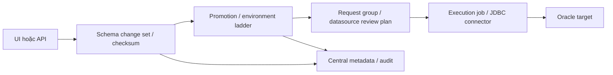

# Rà soát source AccessFlow

Ngày rà soát: 2026-10-04. Phân loại: A (quản lý thay đổi DB) và B (governance SQL), kèm cổng triển khai CI. Nhãn DOC và SOURCE phân biệt tài liệu với mã. Runtime chưa chạy.

## Source và giấy phép

Source ghim: `bablsoft/accessflow@55c209a4d9e4ba09a6c089f90e68a8b16b3f2133`, có trong `evidence/source-manifest.json` và `evidence/product-model/source-manifest.json`. Lệnh chỉ đọc `git ls-remote https://github.com/bablsoft/accessflow.git HEAD` trả cùng SHA. Vì vậy snapshot đã rà soát trùng HEAD chính thức tại thời điểm kiểm tra.

| Nhận định | Loại | Bằng chứng và kết quả |
|---|---|---|
| Mã trong repository chính dùng Apache-2.0. | SOURCE | `evidence/source/bablsoft__accessflow/LICENSE.md`; văn bản Apache-2.0. Chưa thấy cổng trả phí trong luồng schema-change đã rà. |
| Oracle dùng JDBC driver được phân giải riêng. | SOURCE | `connectors/oracle/connector.json:1-22` khai báo `oracle.jdbc.OracleDriver` và Maven `com.oracle.database.jdbc:ojdbc11`; `backend/pom.xml:137-142` nói driver DB khách hàng, gồm Oracle, không được đóng gói sẵn. Cần rà riêng điều khoản phân phối driver Oracle. |
| Dự án phát hành image. | DOC | `README.md:16-25` mô tả image GHCR có tag và Helm chart. Chưa kiểm digest, SBOM hoặc toàn bộ giấy phép trong image. |
| Quyền plugin và driver tách biệt với license gốc. | SOURCE | `connectors/README.md:5-13,52-76` mô tả artifact JDBC/plugin, Maven hoặc URL trực tiếp, cache và bước kiểm chứng. Tệp connector xác định tọa độ driver Oracle. Chưa kiểm JAR thực tế đã resolve, image hoặc giấy phép dependency bắc cầu. |

## Mô hình sản phẩm và Oracle

| Nhận định | Loại | Bằng chứng và kết quả |
|---|---|---|
| AccessFlow có khái niệm organization, datasource, deployment pipeline/environment, request group, schema change set và promotion. | SOURCE | `docs/20-schema-change-governance.md:42-92,94-120,247-252` mô tả change set và promotion bản địa; promotion dùng request group. Đây là nền tảng governance, không phải migration CLI độc lập. |
| Cổng schema change set từ chối bốn nhóm DML được parser nhận diện, nhưng không phải allow-list chỉ nhận DDL. | DOC + SOURCE | `backend/src/main/java/com/bablsoft/accessflow/schemachange/internal/SchemaChangeStatementGate.java:29-40,46-47,74-103,126-152` cho thấy parser chạy theo target và nhóm bị từ chối gồm SELECT/INSERT/UPDATE/DELETE. `docs/20-schema-change-governance.md:149-185` ghi DDL và OTHER đều được nhận. Ví dụ gồm MERGE, UPSERT, CALL, session SET và một số văn bản parser không hỗ trợ. Parser gaps gồm DO blocks, REVOKE, CREATE EXTENSION, CREATE INDEX CONCURRENTLY và SET name TO. |
| Hỗ trợ connector Oracle chưa chứng minh phù hợp với PL/SQL migration. | DOC | `docs/20-schema-change-governance.md:149-185` mô tả parser JSqlParser cho relational DB và các giới hạn parser. Chưa có bằng chứng PL/SQL procedure/package/trigger, slash delimiter, trạng thái compilation hoặc SQLPlus script. Cần kiểm các trường hợp đó trên Oracle mục tiêu. |
| Approval và environment ladder là các tính năng bản địa, kèm giới hạn đáng kể. | DOC + SOURCE | `backend/src/main/java/com/bablsoft/accessflow/schemachange/internal/DefaultSchemaChangePromotionService.java:259-305,321-` kiểm tra rung trước phải APPLIED và yêu cầu datasource có review plan bắt buộc người duyệt khi environment yêu cầu review. `docs/20-schema-change-governance.md:254-329` mô tả `can_ddl`, freeze, mỗi cặp change set/environment chỉ có một promotion mở, review count do datasource plan quyết định, và job chạy sau approval. |
| Promotion lưu checksum, nhưng chưa thấy migration ledger tại Oracle target. | DOC + SOURCE | `backend/src/main/java/com/bablsoft/accessflow/schemachange/internal/DefaultSchemaChangePromotionService.java:164-175` ghi checksum vào audit metadata trung tâm; `SchemaChangeChecksum.java:9-40` định nghĩa SHA-256 theo thứ tự sau chuẩn hóa. `docs/20-schema-change-governance.md:210-224,247-252,335-373` mô tả trạng thái promotion trung tâm và snapshot sau apply. Chưa thấy ledger hoặc lịch sử version do Oracle target lưu giữ trong các đường dẫn đã rà. |
| Tài liệu sản phẩm công bố Oracle là SQL proxy engine được hỗ trợ. | DOC | `README.md:27-29` liệt kê Oracle trong connector catalog. Đây không phải kết quả chấp nhận migration runtime. |

## Cổng và khoảng trống

- Mã repository tự triển khai dùng Apache-2.0. Chưa thấy cổng trả phí trong luồng schema-change đã rà. Điều này không xác nhận license của image, dependency, Oracle JDBC, AI tùy chọn hoặc dịch vụ quản lý secret.
- Oracle: tài liệu và source có connector/driver. Autonomous TCPS, Oracle 19c/21c/26ai, độ chính xác parser PL/SQL, phát hiện compilation INVALID và SQLPlus chưa chạy.
- Governance: tài liệu/source có organization, datasource, pipeline, environment, approval, change set và promotion bản địa. Runtime phải xác minh tách requester/approver, artifact và target đã duyệt không đổi, execution fail-closed và audit đủ actor.
- Ledger: checksum và promotion metadata trung tâm được mô tả. Ledger tại Oracle target và chống replay chưa được chứng minh.
- Hiệu năng: chưa chạy benchmark tương đương. Cần đo proxy, worker, metadata DB và các dịch vụ liên quan cùng lúc.

## Trạng thái kiểm chứng

Runtime: `NOT_RUN`. Không triển khai, chạy test, khởi động service, chạy SQL, đọc credential hoặc thao tác DB. Dòng source thuộc snapshot đã ghim; HEAD chính thức được kiểm tra bằng lệnh chỉ đọc.

## Liên kết source cố định và UI

Các đường source ở trên thuộc cùng SHA đã ghim. Liên kết quan trọng:

- [LICENSE.md](https://github.com/bablsoft/accessflow/blob/55c209a4d9e4ba09a6c089f90e68a8b16b3f2133/LICENSE.md#L1).
- [Oracle connector](https://github.com/bablsoft/accessflow/blob/55c209a4d9e4ba09a6c089f90e68a8b16b3f2133/connectors/oracle/connector.json#L1-L22).
- [SchemaChangeStatementGate](https://github.com/bablsoft/accessflow/blob/55c209a4d9e4ba09a6c089f90e68a8b16b3f2133/backend/src/main/java/com/bablsoft/accessflow/schemachange/internal/SchemaChangeStatementGate.java#L29-L152).
- [Promotion service](https://github.com/bablsoft/accessflow/blob/55c209a4d9e4ba09a6c089f90e68a8b16b3f2133/backend/src/main/java/com/bablsoft/accessflow/schemachange/internal/DefaultSchemaChangePromotionService.java#L259-L321).
- [SchemaChangeChecksum](https://github.com/bablsoft/accessflow/blob/55c209a4d9e4ba09a6c089f90e68a8b16b3f2133/backend/src/main/java/com/bablsoft/accessflow/schemachange/internal/SchemaChangeChecksum.java#L9-L40).
- [Feature guide](https://github.com/bablsoft/accessflow/blob/55c209a4d9e4ba09a6c089f90e68a8b16b3f2133/docs/20-schema-change-governance.md#L149-L185) là DOC, không là source execution proof.

Coordinator đã đọc [Sidebar.tsx:152–275](https://github.com/bablsoft/accessflow/blob/55c209a4d9e4ba09a6c089f90e68a8b16b3f2133/frontend/src/components/common/Sidebar.tsx#L152-L275).
Menu có `/deployments`, `/deployment-versions`, `/schema-change-sets`, `/datasources`, `/admin/deployment-pipelines` và `/admin/audit-log`.
Menu khai báo permission riêng. Static menu không chứng minh server enforcement.
Frontend có [change set list](https://github.com/bablsoft/accessflow/blob/55c209a4d9e4ba09a6c089f90e68a8b16b3f2133/frontend/src/pages/schemaChange/SchemaChangeSetListPage.tsx), [detail](https://github.com/bablsoft/accessflow/blob/55c209a4d9e4ba09a6c089f90e68a8b16b3f2133/frontend/src/pages/schemaChange/SchemaChangeSetDetailPage.tsx) và [environment history](https://github.com/bablsoft/accessflow/blob/55c209a4d9e4ba09a6c089f90e68a8b16b3f2133/frontend/src/components/deployments/EnvironmentHistoryDrawer.tsx).
Cấu trúc trang hỗ trợ đánh giá platform fit. UI reachability/Oracle runtime vẫn NOT_RUN.

## Đường thực thi theo DOC/SOURCE

Target ledger, Oracle compile/replay correctness và crash recovery chưa được chứng minh.
Đường JDBC là của sản phẩm. Ghép Flyway hoặc SQLPlus sẽ là cấu hình adapter riêng cần đánh giá.
