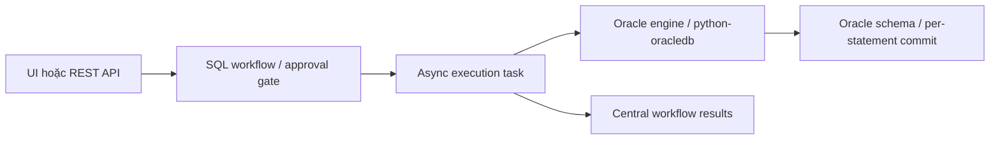

# Rà soát source Archery

Ngày rà soát: 2026-10-04. Archery được phân loại B (governance SQL) với chức năng vận hành DB. Chưa xếp mặc định vào A vì source đã rà chưa chứng minh các đặc tính release/migration P0. Nhãn DOC và SOURCE phân biệt tài liệu với mã. Runtime chưa chạy.

## Source và giấy phép

Source ghim: `hhyo/Archery@ccc7134f48d0e261f9e3ffa0d445dcec48adb790`, có trong `evidence/source-manifest.json` và `evidence/product-model/source-manifest.json`. Lệnh chỉ đọc `git ls-remote https://github.com/hhyo/Archery.git HEAD` trả cùng SHA. Snapshot khớp HEAD chính thức lúc rà.

- **SOURCE, license repo:** [LICENSE tại commit ghim](https://github.com/hhyo/Archery/blob/ccc7134f48d0e261f9e3ffa0d445dcec48adb790/LICENSE#L1-L10) khai báo Apache-2.0.
- **SOURCE, driver Oracle:** [requirements.txt tại commit ghim](https://github.com/hhyo/Archery/blob/ccc7134f48d0e261f9e3ffa0d445dcec48adb790/requirements.txt#L19) pin `oracledb==4.0.1`; [Dockerfile](https://github.com/hhyo/Archery/blob/ccc7134f48d0e261f9e3ffa0d445dcec48adb790/src/docker/Dockerfile#L16) cài dependency này; [setup.sh](https://github.com/hhyo/Archery/blob/ccc7134f48d0e261f9e3ffa0d445dcec48adb790/src/docker/setup.sh#L26-L34) tải Oracle Instant Client 19.21. Driver/client và license của dependency trong image là cổng riêng, chưa audit.
- **DOC, ma trận Oracle:** [README](https://github.com/hhyo/Archery/blob/ccc7134f48d0e261f9e3ffa0d445dcec48adb790/README.md#L25-L42) nói Oracle có query/review/execute/backup/data dictionary/session management; account và parameter management không hỗ trợ. Đây là ma trận tính năng, không phải kiểm runtime.

## Oracle, governance và giới hạn migration

- **SOURCE, kết nối Oracle:** [oracle.py](https://github.com/hhyo/Archery/blob/ccc7134f48d0e261f9e3ffa0d445dcec48adb790/sql/engines/oracle.py#L26-L50) tạo DSN theo SID hoặc service name qua `oracledb`; thiếu cả hai thì báo lỗi. Chưa xác nhận TCPS/wallet trong cấu hình/build mục tiêu.
- **SOURCE, review SQL Oracle:** [oracle.py](https://github.com/hhyo/Archery/blob/ccc7134f48d0e261f9e3ffa0d445dcec48adb790/sql/engines/oracle.py#L736-L807) gọi `get_full_sqlitem_list`, áp dụng regex/prefix và dùng explain cho một số DML/DDL. [sql_utils.py](https://github.com/hhyo/Archery/blob/ccc7134f48d0e261f9e3ffa0d445dcec48adb790/sql/utils/sql_utils.py#L123-L145) dùng `sqlparse.split`; phần `:192-231` có custom delimiter handling. Chưa chứng minh parser cho nested PL/SQL hay script SQLPlus.
- **SOURCE, execution và commit:** [oracle.py](https://github.com/hhyo/Archery/blob/ccc7134f48d0e261f9e3ffa0d445dcec48adb790/sql/engines/oracle.py#L1125-L1152) đặt schema, lặp qua câu đã tách, bỏ dấu `;` cuối với SQL item, execute và commit từng câu. Lỗi giữa script có thể tạo trạng thái một phần; không có transaction nguyên tử cho cả script.
- **SOURCE, kiểm tra INVALID:** [oracle.py](https://github.com/hhyo/Archery/blob/ccc7134f48d0e261f9e3ffa0d445dcec48adb790/sql/engines/oracle.py#L1153-L1205) truy vấn trạng thái object với PLSQL có tên; nếu `INVALID` thì đánh dấu lỗi và ném exception. Điều này chưa chứng minh diagnostics từ `ALL_ERRORS`, bao phủ mọi object type, hoặc quy tắc trạng thái toàn release khi runtime.
- **SOURCE, approval/controller:** [WorkflowApprovalView](https://github.com/hhyo/Archery/blob/ccc7134f48d0e261f9e3ffa0d445dcec48adb790/sql_api/api_workflow_operations.py#L400-L435) yêu cầu `sql.sql_review`, gọi workflow auditor và cập nhật trạng thái approved. [WorkflowExecutionView](https://github.com/hhyo/Archery/blob/ccc7134f48d0e261f9e3ffa0d445dcec48adb790/sql_api/api_workflow_operations.py#L474-L526) yêu cầu execute permission và `can_execute`, rồi đưa job vào queue hoặc xác nhận manual. [sql_review.py](https://github.com/hhyo/Archery/blob/ccc7134f48d0e261f9e3ffa0d445dcec48adb790/sql/utils/sql_review.py#L13-L41) yêu cầu trạng thái đã duyệt/lên lịch và quyền submitter hoặc resource group phù hợp.
- **SOURCE, RBAC platform khác DB role:** các controller dùng Django permission/resource group ở trên; [oracle.py](https://github.com/hhyo/Archery/blob/ccc7134f48d0e261f9e3ffa0d445dcec48adb790/sql/engines/oracle.py#L35-L50) đăng nhập DB bằng account cấu hình. Chưa có bằng chứng RBAC platform ánh xạ thành Oracle role/grant hoặc chặn truy cập chéo schema. Cần kiểm riêng bằng runtime.
- **SOURCE, lưu kết quả trung tâm:** [execute_sql.py](https://github.com/hhyo/Archery/blob/ccc7134f48d0e261f9e3ffa0d445dcec48adb790/sql/utils/execute_sql.py#L60-L99) kiểm workflow state và ghi status/result vào metadata Archery. Các đường dẫn Oracle đã rà không thể hiện migration version/checksum ledger tại target hoặc environment promotion ladder.
- **SOURCE, parser PL/SQL:** `sql_utils.py:123-145,192-231` và vòng lặp Oracle `oracle.py:1132-1151` cho thấy generic splitting/custom delimiter. SQLPlus command, slash delimiter, internal semicolon và mọi procedural form vẫn cần kiểm. Không suy ra lỗi parser chỉ từ việc chưa có bằng chứng.

## Phân loại và khoảng trống

Archery có workflow SQL review/approval, instance management và execute path. Những gì chưa thấy là release identity bất biến, target ledger, kiểm checksum/replay, ordered promotion qua environments, locking/recovery và cross-schema DB authorization. Vì vậy source review xếp **B**; có các hoạt động quản lý DB nhưng chưa đủ căn cứ xếp **A** theo yêu cầu migration governance.

- License repo Apache-2.0. Driver `oracledb`, Instant Client, image và các công cụ review/backup bên ngoài cần rà license riêng.
- Oracle: connector có source; ma trận không xác nhận mọi phiên bản Oracle hoặc Autonomous TCPS.
- Approval có trong controller. POC phải xác minh artifact đúng đã review, requester/approver tách biệt, target ràng buộc và kết quả khi lỗi/retry.
- INVALID detection có trong source với object tên cụ thể. Chưa thấy thu thập lỗi compiler qua `ALL_ERRORS`.
- Quyền Archery là quyền ứng dụng. Quyền Oracle role/grant và cách ly schema là câu hỏi riêng.
- Không có target migration ledger hoặc native environment promotion được chứng minh trong source đã rà.
- Hiệu năng chưa benchmark. Nếu giữ POC cho vận hành SQL, cần tính hàng đợi, app/web, metadata DB và dependency review/backup.

## Trạng thái kiểm chứng

Runtime: `NOT_RUN`. Không deploy, test, start service, chạy SQL, đọc credential hoặc kết nối DB. Các đường dẫn GitHub là commit SHA cố định; HEAD được kiểm tra chỉ đọc.

## UI routes đã kiểm tĩnh

Coordinator đọc [sql/urls.py:30–80](https://github.com/hhyo/Archery/blob/ccc7134f48d0e261f9e3ffa0d445dcec48adb790/sql/urls.py#L30-L80).
Route có `sqlworkflow/`, `submitsql/`, `detail/<workflow_id>/`, `sqlquery/`, `instance/`, `database/`, `group/` và `audit_sqlworkflow/`.
Route user/account tồn tại không chứng minh Oracle account management được hỗ trợ.
Cấu trúc trang là ticket/query/instance/resource group. Chưa có native versioned release/promotion được chứng minh.
Đây là SOURCE về navigation, không là UI runtime PASS hoặc ảnh mới.

## Đường thực thi theo SOURCE

Metadata result khác ledger migration tại target. Native release/promotion chưa được chứng minh.
