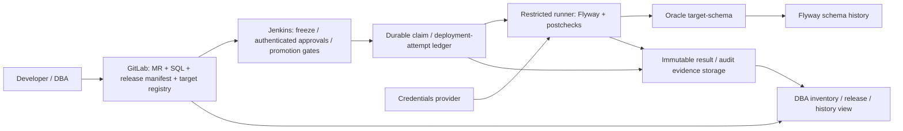

# DB Change Management — POC Design Validation

Ngày kiểm: **07/10/2026**. Phạm vi: khoảng **50 Oracle DB / 20 người**; POC A = ODC + Jenkins/Flyway; POC B = Git + Jenkins/Flyway. **DESIGN + DOC + SOURCE**, sử dụng riêng RUNTIME lịch sử ngày 04/10. Không đăng nhập deployment hiện hữu, không dựng service, không chạy Flyway hoặc Oracle SQL trong vòng này. Không mở rộng catalog.

## 1. Executive conclusion

**Chọn B: `ODC adds insufficient value; proceed with Git/Jenkins/Flyway control plane`.** Đây là quyết định cho operating model hiện tại, không phải kết luận ODC không hỗ trợ Oracle hoặc không có workflow.

ODC **có thể làm approval front-end**: source có `MANUAL`, và POC lịch sử MODEL-08 đã chứng minh ticket dừng ở `WAIT_FOR_EXECUTION` sau duyệt. Vì vậy giả định “approval luôn lập tức chạy native SQL” là sai. Nhưng `MANUAL` là chờ executor **của ODC**: API `/tasks/execute` tiếp tục service task native. Trong controller/model đã kiểm không có contract đăng ký executor ngoài hoặc nhận Jenkins/Flyway result để hoàn tất ticket. `READY_FOR_DEPLOY` cũng không phải enum trạng thái native. [Manual lifecycle](#s04), [flow API](#s05), [RUNTIME lịch sử](#s19).

Có thể poll ticket approved rồi gọi Jenkins, giữ ODC với credential chỉ đọc và lưu kết quả ở dịch vụ bên ngoài. Điều đó **khả thi về thiết kế**, chưa được thử runtime. Tuy nhiên Git binding, target binding, chống dispatch trùng, release/promotion, execution history, recovery và trang tổng hợp vẫn phải tự xây. Sau execution, ODC ticket vẫn `WAIT_FOR_EXECUTION`, mặc định có thể hết hạn sau 48 giờ; không có bằng chứng về writeback external completion. Giá trị bổ sung của ODC là inventory/RBAC/approval UI, trong khi lifecycle release quan trọng nhất vẫn nằm ở composition. [Source lifecycle/expiry](#s04), [inventory](#s02).

**NO-GO cho POC A với yêu cầu ODC là UI control plane khép kín**, trong evidence/build scope này. Không cần fork ODC để làm một approval bridge giới hạn, nhưng để ODC history hiển thị kết quả Flyway như execution native cần supported extension chưa chứng minh hoặc thay đổi backend/frontend. Không chọn fork đó trước baseline B. Không coi notification webhook hoặc “approval integration” là external executor API. [Notification](#s08), [approval integration](#s09).

Kiến trúc cần dựng tiếp: **GitLab MR → Jenkins có deployment approval và promotion gates → restricted Flyway runner → Oracle**, bổ sung **Git target registry, durable attempt/result ledger, trang inventory/release/history cho DBA và audit export**. Đây là composition có custom development; Jenkins/Flyway riêng lẻ không cung cấp đầy đủ UX cho 50 DB. Chi tiết tại §§5–15.

ODC 4.5.0 release note ngày 31/07/2026 công bố OpenAPI cho một số chức năng và MCP; không mô tả external executor completion contract. GitHub `main` được kiểm lại vẫn là pin public tháng 06/2025. Vì chưa map source ↔ image 4.4.1/4.5.0, không mở rộng kết luận absence sang mọi build. Chỉ xem lại A khi có artifact/API chứng minh gap đã đóng. [Pins](#s01), [release mới](#s18).

## 2. State ownership và correlation

### 2.1. Một owner cho mỗi loại state

Bảng dưới mô hình hóa **POC A để kiểm giả định hiện tại**. `P` = authoritative persisted record; `R` = bản sao/projection không được sửa độc lập; `E` = evidence do component tạo; `W` = writer của state lưu tại component khác; `—` = không sở hữu. Jenkins ở đây bao gồm **orchestration ledger phải xây**, không chỉ build page. Oracle là nơi lưu Flyway history; Flyway là sole writer, không tạo thêm một ledger authoritative khác trong máy runner.

| State | Git | ODC | Jenkins | Flyway | Oracle |
|---|---|---|---|---|---|
| SQL source | **P**: commit + SQL bytes | R: SQL preview/copy + digest | R: immutable bundle | Consumer | E: effects/object definitions |
| Release ID | **P**: release manifest | R: description/link | R: run envelope | — | — |
| Change request | R: linked MR/change ID | **P**: flow ID/requester/creation | R: captured request | — | — |
| Approval | E: code review riêng | **P**: deployment approval nodes | R: readback + dispatch snapshot | — | — |
| Target DB | **P**: logical registry + approved snapshot | R: datasource/schema projection | R: resolved snapshot + observed identity | Consumer | E: physical DB/PDB/schema identity |
| Execution status | — | R: external link nếu có; native task state là loại khác | **P**: attempt/deployment decision | E: exit/output | E: observed SQL effects |
| Migration state | E: desired versions/checksums | — | R: history snapshot | **W**: history update | **P**: per-schema Flyway history |
| Audit | E: source/review events | E: request/approval/native audit | **P**: correlated event ledger; nhận evidence từ producers | E: execution output | E: history/object/session evidence |
| Failure state | E: recovery change | R: external summary nếu tích hợp | **P**: failure class/HOLD/recovery decision | E: diagnostics | E: committed effects/locks |

`Target DB` ở bảng là **intended routing metadata**; physical topology do Oracle chứng minh là evidence khác. `Execution status` là deployment attempt của composition; native ODC flow status là state riêng do ODC sở hữu. `Migration state` là những migration Flyway ghi đã applied, không đồng nghĩa mọi object trong Oracle khớp Git. `Audit` P là chuỗi event tương quan; nó giữ provenance của approval/history, không được sửa quyết định gốc của ODC hoặc history Oracle. Nơi lưu bền có thể là database + object storage ngoài Jenkins, nhưng chỉ orchestration identity được ghi attempt/event; UI và logging là readers.

**Thay đổi cho B:** change request = GitLab MR (`P` ở Git); deployment approval = Jenkins authenticated input/event ledger (`P` ở Jenkins); code-review approval vẫn là GitLab state riêng. Không dùng hai approval authority cho cùng target authorization. ODC bị bỏ khỏi dispatch path; migration state và execution state giữ nguyên owner.

| Loại state | Synchronization bắt buộc | Risk và cách phát hiện |
|---|---|---|
| SQL/release | Freeze full commit, bundle SHA-256, file hashes; ODC A preview phải đọc từ bundle | Copy SQL thủ công lệch Git → digest mismatch, chặn dispatch |
| Request/approval A | Re-read flow, **tất cả** approval nodes, strategy, deadline, SQL và target ngay trước claim | Webhook đến sớm, duplicate, revoke/cancel/expiry → event chỉ là hint; lỗi readback giữ HOLD |
| Target | So registry revision với ODC mapping và observed DB/PDB/schema; đổi mapping cần approval mới | Cùng tên DB nhưng khác service/PDB, rename ODC ID → identity mismatch |
| Execution | Claim bền trước queue; build/attempt IDs unique; heartbeat và reconciliation | Jenkins restart/result callback mất → `UNKNOWN`, không giả định FAIL/no effects |
| Migration | Flyway `info/validate` + history/object snapshot sau execution và recovery | SQL đã commit nhưng history chưa ghi → `UNKNOWN_EFFECTS`; không replay tự động |
| Audit | Xuất SQL bundle, approvals và từng attempt khi phát sinh; event ID/sequence/digest | ODC/Jenkins mất log hoặc callback out-of-order → giữ gap explicit, không complete release |

ODC inventory edits không tự sửa registry. A cần reconciliation job báo khác biệt; sửa intended target đi qua Git review rồi cập nhật ODC projection. Chính sách “ODC inventory là owner, Git là owner nữa” bị loại.

### 2.2. Identifiers và khóa idempotency

Ví dụ thiết kế, **không phải IDs của lần chạy mới**:

```text
change_id       = DBCHG-2026-00123
release_id      = REL-2026.10.07-01
git_commit      = abc123... (thực tế bắt buộc full 40-hex commit)
odc_flow_id     = <flow trả về bởi API>          # chỉ A
git_mr          = core/db-migrations!123        # B, source review ở cả A/B
deployment_id   = DBCHG-2026-00123/SIT/core-sit-01/CORE_SCHEMA
attempt_id      = <UUID riêng cho mỗi lần thử>
jenkins_build   = db-migration/428
migration       = 20261007.001 / 20261007.002
history_key     = <target_id, history_schema, history_table, version>
```

`change_id` là ID xuyên suốt, một request cho một immutable release; release có nhiều deployment/environment/target. Đối với A, nhiều flow có thể map vào một change, một flow **mỗi environment/target-schema** để approval không bị hiểu là duyệt mọi DB. B lưu change ID trong release manifest/MR metadata. Release ID được cấp duy nhất qua reviewed manifest; không tự dùng số build làm release ID.

Khóa semantic deployment = `(change_id, environment, target_id, schema, bundle_digest, target_snapshot_digest)`. Claim có unique constraint và owner lease; mỗi retry tạo attempt mới dưới cùng deployment. Một change/release không được bind sang bundle khác; SQL thay đổi cần change/release mới. Job enqueue lại trả existing claim/build, không gọi engine lần nữa. Lock theo `(physical_db_id, pdb_id, schema)` bảo vệ các change chạm cùng schema, kể cả hai service aliases trỏ cùng DB/PDB; không chỉ lock theo display target ID hoặc build. Hết lease khi worker mất heartbeat **không cho worker mới chạy ngay**: reconcile Oracle trước.

```text
ODC flow ID / GitLab MR
  → mapping change_id + release_id + full commit + approved digests
  → deployment_id + attempt_id + Jenkins build URL
  → file/version/checksum + Flyway invocation/output
  → target_id + DB/PDB identity + schema + history row
  → sealed event bundle và audit view
```

ODC `description` có thể giữ change/release/commit/result-view URL từ lúc tạo (§4); đây là **reference tự khai**, không chứng minh Git integration hay immutable approval binding. Adapter phải so SQL lấy từ `parameters.sqlContent` hoặc file content với bundle. Với release nhiều file, tạo review preview từ ordered file bytes theo quy tắc concat đã pin, giữ file hashes trong manifest và riêng `preview_sql_sha256`; so readback với đúng preview này, không so một SQL string với digest của archive. Preview không phải nguồn SQL mà Flyway chạy. Upload chỉ có filename/object ID thì chưa đủ; không đọc được file bytes → HOLD. Không đặt full SQL trong comment để thay artifact.

Flyway history không có cột chuẩn `change_id`, `release_id`, reviewer hoặc pipeline URL. Giữ mapping trong attempt ledger, không ALTER history table. Có thể dùng `installedBy` = token ngắn theo **attempt ID** nếu build/column length cho phép; đó là chuỗi do caller đặt, không xác thực actor. Tài khoản Oracle thực và human approver lưu riêng. [History](#s14), [installedBy](#s20).

### 2.3. Audit phải trả lời được toàn chuỗi

| Trường cần truy xuất | Nguồn authority/evidence | Bằng chứng giữ bền |
|---|---|---|
| change_id, release_id | Git manifest; A mapping tới ODC request | Manifest + mapping event |
| requester | A human ODC creator nếu tự submit; adapter-create lấy human requester từ authenticated intake/Git request; B authenticated MR author | Stable principal ID + provider; giữ ODC creator service ID riêng, không nhận tự do từ job params |
| reviewer | GitLab review record và commit/tree đã review | MR export/review snapshot; A ODC node chỉ gọi reviewer nếu thực sự có node đó |
| approver | A ODC approval node operators; B Jenkins input actors | Node/event IDs, decision, comment, timestamp, policy/digest binding |
| git commit | Git object full SHA | Immutable bundle + SHA-256; không fetch branch HEAD lúc deploy |
| pipeline | Jenkins queue/build/attempt | Build URL, orchestrator source pin, job identity |
| target DB/schema | Registry snapshot + runtime observation | Logical ID, service/PDB identifier, observed schema; sanitized endpoint |
| migration | Manifest + engine output + Oracle history | Filename, version, description, SHA-256, Flyway checksum, installed_rank |
| execution result | Attempt decision dựa engine + postchecks | Exit code, raw output digest, history before/after, postcondition result |
| timestamp | Producer times + ledger received_at | UTC RFC3339, start/end; sequence để không phụ thuộc đồng hồ đồng bộ tuyệt đối |

Audit query theo `change_id` phải liệt kê **mọi target và mọi attempt**, gồm không dispatch, failed và unknown. Jenkins SUCCESS, Flyway history Success và release VERIFIED là ba dữ kiện khác nhau. ODC native audit không tự có external execution; centralized logging/search là projection của sealed evidence, không là nơi tự approve hoặc repair. [Audit source](#s07).

## 3. ODC deep validation

### 3.1. Evidence scope

Backend public pin **`d517c0f27971642fb0cd7565fd61ab2309875ec3`**, frontend **`273fa3c4cc7d87f942ade231ce9220b98fa595e2`**, docs **`40dc7c03522fef1968bd11b2b051bc216091e60d`**. GitHub API kiểm ngày 07/10: backend `main` vẫn pin này; latest GitHub release `v4.3.4_bp2`, 06/06/2025. **Không có mapping đã chứng minh** tới historical image `4.4.1-20260116` hoặc product 4.5.0. SOURCE dưới đây áp dụng code đã đọc; DOC có version riêng; RUNTIME chỉ là evidence cũ. [Pins/license](#s01), [historical image/API](#s19).

### 3.2. Inventory

| Capability | Kết quả cụ thể | Class / evidence | Giới hạn cho operating model |
|---|---|---|---|
| Datasource | `ConnectionEntity/ConnectionConfig`: ID, name, type/dialect, host/port, username/defaultSchema, owner/org/creator, environment, labels, encrypted password | Native; SOURCE [S02](#s02) | Connection record, không phải discovery/CMDB hoặc provisioning Oracle |
| Oracle datasource | `ORACLE` riêng với `OB_ORACLE`; plugin tạo JDBC Thin SID hoặc serviceName và Oracle driver class | Native; SOURCE [S02](#s02); RUNTIME cũ [S19](#s19) | TCPS lab từng cần wrapper; không chứng minh stock image hỗ trợ mọi wallet/DB version |
| Database/schema | `DatabaseEntity`: connectionId, projectId, environmentId, name/alias, sync status/time, existed, object status | Native; SOURCE [S02](#s02) | Oracle schema là entry database trong ODC; instance/service/PDB khác schema |
| Environment/group | Datasource/database environment; project gom các schema/application members; label associations tồn tại | Native + Configurable; SOURCE [S02](#s02) | Không có hierarchy bắt buộc Application→Environment→DB→Schema hay promotion policy chỉ nhờ environment |
| Ownership | Datasource owner với scope PRIVATE/ORGANIZATION, creator/modifier; project membership/roles | Native; SOURCE [S02](#s02), [S03](#s03) | `owner_id` public connection có thể là organization ID; không mặc định business application owner |
| Tags/labels | `ConnectionConfig.labelIds`, `ConnectionLabelRelationEntity` | Native; SOURCE [S02](#s02) | Labels để lọc/hiển thị; không là immutable release target set hoặc DB grant |

**Inventory usable:** có căn cứ model và POC trên một Oracle instance. **50 DB discovery, paging/usability, RO-only schema metadata và session budget chưa RUNTIME**. Synthetic 50 records chỉ kiểm UX/import, không chứng nhận 50 live connections.

### 3.3. Identity, access và edition

| Capability | Điều đã xác minh | Evidence / restriction |
|---|---|---|
| Local users | Local account/password, custom system roles, built-in admin | DOC [S03](#s03); RUNTIME cũ local login [S19](#s19) |
| RBAC | System/resource authority + project roles OWNER, DBA, DEVELOPER, SECURITY_ADMINISTRATOR, PARTICIPANT | SOURCE enum/permission helper [S03](#s03); roles không đồng nghĩa native Oracle roles |
| Project permission | Membership/project-role checks cho view/approve/execute tùy operation | SOURCE [S03](#s03), [S06](#s06); runtime outsider denial có ở [S19](#s19) |
| Datasource/database permission | Source có datasource resource checks và database/table actions QUERY, CHANGE, EXPORT, ACCESS; ASYNC request đòi CHANGE | SOURCE [S03](#s03), [S05](#s05); runtime QUERY/CHANGE/revoke đã kiểm riêng |
| SSO | Docs OAuth2/OIDC/LDAP/SAML; source web starter có các security helper/provider tương ứng | Native + Configurable; DOC/SOURCE [S03](#s03); federation/group mapping chưa RUNTIME |
| Requester/executor SoD | `withExecutableCheck()` cho creator hoặc project OWNER/DBA; requester Execute sau approval từng trả 200 | SOURCE [S06](#s06), RUNTIME [S19](#s19); không phải cấu hình bảo đảm executor độc lập |
| Community vs commercial | Backend/frontend pin Apache-2.0; paths đã kiểm có workflow/RBAC/audit/SSO, không phát hiện seat/instance paywall ở các paths đó | SOURCE [S01](#s01); không có edition matrix đáng tin cậy để bảo đảm mọi image 4.5.0/Oracle feature giống OSS |

**50 DB license:** source Apache không có cap theo số DB/users trong phạm vi đã đọc. Đây không phải certification “mọi binary/dependency miễn phí/unlimited”: MetaDB, Oracle JDBC/client, wrapper, distribution và vendor support phải kiểm theo exact artifacts. Không có bằng chứng rằng feature bắt buộc hiện tại chỉ thuộc commercial ODC, nên **không dùng commercial restriction làm lý do loại ODC**. Gate license/build vẫn chưa hoàn thành.

### 3.4. SQL change workflow

| Capability | Kết quả | Class / evidence |
|---|---|---|
| SQL editor/execution | Workbench/SQL window và JDBC execution; native execution thật trong POC cũ | Native; DOC + RUNTIME [S19](#s19) |
| Order/change/task | Flow instance (ticket), approval nodes, service task, task parameters/result/log; ASYNC là database change | Native; SOURCE [S04](#s04), [S05](#s05), [S10](#s10) |
| SQL review | Built-in SQL check/risk policies; external SQL-audit integration gọi reviewer service | Native + Configurable; DOC/SOURCE [S09](#s09), [S10](#s10); coverage native Oracle rules chưa đầy đủ |
| Approval | Risk→approval flow; approve/reject; detail chứa node operator, decision/status, comment, time, candidates | Native + Configurable; SOURCE [S06](#s06); OWNER/DBA approval RUNTIME cũ |
| Comment | Approve/reject request nhận comment; request có description | Native; SOURCE [S05](#s05), [S06](#s06); chưa thấy generic external-result comment/attachment write API trong controller này |
| Status/history | Native enums, node route, task result/log/download và audit events | Native; SOURCE [S04](#s04), [S05](#s05), [S07](#s07) |
| Git linkage/release | Source có project git repository CRUD, request `description`; flow request không có typed release_id/git_commit/checksum contract | Native repository config; **Integration/Custom** cho immutable release binding; [S05](#s05) |
| Multi-DB/promotion | Có ordered multi-database native tasks; không chứng minh DEV→SIT→UAT→PROD gates cho external Flyway | Native rollout khác contract; SOURCE [S10](#s10) |

Review, approval và execution phải tách nghĩa. SQL rule PASS không thay human approval; project OWNER approval không tự bảo đảm đúng Oracle object validity hoặc version/checksum. Native target migration ledger và replay enforcement chưa được thiết lập ở reviewed worker. [Source survey cũ](research-round-2/coordinator/odc-source-survey-20261006.md).

### 3.5. Audit records có gì?

`AuditEventEntity` chứa event ID/type/action, database ID/name, datasource ID/name/host/port, connection username/dialect, human user ID/name/org, client/server IP, JSON detail, result, task ID, start/end/create/update times. `AuditEventAspect` lấy executed SQL cho console-result events, hoặc serialize request parameters; **detail bị cắt ở 20.000 ký tự**. Với uploaded script có thể chỉ có tên file thay vì toàn SQL. Vì vậy audit trace native có đủ các dimensions user/target/schema/time/result theo event, nhưng không hứa mỗi event chứa đầy đủ SQL bytes hay hợp nhất thành một record. [Entity/aspect/API](#s07).

Approval actors/comment ở flow node detail; API caller Execute phải đối chiếu audit, **không suy từ service-task operator**: detail mapper có fallback creator khi operator null. `completeTime`/update time trên flow cũng không thay engine end timestamp. [Node mapper](#s06).

ODC operation-record DOC nói có view/export; historical POC có 97 audit records theo actor/action/time, nhưng log/attachments của một số ticket không đọc được sau restart. Native audit không ghi Jenkins build hoặc Flyway result nếu ODC không execute. Không đủ làm audit cuối cùng cho A nếu chưa có exporter/correlation store; không tự nâng historical PARTIAL lên PASS. [Audit DOC/SOURCE](#s07), [historical retention limits](#s19).

### 3.6. API validation theo controller/model

Đây là **UI/internal REST routes** ở source pin, không mặc định public API ổn định cho mọi version. Prefix flow = `/api/v2/flow/flowInstances`. Auth/CSRF/session/service identity và compatibility của exact image cần kiểm ở application lab; không gọi API lần này.

| Nhu cầu | Method/path đã tìm | Dữ liệu/caveat | Evidence |
|---|---|---|---|
| Create change | `POST /api/v2/flow/flowInstances/` | `CreateFlowInstanceReq`: databaseId, taskType ASYNC, executionStrategy MANUAL, description, DatabaseChangeParameters; response **list**, phải map từng flow | SOURCE [S05](#s05); historical create RUNTIME [S19](#s19) |
| Query change | `GET /api/v2/flow/flowInstances/{id}`; list/status GET | Status, creator, database, parameters, nodeList; list có scope/query flags | SOURCE [S05](#s05) |
| Read SQL | Detail `parameters.sqlContent` hoặc SQL object IDs; `/tasks/download` | Download chủ yếu artifact/result của task, không mặc định là immutable uploaded SQL trước execution; thử exact file-storage API nếu chọn uploads | SOURCE [S05](#s05), [S10](#s10) |
| Read approval | Detail `nodeList` | Mỗi approval node/operator/comment/status/autoApprove/times; cần verify cả route và required policy | SOURCE [S06](#s06) |
| Approve/reject | `POST .../{id}/approve`, `/reject` | Comment + server auth; adapter không tự approve thay người | SOURCE [S05](#s05) |
| Update status | `/cancel`, `/tasks/execute` là **actions native** | Không có generic PUT/PATCH flow status hoặc external-complete route trong controller đã đọc; rollback route ném UnsupportedOperationException | SOURCE [S05](#s05) |
| Read task result/history | `GET .../{id}/tasks/result`, `/tasks/log`, `/tasks/log/download` | Native task output, không nhận kết quả Flyway | SOURCE [S05](#s05) |
| Retrieve audit | `GET /api/v2/audit/events`, `/events/{id}`; `POST /events/export` | List mặc định personal khi thiếu fuzzyUsername; organization read có auth riêng; exporter phải kiểm scope/paging/time overlap | SOURCE [S07](#s07) |
| External approval | Built-in integration cấu hình start/status/cancel cho approval provider | **ODC gọi approval service**, không phải engine ngoài hoàn tất SQL task | DOC [S09](#s09) |
| Webhook | Custom HTTP notification channel + rules | Tín hiệu notification; không chứng minh durable deploy callback/signature/exactly-once | DOC [S08](#s08) |

4.5.0 có DOC OpenAPI/MCP nhưng **coverage/auth/writeback UNKNOWN**. Không dùng OCP `/api/v2/tasks/instances` làm ODC endpoint: đó là sản phẩm khác. Việc tìm trong public source không chứng minh mọi commercial/current build thiếu extension. [4.5 release](#s18).

### 3.7. Native execution risk — source trace

Đường reviewed: flow/task → `DatabaseChangeRuntimeFlowableTask` → `DefaultConnectSessionFactory` → `DatabaseChangeThread` → JDBC statement callback → Oracle. Đây là native executor, không phải wrapper Flyway. [Worker](#s10), [session/driver](#s11).

| Điểm kiểm | SOURCE/DOC xác lập | Hệ quả |
|---|---|---|
| Transaction/autocommit | Worker tạo default session factory; constructor mặc định autoCommit=true. Thread split SQL và execute từng statement; không thấy transaction atomic bao toàn release | Không dùng SQL-window manual commit để suy async task atomic. Oracle DDL commit theo DB semantics dù đổi JDBC autocommit [S13](#s13) |
| Timeout | Parameters mặc định 172.800.000 ms (48h); statement setQueryTimeout theo giây. Oracle initializer đọc profile IDLE_TIME, bắt lỗi rồi tiếp tục; không đặt OB timeout vars cho ORACLE | Query timeout, idle timeout và total task expiration khác nhau; timeout không chứng minh không có committed effects |
| Session | Async task có session riêng, current schema/timezone; finally expire session. Factory mặc định autoReconnect=true, keepAlive=false cho constructor này | Reconnect không khôi phục transaction/session state cũ hoặc giải quyết uncertain effects |
| Cancellation | Runtime cancel gọi `stopTaskAndKillQuery`; đặt stop rồi kill query, **kill exception bị catch/log**, sau đó cập nhật task cancel. Native Oracle plugin tạo `ALTER SYSTEM KILL SESSION ... IMMEDIATE`; lấy SID/SERIAL# qua V$SESSION, fallback SESSIONID nếu đọc thất bại | Cần session/kill privileges thích hợp; fallback SESSIONID không chứng minh có đúng SID,SERIAL# để kill. “Cancelled” không là bằng chứng Oracle stopped/rollback; không cấp ALTER SYSTEM cho inventory RO chỉ để cancel |
| Retry | retryTimes mặc định 0, interval 180.000 ms; vòng retry chạy lại **statement** khi lỗi nếu cấu hình >0 | Cấu hình retry=0 giảm risk; bật retry có thể replay DDL đã commit khi response mất |
| Execution/failure reduction | ABORT hoặc failCount>0 với markAsFailedWhenAnyErrorsHappened → fail; IGNORE + flag false có thể task succeed dù có failed statements | Tổng trạng thái không thay per-statement diagnostics; dùng ABORT/mark failed nếu kiểm native |
| Oracle driver | Native ORACLE plugin tạo SID/service JDBC Thin URL và driver class; deployed TCPS task path từng cần wrapper | Driver image/module/version/transport phải pin; không suy OceanBase Oracle behavior sang Oracle |
| Connection/pool | Console executor dùng `SingleConnectionDataSource` với lock/reconnect; backend metadata factory dùng Druid, source maxActive=5, initialSize=2, maxWait=5s, connect/socket=60s | Các số này là **per factory**, không global cap 5 cho 50 DB. MetaDB pool khác target connection; inventory/session fan-out cần đo |
| Migration state | Statement/result files, task status; reviewed path không có Flyway target ledger/checksum/dedup | Task ID không đủ replay protection hoặc recovery after crash |
| Oracle validity | Callback success chủ yếu JDBC/result; source survey không thấy authoritative ALL_OBJECTS/ALL_ERRORS gate trong worker | Historical INVALID procedure nhưng ticket thành công là RUNTIME FAIL; explicit postcheck vẫn cần cho Flyway |

Nguồn chính của bảng: [S10](#s10), [S11](#s11), [Oracle DDL](#s13), [historical INVALID/session/TCPS](#s19). 4.5.0 release note nói đã sửa hardcoded max_active và task/multi-DB defects; không áp số pin cũ cho 4.5.0. [S18](#s18).

**Giữ restriction block native migration execution cho A.** Mục đích: một executor/version stream, tránh hai hệ execute cùng release, giữ target ledger và recovery ownership rõ. Điều này không phủ nhận giá trị ODC SQL workbench cho stream khác đã phân quyền riêng. Flyway bổ sung history/checksum nhưng **không biến Oracle DDL thành atomic và không tự chứng minh PL VALID**.

## 4. Workflow-only feasibility

### 4.1. Kết luận theo từng mức

| Yêu cầu | Mức | Kết luận |
|---|---|---|
| Create→review/check→approve→chờ | **Native + Configurable** | Có MANUAL → WAIT_FOR_EXECUTION; SOURCE và RUNTIME cũ |
| Chờ mà không execute SQL migration | **Configurable** | Có khi MANUAL; precheck có thể đọc metadata/SQL analysis, không được gọi đây là “không kết nối DB” |
| READY_FOR_DEPLOY exact state | **Integration** | Derived state trong adapter sau verify policy/digests; không phải ODC native enum |
| Trigger Jenkins sau approval | **Integration** | Poll detail là reference; notification webhook tùy chọn giảm latency, luôn readback |
| Ngăn native execution đối với managed stream | **Integration + DB grants** | ODC chỉ có account RO không phải schema owner; gateway/endpoint restrictions ngăn native execute/AUTO intake. Chưa có một native “external-only” switch được chứng minh |
| Native ODC history hoàn tất theo Flyway result | **Custom / chưa chứng minh supported path** | Không thực hiện được bằng controller đã kiểm; cần supported extension hoặc backend/frontend change |
| Unified audit/result ngoài ODC | **Custom service/view** | Khả thi theo thiết kế, không cần ODC fork; user phải dùng thêm result UI |

MANUAL wait expiry mặc định **48h** qua `odc.task.default-wait-execution-expiration-interval-hours`. Cấu hình kéo dài/disable timer ở source không biến task thành external execution; không dùng endless WAIT backlog làm completion model. [S04](#s04).

### 4.2. Workaround A có thể xây, với giới hạn công khai

1. Git freeze bundle; adapter lập mapping, tạo ASYNC MANUAL ticket với SQL preview và description chứa change/release/full commit/digests + stable URL của **external result view**. POC intake ban đầu chọn inline SQL nhỏ để tránh chưa biết upload readback API.
2. Reviewer/DBA approve trong ODC. Adapter poll GET detail; đòi đúng target, MANUAL, WAIT_FOR_EXECUTION, required human nodes, unexpired và matching SQL digest. Không dispatch dựa chỉ vào HTTP 200 approve hoặc một notification.
3. Adapter tạo durable deployment claim, đóng cửa revoke theo dispatch cut-off rồi gọi Jenkins. Re-read/cancel trước engine start. Cancel/revoke sau cut-off là yêu cầu stop/HOLD cho worker; không hứa rollback hoặc thu hồi DDL đã commit. Do ODC không có atomic approval-consume với adapter, race approval→dispatch phải được chấp nhận như product policy hoặc sửa integration; chặn GO nếu policy đòi instant revocation.
4. Jenkins/Flyway chạy bằng secret khác; output vào ledger/evidence. **Không gọi ODC `/tasks/execute`**; không dùng native SQL “SELECT 1” làm task success thay release; không cập nhật trực tiếp MetaDB/Flowable để giả completion.
5. ODC giữ native WAIT/EXPIRED/CANCELLED; external view hiển thị deployment verdict riêng và approval snapshot tại dispatch. Cần closure policy riêng hoặc external task implementation nếu muốn native ticket complete. Description link có text là SOURCE-confirmed; **clickable link rendering/UX trong exact UI chưa kiểm**.

Giới hạn security: ASYNC request cần **ODC CHANGE permission** ngay cả khi datasource Oracle là RO. Đây là hai lớp quyền khác nhau. Chỉ bỏ CHANGE sẽ chặn cả tạo ticket; chỉ ẩn nút Execute không chặn API. Muốn giữ human ODC submission cần deny native execute endpoints/other write task paths trên gateway, không cho bypass vào backend, chỉ adapter tạo MANUAL ticket đã freeze; nếu giữ direct user intake thì phải validate strategy/content bằng admission integration. Vì không thấy native admission switch, đó là code vận hành cần duy trì. Các prechecks/metadata cần quyền quá rộng thì HOLD, không cấp DBA/ANY cho RO account. [Permission/create](#s03), [request default AUTO/API](#s05).

Nếu adapter POST bằng service identity, **native ODC creator là service identity**, không phải developer. Model create đã kiểm không có field cho phép tùy ý impersonate requester. Human `requested_by` phải đến từ authenticated intake/MR evidence và được bind vào envelope; audit ghi cả human requester lẫn API actor. SoD gate so approvers với human requester, không chỉ so với ODC creator service. Không dùng description `requested_by=alice` làm identity evidence. Đây là thêm integration work của A, không native actor propagation. [Create model](#s05).

Ví dụ ODC intake body cho **một migration** (databaseId placeholder, không gửi API); runner envelope §5 là interface khác:

```json
{
  "databaseId": 101,
  "taskType": "ASYNC",
  "executionStrategy": "MANUAL",
  "description": "DBCHG-2026-00123; REL-2026.10.07-01; <commit/digests/result-ref>",
  "parameters": {
    "sqlContent": "ALTER TABLE CUSTOMER ADD RISK_LEVEL VARCHAR2(20);",
    "generateRollbackPlan": false,
    "errorStrategy": "ABORT",
    "markAsFailedWhenAnyErrorsHappened": true,
    "retryTimes": 0,
    "timeoutMillis": 172800000,
    "delimiter": ";"
  }
}
```

`databaseId` phải resolve từ approved schema mapping; executionStrategy không bỏ trống vì default AUTO. Fields là SOURCE model, **không là RUNTIME validated request của exact image**. Với release hai files, dùng preview rule trên hoặc verified file-intake path; adapter không tự execute preview/native task sau approval.

**Phương án “Git MR merged → ODC record linked → Jenkins”**: nếu ODC approval không được gate Jenkins, ODC chỉ là record/inventory satellite; không phải deployment authority. Nếu Jenkins vẫn gate qua ODC thì quay lại workaround trên. Không duyệt cùng một deployment ở cả Git/Jenkins và ODC rồi để hai nơi có quyền quyết định ngược nhau.

### 4.3. Blocking gap và mức thay thế

Gap đã chứng minh trong phạm vi reviewed controller: **không có external-completion lifecycle**, đồng thời thiếu immutable Git/target/approval consume contract. Không phải gap Oracle inventory. A chỉ đáp ứng full UI khi xây overlay hoặc source extension; overlay vẫn phải làm hầu hết B. Vì baseline đã có thể cung cấp owner/model rõ với fewer component boundaries, chọn B thay ODC trong control path.

Không mở catalog mới. Nếu sau baseline vẫn cần mua một integrated DB platform, **Bytebase Enterprise** đã có trong shortlist là benchmark hiện có đáng kiểm tiếp bằng exact entitlement/API/Oracle correctness; không đổi sang Bytebase + Flyway cùng stream. **CloudDM + Flyway** hiện là candidate optional, không tự coi HttpCall/action là đã giải quyết ownership/recovery; native CloudDM NO-GO giữ nguyên. [Shortlist hiện có](solution-shortlist.md), [reference architectures](reference-architecture.md).

## 5. Flyway integration contract

### 5.1. Input envelope

Minimum fields của yêu cầu chưa đủ để chống wrong target/replay; thêm digests, identity policy, expiry và attempt IDs. Ví dụ dưới là **schema-shaped DESIGN**, placeholders không dùng làm production values. `database` là logical DB/service ID; Oracle schema là field riêng.

```yaml
contract_version: "1"
change_id: DBCHG-2026-00123
release_id: REL-2026.10.07-01
git_commit: "<full-40-hex-sha>"
environment: SIT
database: core-sit-01
schema: CORE_SCHEMA
migration_path: migrations/core-customer
requested_by: "<identity-provider>:<immutable-user-id>"
approved_by:
  - "<identity-provider>:<reviewer-or-dba-id>"
target_id: core-sit-01/core-schema
migration_stream: core-customer
deployment_id: DBCHG-2026-00123/SIT/core-sit-01/CORE_SCHEMA
attempt_id: "<uuid>"
bundle_sha256: "<64-hex>"
target_snapshot_sha256: "<64-hex>"
policy_sha256: "<64-hex>"
approval:
  authority: "odc-or-jenkins"       # chọn đúng một, không literal này
  record_ids: ["<approval-node-or-event-id>"]
  decided_at: "<UTC-RFC3339>"
  valid_until: "<UTC-RFC3339>"
  envelope_sha256: "<digest-of-approved-material>"
  evidence_uri: "<immutable-evidence-reference>"
target_version: "20261007.002"
history_schema: CORE_SCHEMA
history_table: flyway_schema_history
credential_ref: oracle/core/SIT/core-sit-01/CORE_SCHEMA/migration
expected_target_identity:
  service_name: "<service>"
  pdb_name: "<PDB-if-applicable>"
  database_unique_name: "<DB-identity>"
migrations:
  - file: V20261007_001__customer_risk_level.sql
    version: "20261007.001"
    sha256: "<64-hex>"
  - file: V20261007_002__customer_index.sql
    version: "20261007.002"
    sha256: "<64-hex>"
```

Canonical approved material = change/release, full commit, bundle+ordered migration list, environment/target/schema/history routing, target snapshot, credential **reference**, policy, requested identity, predecessor attestations và expiry. Approval decision record/signature đứng ngoài material để tránh digest tự tham chiếu; attempt/build IDs được cấp khi dispatch và link về envelope, không đổi approved material. Manifest trong Git không tự chứa SHA của chính commit đó: resolver lấy commit từ Git và tạo envelope sau freeze.

Requester/approved_by **do authority resolve**, không tin strings client gửi. A đọc native node actors và authenticated human requester provenance (§4), rồi enforce độc lập requester/reviewer/DBA; B lấy authenticated input actor rồi validate groups/SoD. Trusted orchestration code ở repo/library tách quyền khỏi SQL-authoring repo; SQL author không sửa Jenkinsfile, shell hooks/callbacks hay endpoint để lấy deploy secret. Không chạy arbitrary Jenkinsfile từ MR với migration credential.

Runner resolve credential/endpoint từ registry đã duyệt, không nhận tùy ý JDBC URL/password/schema từ parameters. Reject path traversal/extra migration/callback/placeholders chưa duyệt. Cấu hình history/defaultSchema và `target=20261007.002` pinned; **`target` là version, không chọn database**. Trước migrate, `info/validate` phải cho pending set đúng manifest và expected baseline; không tự apply migration cũ ngoài approval. Bundle chứa history migrations cần validate, còn executable pending set chỉ là set đã duyệt. [Version/history/target](#s14), [S20](#s20).

### 5.2. Output contract

Output sau là wrapper-normalized contract; Flyway JSON native không tự cung cấp đầy đủ fields này. `migration_version/description` dạng scalar đáp ứng minimum, nhưng **mỗi migration cần một entry** để biểu diễn partial release.

```yaml
contract_version: "1"
change_id: DBCHG-2026-00123
release_id: REL-2026.10.07-01
deployment_id: DBCHG-2026-00123/SIT/core-sit-01/CORE_SCHEMA
attempt_id: "<uuid>"
status: "<VERIFIED|FAILED|UNKNOWN|BLOCKED|NOT_STARTED>"
start_time: "<UTC-RFC3339-or-null>"
end_time: "<UTC-RFC3339-or-null>"
flyway_version: "<actual-version-or-null-if-not-started>"
target_database: core-sit-01
target_schema: CORE_SCHEMA
migration_version: "20261007.001"
migration_description: customer risk level
error: null                         # hoặc class/code/sanitized-message
pipeline_url: "<jenkins-build-url>"
engine_started: false               # giá trị minh họa, không là kết quả lần chạy
engine_exit_code: null
engine_status: "<NOT_STARTED|SUCCESS|FAILED|UNKNOWN>"
postcheck_status: "<NOT_RUN|PASS|FAIL|UNKNOWN>"
observed_target_identity: null
history_before_sha256: null
history_after_sha256: null
raw_output_uri: "<sealed-output-reference>"
migrations:
  - version: "20261007.001"
    description: customer risk level
    script: V20261007_001__customer_risk_level.sql
    checksum: null
    state: "<Pending|Success|Failed|UNKNOWN>"
    installed_rank: null
    installed_by: null
    installed_on: null
  - version: "20261007.002"
    description: customer index
    state: "<Pending|Success|Failed|UNKNOWN>"
recovery_required: false
```

Flyway `migrate` JSON có migrations/version/description/filepath/executionTime, flywayVersion/database và warnings; wrapper thêm IDs/times/error/build URL, exit code, before/after `info`/history và postchecks. Parse pinned output theo schema; giữ raw output cả khi parse fail. **Không tìm được output ≠ engine chưa chạy**. [Migrate DOC](#s14).

`VERIFIED` chỉ khi intended/observed target khớp, expected history thành công, checksum validation đúng, postconditions PASS và evidence persist thành công. Engine success nhưng PL INVALID → deployment FAILED/postcheck, history vẫn Success; không chạy lại applied version. Evidence export fail sau DDL → UNKNOWN/HOLD tới khi phục hồi evidence. History table chỉ ghi successful/failed engine migrations, không ghi approval/result exporter failure. [History/repair](#s14).

### 5.3. Data storage boundaries

| Data | Git | ODC A | Jenkins/ledger | Flyway history tại Oracle | Central logging/evidence |
|---|---|---|---|---|---|
| SQL/manifest/targets | Primary immutable revision | Preview/reference copy | Bundle/hash snapshot | Script/version/checksum, không full SQL | Sealed bundle copy + provenance |
| Request/actors | MR/reviewer và release identity | Primary ticket/approval A | Authority snapshot; B primary deploy approval | DB installed_by, không human approval | Export native approval events |
| Secret | **Không**; chỉ refs | Chỉ inventory RO encrypted | Provider refs; secret chỉ lúc runner cần | Không lưu secret | Không ghi secret/wallet content |
| Execution/results | Links tùy chọn | Native status riêng; external link giới hạn | Primary deployment/attempt/migration mapping | Primary applied history, sole writer Flyway | Raw output + snapshots + normalized events |
| Promotion/recovery | Policy/runbooks/forward fix reviewed | Không native enforce external flow | Primary decision/claims/HOLD | Current history + Oracle postcheck evidence | Durable decision chain, append correction |

### 5.4. Dispatch/reconciliation state machine

```text
DRAFT → REVIEWING → APPROVED → READY_FOR_DEPLOY → CLAIMED → RUNNING
                    |              |               |
                REJECTED       EXPIRED/HOLD      dispatch lỗi trước start → NOT_STARTED
RUNNING → ENGINE_SUCCEEDED → VERIFIED
RUNNING → FAILED hoặc UNKNOWN → HOLD → RECONCILED → retry mới / forward fix / stop
```

Các trạng thái trên là **composition**, không rename ODC enum. Release aggregate = tất cả required deployments VERIFIED; có subset success + stop/fail → `PARTIAL_HELD`; có unknown → `UNKNOWN_HELD`. Target chưa chạy = `NOT_STARTED` hoặc `BLOCKED_BY_PREDECESSOR`, không FAIL. Ledger không sửa history để khớp desired status.

Queue delivery at-least-once, semantic claim idempotent; không hứa exactly-once DDL khi network/session chết. Claim timeout, ODC API outage, revoked/expired approval, checksum/identity mismatch đều giữ HOLD. Reconciler dùng observer đọc target/history, xác nhận worker/session đã dừng và lưu quyết định có actor trước attempt mới; không tự retry migrate/repair/clean. Các handler/exporter retries chỉ retry **publication của cùng result**, không retry SQL.

## 6. Credential architecture

### 6.1. So sánh bốn lựa chọn

| Lựa chọn | Điểm dùng được | Giới hạn cho 50 Oracle DB | Quyết định thiết kế |
|---|---|---|---|
| Jenkins Credentials | Credentials IDs, encrypted controller storage; username/password, secret file; scope theo folder/job qua plugin/config | Rotation/static-account lifecycle và vault-style audit phải bổ sung; người sửa trusted pipeline có thể dùng secret, masking không là access boundary | Reference cho POC B nếu chưa có manager; folder application/env, credential riêng mỗi target/schema, agent restricted [S15](#s15) |
| HashiCorp Vault | KV secret retrieval, auth/policy/audit; Oracle DB plugin hỗ trợ static/dynamic credentials | Oracle plugin current docs yêu cầu **Vault Enterprise**; client/plugin compatibility và provisioning/revocation grants cần kiểm. Không mặc định dynamic Oracle credentials miễn phí | Nếu đã có Vault, POC lấy **KV static secret**; dynamic/rotation plugin là gate riêng, không dependency cho baseline [S16](#s16) |
| Kubernetes Secrets | Secret mounted vào job/container với service account và RBAC | Base64 không encryption; mặc định etcd unencrypted, namespace/pod-create quyền có thể làm lộ secret; không tự có rotation/SoD/release approval | Delivery mechanism nếu hạ tầng đã có K8s; encryption-at-rest + RBAC + external store khi phù hợp. Không dựng K8s chỉ để POC [S16](#s16) |
| ODC datasource credentials | SOURCE có `passwordEncrypted`, `readonlyPasswordEncrypted`, cipher/salt; encrypt khi persistence bằng organization encryptor | ODC decrypt để connect; phải bảo vệ MetaDB/key/backups. Không chứng minh external-vault reference native trong datasource model | A chỉ lưu **inventory RO** ở encrypted datasource storage; không lưu migration secret. Không có password plaintext trong config/repo [S12](#s12) |

Không xem Jenkins credential ID, Vault KV ref hoặc K8s Secret name là bí mật thay thế quyền truy cập; chúng là routing refs. Không cho users chuyển credential ref tới PROD mà giữ target DEV. Chính sách provider kiểm binding app/env/target/schema + authorized runner.

### 6.2. Accounts và separation of duty

```text
ODC / inventory observer: oracle_inventory_ro_<target>
    → CREATE SESSION + metadata/object SELECT cần thiết, giới hạn schema

Jenkins restricted runner: oracle_migration_rw_<target_schema>
    → quyền migration scope đã duyệt, không generic DBA/ANY default

Recovery operator: quyền riêng có approval và evidence
    → chỉ reconcile/repair/forward fix trong runbook được duyệt
```

**RO riêng dùng được về nguyên tắc**, nhưng coverage inventory metadata bằng least privilege phải thử; `defaultSchema=CORE_SCHEMA` giúp routing/preview, không cấp quyền. RO account không là CORE_SCHEMA owner, không có business write/DDL/unsafe EXECUTE hoặc ANY quyền; chỉ đổi tên account thành `_ro`, đặt JDBC readOnly hoặc cấu hình ODC read-only username là chưa đủ. Không cấp SELECT ANY DICTIONARY/DBA để “làm inventory chạy” nếu chưa chứng minh nhu cầu tối thiểu. Source timeout probe DBA_PROFILES/DBA_USERS có thể fail/log; không vì probe đó tăng privilege. [S02](#s02), [S11](#s11).

Với ~50 DB, số secret tính theo target-schema/env, có thể nhiều hơn 50; không dùng một migration account/password cho cả estate. DBA sở hữu grants/target mapping; secret admin quản lý storage/rotation; reviewer/approver không đọc migration secret; runner chỉ lấy secret **sau approval+claim**, một target mỗi attempt. ODC app compromise chỉ chạm RO boundary; Jenkins controller/trusted pipeline compromise vẫn là deploy trust boundary cần quản trị riêng.

Nếu migration dùng schema-owner credential, account đó có quyền DDL trong schema; rotation/secret access bảo vệ và caller identity ghi audit riêng. Proxy/delegated schema deployment chỉ chọn sau khi DBA xác minh supported grants, không tự chuyển sang CREATE ANY TABLE để deploy nhiều schema. Evidence ghi credential reference/version và actual DB principal, **không secret value**. Không truyền password trong URL/CLI args/logs; wallet/temp config giữ ngoài workspace/artifacts, quyền file hạn chế và cleanup trên agent. Jenkins masking không bảo vệ trước script độc hại.

## 7. Multi-DB model

Logical desired model:

```text
Application: Core Banking (app_id=core)
  DEV  → core-dev-01  → CORE_SCHEMA
  SIT  → core-sit-01  → CORE_SCHEMA
  UAT  → core-uat-01  → CORE_SCHEMA
  PROD → core-prod-01 → CORE_SCHEMA
```

Registry Git = app_id, environment, target_id, DB/service/PDB identity, schema, owner_group, migration_stream, history location, credential refs, display labels và connection-profile reference. Chỉ metadata không bí mật. Distinguish DB instance vs service/PDB vs schema: một physical DB có nhiều services/schemas; 50 registered connection records không luôn là 50 independent instances.

| Logical concept | Mapping ODC A | Native hay workaround |
|---|---|---|
| Application | Project `Core Banking` và project roles | Native project; app_id/business owner mapping bằng registry |
| Environment | Environment DEV/SIT/UAT/PROD trên datasource/database | Native; approval/rollout order riêng |
| Database instance/service | Datasource `core-prod-01`, Oracle service/PDB connection profile | Native connection; physical identity/profile constraints thêm registry |
| Schema | ODC database entry `CORE_SCHEMA` linked datasource/project | Native schema model; RO grants/default schema cần test |
| App→env→DB→schema hierarchy | Filter project/environment + naming/labels | **Configurable mapping**, không hierarchy enforcement native được chứng minh |
| Owner/tag | Project role + labels; datasource creator/org owner riêng | Native fields + explicit business-owner mapping |
| Release matrix across 50 DB | Deployment ledger/view keyed target-schema | **Custom**; native multiple-change UI không là Flyway fleet history |

Một schema thuộc project theo `projectId`; application sharing schema không tự map nhiều project owners: registry chỉ định **một migration_stream owner**, các app phụ thuộc có review visibility. Mỗi stream có một history table/owner; hai application migrations chạm cùng schema phải dùng chung coordinator/lock, không hai executor độc lập.

ODC thêm UI inventory hữu ích; B cần trang đọc registry với filter application/environment/owner, target/schema preview, last verified release, current history observation và stale/unknown badge. “Connected/healthy” chỉ hiển thị từ observation thật có timestamp, không suy từ tồn tại record. POC dùng 50 synthetic records; scale/live connections vẫn UNKNOWN. [Inventory source](#s02).

## 8. Release model và promotion

Release **`REL-2026.10.07-01`**, change **`DBCHG-2026-00123`**:

```text
migrations/core-customer/
  V20261007_001__customer_risk_level.sql
  V20261007_002__customer_index.sql
```

Migration 001 minh họa, **không execute**:

```sql
ALTER TABLE CUSTOMER ADD RISK_LEVEL VARCHAR2(20);
```

Migration 002 là index change cùng release; index definition/postcondition phải review riêng trước implementation. Flyway diễn giải underscore trong version thành dotted components (`20261007.001`, `20261007.002`); cùng version/checksum trên mọi target đã promote. SQL bytes giữ nguyên; nếu placeholders/callbacks cần dùng, toàn effective config và nội dung cũng phải được digest/approve. [Versioned migrations](#s14).

| Câu hỏi | POC A | POC B |
|---|---|---|
| Code review ở đâu? | GitLab MR cho immutable SQL, trước ODC ticket | GitLab MR cho immutable SQL |
| Deployment approval ở đâu? | ODC ticket **theo environment/target set**, adapter bind digest | Jenkins authenticated input, capture actor/event/digests; không nhận approved_by tự khai |
| Target ở đâu? | Registry snapshot trong Git + ODC projection và ticket target | Registry snapshot trong Git + Jenkins parameter form chỉ chọn IDs allowed |
| Migration version ở đâu? | Git filenames/manifest; applied state trong Oracle Flyway history | Giống A |
| Promotion enforce ở đâu? | **Jenkins orchestration ledger/policy**, không ODC environment field | **Jenkins orchestration ledger/policy** |
| Release visibility ở đâu? | Custom release view; ODC native ticket không có external completion | Custom release view cùng inventory/history |

Default policy thiết kế có thể đảo ngược: DEV có reviewed artifact và authorized requester dispatch; SIT/UAT có independent approver; PROD có DBA và application approver khác requester và khác nhau. A required nodes cần map đúng ODC flow/risk policy; B dùng hai authenticated input gates. Dù platform admin có quyền override, audit ghi rõ actor và policy violation/break-glass; không gọi quyền admin là bypass không tồn tại. Jenkins input `submitter` có admin exception, nên wrapper vẫn validate captured actor với policy. [Jenkins input](#s15).

```text
DEV: all required target-schema VERIFIED
  ↓ predecessor attestation cùng bundle/policy scope
SIT: approval mới + all required target-schema VERIFIED
  ↓
UAT: approval mới + all required target-schema VERIFIED
  ↓
PROD: approval + maintenance window + wave rollout
```

Phải kiểm predecessor status/digest trong durable ledger trước mỗi dispatch, kể cả job gọi trực tiếp; MR merge không grant mọi environment. Đổi SQL/target set/predecessor policy → approval mới; thay SQL tạo version/release mới, không sửa applied migration. PROD triển khai wave, serial concurrency=1 trong POC; stop-on-failure/unknown. History/version nâng trên từng schema; không có global Oracle transaction qua 50 DB. Không promote SIT thất bại bằng cách manually parameterize job PROD.

Các environment có số DB khác nhau dùng explicit mapping tương ứng logical stream/cohort; “all required predecessor” là set đã freeze, không đòi 50 DEV nếu thực tế chỉ có 5. Backfill/special exception phải có approval với scope và audit riêng; không silently skip predecessors.

## 9. Failure/recovery scenarios

### 9.1. Quy ước đọc status

Scenario là migration 001 ở §8. Tất cả dưới đây là **DESIGN simulation, không RUNTIME**. Owner `J` = orchestration attempt/release ledger; `O` = authoritative Oracle effects/Flyway history evidence. Native ODC trạng thái ghi riêng với external deployment verdict để tránh hiểu nhầm.

Với A, ký hiệu **W** trong bảng = ODC `WAIT_FOR_EXECUTION`, hoặc `WAIT_FOR_EXECUTION_EXPIRED` nếu deadline qua; ODC không biết engine result. External result view mới có verdict. Với B ODC = `N/A`. Cancel ticket chỉ là cancel approval/workflow, không chứng minh Oracle rollback. Flyway labels là state theo `info` + raw output/history, không tự tạo history row cho mọi lỗi.

| Case | State owner / visible deployment | ODC A / B | Jenkins | Flyway / Oracle state |
|---|---|---|---|---|
| 1. Jenkins fail trước Flyway | J: `NOT_STARTED`, execution-stage evidence xác nhận chưa spawn | W / N/A | FAILURE hoặc ABORTED trước engine_start | Not invoked; versions Pending so với prior history |
| 2. Flyway connect fail | J: `FAILED_CONNECT`, không SQL start; O chứng minh target chưa đổi khi có observation | W / N/A | FAILURE, sanitized connect error | Engine invoked nhưng connect lỗi; không có history write mới dự kiến, prior state có thể chưa đọc được |
| 3. Migration fail | J: `FAILED_SQL` + HOLD; O: committed effects/history | W / N/A | FAILURE | Failed/Pending tùy failure point; prior successful DDL có thể đã commit; migration 002 không chạy theo abort policy |
| 4. Oracle session disconnect | J: `UNKNOWN_EFFECTS` + HOLD; O quyết định effects khi reconcile | W / N/A | FAILURE/ABORTED/lost agent; không tự ánh xạ thành “no change” | Column có thể đã tồn tại; history có thể Success, Failed hoặc chưa có row; engine response không đủ |
| 5. Lock/history abnormal | J: `BLOCKED_LOCK` hoặc `BLOCKED_HISTORY`; O: lock/history evidence | W / N/A | FAILURE/HOLD preflight hoặc lock timeout | Lock contention không đồng nghĩa corruption; checksum mismatch/failed entry có thể ngăn migrate |
| 6. DEV success, SIT fail | J: DEV VERIFIED, SIT FAILED/HOLD, UAT/PROD BLOCKED; release `PARTIAL_HELD` | Flow DEV và SIT đều W native / N/A | DEV SUCCESS; SIT FAILURE; later builds chưa dispatch | DEV versions Success; SIT theo case 2/3/4/5; history mỗi target độc lập |
| 7. PROD dừng giữa release | J: `PARTIAL_HELD` hoặc `UNKNOWN_HELD`, target/migration matrix rõ | Các flow W native / N/A | SUCCESS ở targets xong; FAILURE/ABORTED ở attempt dừng; pending targets NOT_STARTED | VD V001 Success/V002 Failed trên target A; target B cả hai Success; target C cả hai Pending |

Nếu process bị tạo nhưng engine_start event chưa persist, **case 1 chuyển case 4**, không giả định NOT_STARTED chỉ vì thiếu marker. STARTING/CLAIMED observation cần reconcile worker trước enqueue lại.

| Case | Retry method | Manual action / recovery authority | Audit impact |
|---|---|---|---|
| 1 | Attempt mới cùng approved bundle/target khi approval còn hiệu lực; verify không có worker cũ | DevOps sửa agent/checkout/job; release owner cho resume theo policy | Giữ failed build và NOT_STARTED evidence; link new attempt, không overwrite |
| 2 | Bounded retry connection/preflight sau diagnosis; **không blanket retry migrate** | DBA/secret admin sửa route/credential; đổi target mapping cần approval mới | Record secret version ref/connect code; thiếu target observation hiển thị UNKNOWN observation |
| 3 | Chỉ retry sau Oracle effects + history reconcile; new forward version cho changed SQL | DBA đánh giá partial objects; approved cleanup/history repair nếu phù hợp, hoặc forward fix. Applied V001 không replay | Capture fail statement/version, diagnostics, history/object snapshots, repair decision và approval |
| 4 | Chặn auto retry; xác nhận worker/session stopped và authoritative state trước attempt mới | DBA observer xem CUSTOMER.RISK_LEVEL + history + sessions; nếu effects tồn tại mà history chưa ghi phải quyết định recovery riêng | UNKNOWN event giữ nguyên; append reconciliation event/actor/evidence, không sửa quá khứ thành success |
| 5 | Chờ lock nếu legitimate owner còn chạy; re-run preflight có bound sau release owner clear HOLD | DBA kiểm owner/session/history; không kill blocker/DELETE history row tự động; backup evidence trước approved repair | Record blocker/observed checksum; repair before/after/raw output; không “repair để validate xanh” |
| 6 | Retry/recover **chỉ SIT** theo case cụ thể; DEV success giữ nguyên | DBA/application owner sửa nguyên nhân; SQL thay đổi → new migration/release, rồi predecessor check lại | Audit thể hiện cùng artifact qua env + divergence; UAT/PROD chưa được phép, không fake failed rows |
| 7 | Resume đúng remaining target/migration set sau reconcile, approval/window còn hợp lệ hoặc được cấp mới | Release owner quyết định stop/resume/forward recovery; không roll back toàn estate bằng một lệnh | Persist matrix theo version/target/attempt; record resume scope/window/actor; không chỉ một release SUCCESS/FAIL |

**Oracle DDL rule:** không coi rollback JDBC hoặc Jenkins abort là undo `ALTER TABLE`. **Flyway repair** sửa schema history, có thể remove failed entries/realign metadata; không undo object effects và không thay human approval. Normal runner không có auto-clean/repair/baseline. Không sửa migration đã applied; nếu history cần administrative reconcile phải snapshot và review riêng, không bỏ checksum mismatch để chạy tiếp. [Oracle COMMIT](#s13), [Flyway repair/history](#s14).

Postcondition đề xuất cho case 001: column RISK_LEVEL có type/length đúng trong intended schema, history version/checksum đúng, không unexpected pending/applications; diagnostics theo Oracle object type. Nếu PL included ở release khác, query object validity/errors là gate bổ sung. Các query này chỉ là yêu cầu lab sau, không chạy trong validation.

## 10. POC A demo screen flow

Walkthrough thiết kế, chưa có screenshots/runtime mới. Labels: **Native** = màn hình/model ODC có sẵn; **Integrated** = dùng API/script nối hệ; **Custom** = component/UI/logic cần phát triển; **Not possible** = không đáp ứng bằng native paths đang kiểm. Native có thể cần cấu hình, không tự là PASS runtime.

| Step | Màn hình/action và dữ liệu phải thấy | Label | Evidence/gap cần công khai |
|---|---|---|---|
| 1 | Login ODC bằng local user; SSO optional | Native | Local đã RUNTIME cũ; SSO DOC/SOURCE, chưa runtime |
| 2 | Data Sources: Oracle targets, environment, connection/profile, labels | Native | Không fake connection status cho 50 synthetic records |
| 3 | Project Core Banking → database CORE_SCHEMA của target/environment | Native | Oracle schema entry khác physical service/PDB |
| 4 | Từ Git frozen bundle tạo/open linked change ticket | Integrated | Adapter POST ASYNC MANUAL; mapping change/release/full commit |
| 5 | Ticket hiển thị SQL/target; description có commit/digest/result reference | Native + Integrated | Text reference có sẵn; immutable binding/clickable URL UX chưa native verified |
| 6 | Reviewer/DBA xem Task Process, approve/comment | Native | Required independent nodes; không suy request creator là executor |
| 7 | Ticket native WAIT_FOR_EXECUTION; external view READY_FOR_DEPLOY | Custom | READY là derived verdict sau readback/digest check, không sửa enum |
| 8 | Jenkins triggered; build URL/attempt/claim hiện trong result view | Integrated | Poll + durable claim + native execution guard |
| 9 | Restricted runner chạy Flyway và postchecks | Integrated | Trong no-DB demo chỉ SIMULATED engine output, không gọi Oracle |
| 10 | Result persist và correlate target/history/approvals | Custom | Ledger/exporter/reconciler phải xây |
| 11a | ODC native task/history hiển thị Flyway completion | **Not possible** | Không có supported completion API được chứng minh trong inspected paths |
| 11b | External result page hiển thị VERIFIED/FAILED/UNKNOWN, ODC native WAIT ghi riêng | Custom | Workaround dùng UI khác; không gọi native ODC execution success |
| 12 | Search change_id trả full audit chain tới migrations/targets/attempts | Custom | ODC audit chỉ phần request/approval; export/correlation cần code |

**Demo A không đạt full desired flow** nếu step 11a là bắt buộc. Native ODC UI hữu ích ở steps 1–3/6; steps 7–12 là phần chi phối correctness/operating model. Không làm prototype screenshot có “completed” rồi gọi đó là evidence ODC support external execution.

## 11. POC B demo screen flow

Reference chọn GitLab Free + Jenkins deployment approvals để không dựa required MR approval thuộc paid tier. MR Free có approve/review nhưng **không chặn merge nếu thiếu approval**; nếu đã có Premium/Ultimate có thể enforce code review native. Baseline Free cần Jenkins check human review/approved artifact trước deploy; không khẳng định enforce review-before-merge tương đương Premium. [GitLab tiers](#s17).

| Step | Screen/action | Class / outcome |
|---|---|---|
| 1 | Developer mở GitLab MR có 2 migration files, manifest/change/release IDs | Native GitLab UI; Git authoritative source |
| 2 | Reviewer xem SQL diff/comment; freeze full commit/bundle sau merge candidate | Native review + Integrated freeze; exact tree/SQL bytes được deployment approve sau freeze |
| 3 | DBA mở inventory/release view chọn application/env/allowed target schemas | **Custom** registry view; không nhập tùy ý JDBC URL/credentials |
| 4 | Jenkins approval page hiển thị frozen SQL/reference, target set/schema, predecessor status và window | Configurable input + Custom envelope/preview; authenticated independent actors |
| 5 | Approved envelope → durable claim; Jenkins build link theo deployment/attempt | Integrated; approval không nằm trong arbitrary string job params |
| 6 | Runner preflight/history validation rồi Flyway execute/postcheck | Integrated; simulated riêng trong no-DB demo |
| 7 | Release matrix hiện từng target/migration/attempt và timestamp | Custom read view; overall result derived có HOLD/UNKNOWN |
| 8 | Search change_id → MR/actors/commit/build/history/postchecks/raw evidence | Custom audit projection + built-in Git/Jenkins links |
| 9 | Mô phỏng session disconnect/partial PROD rồi resume gate | Custom orchestrator/reconciler; không auto replay/repair |

Nếu MR reviewed head khác merge commit, check reviewed SQL tree/digests và approve deployment trên **bundle final**; merge commit string riêng không chứng minh approver đã xem byte SQL thực chạy. Jenkins forms và evidence preview phải render cùng immutable artifact mà runner tiêu thụ.

| UX gap B so với phần native ODC | B cần bổ sung | Điều A cũng chưa giải quyết khi dùng Flyway |
|---|---|---|
| DB inventory | Registry view, labels/owner/schema/environment filters | Live discovery/least-privilege coverage và intended vs actual reconciliation |
| Target visibility | Approved target-set preview và observed identity status | Binding Git/ODC datasource/Oracle physical identity |
| Centralized history | Per-target/per-version history observations và all attempts | ODC native history không có external result |
| Audit | Correlation search/export và actor provenance | ODC native audit chỉ nửa đầu workflow |
| DBA usability | Stable direct link/form, SQL preview, approve/resume without CLI | A thuận tiện inventory/approval hơn nhưng completion phải chuyển UI |
| Release visibility | DEV/SIT/UAT/PROD matrix, partial/unknown statuses | A cần cùng custom release matrix |

Không gọi B “chỉ thêm Jenkinsfile là đủ”. Baseline phải chứng minh giảm thao tác thủ công trên estate, không chỉ một ALTER thành công.

## 12. Delta analysis

“Current” là baseline mô tả trong nghiên cứu: DBeaver thao tác từng DB, đã dùng repo/Flyway CLI nhưng thiếu quản lý estate; không audit configuration tổ chức lần này. B/A columns là **target design**, chưa implemented.

| Capability | Current DBeaver/Flyway | Git/Jenkins/Flyway | ODC + Jenkins/Flyway |
|---|---|---|---|
| Inventory | Local saved connections, phân tán theo client | Git registry + **custom shared view** | Native datasource/project/env UI + registry sync |
| Git trace | Có thể có repo; manual execution linkage thiếu | Immutable bundle/commit + MR/build mapping, cần wrapper | Cùng wrapper, thêm bind ODC SQL/flow IDs |
| Review | Team/manual Git tùy hiện trạng | MR diff/comments native; enforce theo tier hoặc deployment gate | MR review + ODC SQL checks/approval UI; copy/hash reconciliation |
| Approval | Chưa có centralized enforced deploy authority được chứng minh | Jenkins authenticated policy gates + event capture | ODC native approval; adapter consume/readback policy |
| DB target visibility | DBeaver connection/schema từng lần | Registry preview + runtime identity/postcheck | ODC UI dễ chọn DB; cùng identity binding cần bổ sung |
| Credential management | Client/CLI method thực tế UNKNOWN | Jenkins store hoặc existing Vault; restricted runner | Cùng migration secrets + thêm ODC encrypted RO store/rotation |
| Multi-env promotion | Thủ công | Jenkins durable gates/policy, **custom** | Cùng Jenkins gates; ODC env không thay promotion logic |
| Execution history | Console/log và target Flyway history nếu dùng | Jenkins + durable result/history matrix, **custom** | Cùng store; ODC native history không nhận external completion |
| Audit | Ghép manual logs/Git/history | Correlated immutable event/evidence export, **custom** | Thêm ODC request/native audit nhưng exporter/correlation vẫn custom |
| Recovery | DBA kiểm target/CLI thủ công | Per-attempt HOLD/reconciliation/runbook, **custom** | Cùng recovery + xử lý ODC WAIT/expiry/native-vs-external state |
| UI | SQL workbench thuận tiện, thiếu release estate view | Git/Jenkins UI + custom DBA inventory/release pages | ODC inventory/approval thuận tiện; cần custom pages cho external results |
| Custom development | Script/thao tác hiện hữu chưa đo | Envelope, registry view, ledger, runner gates, audit/reconcile | Toàn phần shared B + ODC adapter/guard/sync/expiry; full native completion cần extension/fork |

**Giá trị tăng thêm ODC:** shared inventory + project/access model + DB-centric approval/comment UI + SQL checks và SSO integration. **Giá trị chưa chứng minh:** giảm complexity của external release/promotion/audit/recovery. Số users/DB không tự chứng minh benefit vượt maintenance thêm; POC B usability phải đo thao tác chọn/approve/trace/recover ở synthetic estate trước adoption.

## 13. Integration/custom development estimate

Ước lượng engineering judgement, **không là DOC/SOURCE claim hoặc cam kết lịch giao**. Đơn vị **person-days**, một engineer quen Git/Jenkins/API/Oracle và DBA hỗ trợ; no-DB/local contract demo, không bao production HA/security certification/SSO migration/real 50 DB onboarding. Không cộng tên component với elapsed days; reuse shared work giữa A/B.

| Work package | Shared A/B | Increment chỉ A | Vì sao cần |
|---|---|---|---|
| Registry + envelope/hash/identity policy | 2–3 | 1–2 | A thêm ODC ID mapping/import/readback reconciliation |
| Trusted Jenkins gates + runner wrapper/output parsing | 2–3 | 0–1 | Freeze/approval/credential boundary/version/history/postcheck contract |
| Durable claims/attempt ledger + retry/reconciliation states | 3–5 | 1–2 | A thêm approval expiry/cancel race/native-state mismatch handling |
| Inventory/release/audit read UI + evidence publisher | 3–5 | 1–2 | A cần link UX + exporter/approval-node normalization; ODC không thay release view |
| Dry fake-executor scenarios + permission/negative cases | 2–4 | 2–3 | A exact internal API auth/compatibility và native execute deny-path tests |
| ODC application/MetaDB setup và credential separation | — | 2–4 | Build/source mapping, encrypted RO, gateway/strategy guard, session budget |
| **Tổng no-DB bounded POC** | **12–20** | **7–14** | **B: 12–20; A bridge: 19–34 person-days** |

ODC external-task completion nếu phải đổi backend/Flowable/frontend: thêm **15–30 person-days exploratory**, chưa đủ dữ liệu để hứa làm được hoặc dễ upgrade. Đây là option **không đề xuất thực hiện**; phải kiểm extensibility/licensing trước. Tổng A full native-UI objective có thể **34–64+**, trong khi shared release service vẫn tồn tại. Không nhầm “API polling script vài ngày” với operating model đầy đủ.

Existing Git/Jenkins/ODC infrastructure có thể giảm setup effort; chưa đo mức reuse nên không coi toàn bộ setup là greenfield chắc chắn. A no-DB demo chỉ dùng approval evidence/fixtures và application API paths không cần Oracle; nếu native intake/precheck phải connect Oracle thì phần đó giữ NOT_RUN hoặc mock có nhãn, không tính thành native workflow PASS. Estimate không bao giờ cấp quyền gọi DB hiện hữu.

Giới hạn effort gate đề xuất: chỉ giữ ODC nếu supported lifecycle được chứng minh mà không fork và phần incremental ≤5 person-days cho bridge/readback/UX trong một scope nhỏ; nếu phải duy trì source fork hoặc A lifecycle vượt 10 incremental person-days trước usable baseline thì STOP A. Estimate hiện tại và completion gap **chưa đạt gate**. Đây là decision threshold thiết kế, có thể review với team khi implementation, không phải authorization mua/license.

Operating owner: DevOps giữ trusted pipeline/agent/claims; DBA giữ target/grants/postconditions/recovery; application team giữ migrations/manifest; platform maintainer giữ UI/export retention. A thêm owner ODC/MetaDB upgrades/auth/internal API regression. Cả hai cần monitoring stale RUNNING, UNKNOWN/HOLD, export failures và secret rotation. Không có người vận hành durable ledger/evidence thì B cũng chưa adoption-ready.

## 14. GO/NO-GO criteria

### 14.1. ODC POC gate

Tất cả GO conditions phải đạt **trên exact build**; documentary design không thay runtime. Historical PASS chỉ dùng đúng case/build/scope.

| Criterion | GO evidence bắt buộc | NO-GO trigger | Hiện tại |
|---|---|---|---|
| Oracle inventory usable | RO inventory chọn đúng app/env/target/schema; synthetic50 UX + representative real targets ở lượt sau | Oracle/model coverage không đủ hoặc cần credentials vượt boundary | Model + historical one-instance PASS; scale/RO UNKNOWN |
| Workflow usable | Create/review/approve/MANUAL wait giữ SQL+target preview | Auto native execution không thể chặn; approval-only UI bị workflow side effects không chấp nhận | MANUAL SOURCE + historical RUNTIME PASS |
| Approval usable | Independent policy nodes/actors/expiry; exact artifact binding; consume/cancel cut-off accepted | Requester self-approve/execute violate policy, mutable content hoặc revoke race trái policy | Native approval có; bridge/binding/SoD guard chưa implemented |
| Audit usable | Query change_id trả đầy đủ producer chain/attempts, survives restart | Chỉ native events, thiếu actor/artifact hoặc loss không phát hiện | Native audit PARTIAL; external audit UNKNOWN |
| External handoff + completion | Supported immutable intake, approved readback, no native DDL, external result/closure path usable | Phải execute native hoặc update MetaDB/Flowable để fake completion; không có external result/closure UX được chấp nhận | **Full ODC completion gap**; bridge design partial |
| State correlation | Unique claim, exact hashes/targets/actors, no duplicate run/replay khi outage | SQL/version/target/migration outcome không join được hoặc dual owner | Contract thiết kế; runtime NOT_RUN |
| No large fork | Configuration + bounded adapter, documented extension compatibility | Backend/frontend workflow fork hoặc incremental effort vượt gate §13 | Full native-UI path chưa support; estimate bridge vượt preferred gate |
| License ~50 DB | Exact source/image/deps/driver entitlement phù hợp; không required paid feature ngoài quyền | Required entitlement không phù hợp hoặc không thể verify artifact provenance | Apache pins phù hợp sơ bộ; exact image/deps UNKNOWN |

**Disposition: NO-GO A theo mục tiêu centralized ODC control plane đầy đủ hiện tại.** Không phải NO-GO cho local MANUAL approval proof; proof đó đã có và không cần chạy lại chỉ để trì hoãn quyết định. UNKNOWN API mới/edition không tự chuyển thành PASS. Chỉ reopen khi vendor/upstream cung cấp supported external executor/result contract, hoặc chủ sản phẩm chủ động chấp nhận approval-only ODC + external result UI và incremental cost.

### 14.2. Baseline B acceptance

B = **GO cho next implementation no-DB demo**, chưa là GO production. B demo phải cho thấy:

1. 50 synthetic targets filter được theo app/env/schema; không chọn nhầm routing/credential.
2. Exact SQL bundle/target preview + authenticated independent approver; Free MR optional approval không làm bypass deployment gate.
3. DEV→SIT→UAT→PROD enforced cả khi trigger job trực tiếp; unknown/partial predecessor giữ HOLD.
4. Duplicate trigger/restart không tạo engine dispatch mới khi state uncertain; cả bảy cases §9 có visible status/owner/recovery action.
5. Query `change_id` có toàn bộ required actors/commit/build/target/schema/migrations/result/time; survives application/agent restart về evidence storage.
6. Trusted runner không chạy author-controlled orchestration hoặc receive free-form credentials/endpoint; postcondition và history-check stages có result riêng.

Dry demo chứng minh orchestration/UX, không Oracle transaction/driver/locking/recovery. Actual Oracle verification là stage riêng được yêu cầu sau; không gán simulated statuses thành native RUNTIME PASS.

## 15. Recommended next implementation step

Thực hiện **POC B no-DB control-plane demo** trong workspace riêng như skeleton đã có ở [poc-plan.md](poc-plan.md); file này không yêu cầu dựng service hay pipeline ngay trong vòng design validation.



Implementation đầu: một app, bốn environment, hai migration filenames §8, 50 fake target entries, schema contract cho input/output, trusted Jenkins orchestration, ledger unique claims và read UI tối thiểu. Fake runner **không có Oracle driver/network/credential**; results `SIMULATED_*` với seven-case fixtures. Không dùng Flyway paid dry-run feature để giả định no-DB execution; fake executor là code của POC.

Deliverable tiếp theo phải có executable no-DB walkthrough, negative policy/hash/target/duplicate/restart cases, sealed evidence, operation runbook và effort thực so estimate. Sau khi B usable, dùng measurements để quyết định cần ODC approval UI, một integrated platform hoặc chỉ nâng DBA view. Không triển khai ODC fork, không auto-upgrade 4.5, không thêm catalog ở bước này. Versions Jenkins/Flyway trong [catalog](tool-feature-catalog.md) chỉ là reference; pin actual binaries/plugins/license khi implementation được yêu cầu.

## 16. Sources

Nguồn DOC mở/kiểm ngày 07/10/2026; source local pinned được đọc trực tiếp. Links backend dưới đây trỏ exact commit; không dùng `main` để chứng minh historical image. SOURCE absence chỉ bounded paths, không global proof. RUNTIME là report/evidence được giữ nguyên từ ngày 04/10.

<a id="s01"></a>

**S01 — SOURCE pins/license và remote recheck.** [backend LICENCE](https://github.com/oceanbase/odc/blob/d517c0f27971642fb0cd7565fd61ab2309875ec3/LICENCE); [frontend LICENSE pin](https://github.com/oceanbase/odc-client/blob/273fa3c4cc7d87f942ade231ce9220b98fa595e2/LICENSE); [public main commit API](https://api.github.com/repos/oceanbase/odc/commits/main); [latest release API](https://api.github.com/repos/oceanbase/odc/releases/latest); local snapshot `evidence/product-model/sources/oceanbase__odc`, `git rev-parse HEAD` khớp pin; remote chỉ read-only, không fetch/modify checkout.

<a id="s02"></a>

**S02 — SOURCE inventory/Oracle connection.** [ConnectionEntity](https://github.com/oceanbase/odc/blob/d517c0f27971642fb0cd7565fd61ab2309875ec3/server/odc-service/src/main/java/com/oceanbase/odc/metadb/connection/ConnectionEntity.java); [ConnectionConfig](https://github.com/oceanbase/odc/blob/d517c0f27971642fb0cd7565fd61ab2309875ec3/server/odc-service/src/main/java/com/oceanbase/odc/service/connection/model/ConnectionConfig.java); [DatabaseEntity](https://github.com/oceanbase/odc/blob/d517c0f27971642fb0cd7565fd61ab2309875ec3/server/odc-service/src/main/java/com/oceanbase/odc/metadb/connection/DatabaseEntity.java); [labels relation](https://github.com/oceanbase/odc/blob/d517c0f27971642fb0cd7565fd61ab2309875ec3/server/odc-service/src/main/java/com/oceanbase/odc/metadb/connection/ConnectionLabelRelationEntity.java); [ProjectEntity](https://github.com/oceanbase/odc/blob/d517c0f27971642fb0cd7565fd61ab2309875ec3/server/odc-service/src/main/java/com/oceanbase/odc/metadb/collaboration/ProjectEntity.java); [EnvironmentEntity](https://github.com/oceanbase/odc/blob/d517c0f27971642fb0cd7565fd61ab2309875ec3/server/odc-service/src/main/java/com/oceanbase/odc/metadb/collaboration/EnvironmentEntity.java); [OracleConnectionExtension](https://github.com/oceanbase/odc/blob/d517c0f27971642fb0cd7565fd61ab2309875ec3/server/plugins/connect-plugin-oracle/src/main/java/com/oceanbase/odc/plugin/connect/oracle/OracleConnectionExtension.java).

<a id="s03"></a>

**S03 — DOC/SOURCE identity/permissions.** [local users/roles](https://github.com/oceanbase/odc-doc/blob/40dc7c03522fef1968bd11b2b051bc216091e60d/en-US/700.database-change-management/100.user-permission-and-management/100.odc-users-and-roles.md); [login integration](https://github.com/oceanbase/odc-doc/blob/40dc7c03522fef1968bd11b2b051bc216091e60d/en-US/1000.system-integration/100.login-integration.md); [ResourceRoleName](https://github.com/oceanbase/odc/blob/d517c0f27971642fb0cd7565fd61ab2309875ec3/server/odc-core/src/main/java/com/oceanbase/odc/core/shared/constant/ResourceRoleName.java); [DatabasePermissionType](https://github.com/oceanbase/odc/blob/d517c0f27971642fb0cd7565fd61ab2309875ec3/server/odc-service/src/main/java/com/oceanbase/odc/service/permission/database/model/DatabasePermissionType.java); [request permission checks](https://github.com/oceanbase/odc/blob/d517c0f27971642fb0cd7565fd61ab2309875ec3/server/odc-service/src/main/java/com/oceanbase/odc/service/flow/FlowInstanceService.java).

<a id="s04"></a>

**S04 — SOURCE MANUAL wait/expiry/state.** [execution strategies](https://github.com/oceanbase/odc/blob/d517c0f27971642fb0cd7565fd61ab2309875ec3/server/odc-service/src/main/java/com/oceanbase/odc/service/flow/model/FlowTaskExecutionStrategy.java); [ExecutionStrategyConfig](https://github.com/oceanbase/odc/blob/d517c0f27971642fb0cd7565fd61ab2309875ec3/server/odc-service/src/main/java/com/oceanbase/odc/service/flow/model/ExecutionStrategyConfig.java); [FlowInstanceConfigurer](https://github.com/oceanbase/odc/blob/d517c0f27971642fb0cd7565fd61ab2309875ec3/server/odc-service/src/main/java/com/oceanbase/odc/service/flow/instance/FlowInstanceConfigurer.java); [pending listener](https://github.com/oceanbase/odc/blob/d517c0f27971642fb0cd7565fd61ab2309875ec3/server/odc-service/src/main/java/com/oceanbase/odc/service/flow/listener/ServiceTaskPendingListener.java); [pending-expired listener](https://github.com/oceanbase/odc/blob/d517c0f27971642fb0cd7565fd61ab2309875ec3/server/odc-service/src/main/java/com/oceanbase/odc/service/flow/listener/ServiceTaskPendingExpiredListener.java); [FlowTaskProperties](https://github.com/oceanbase/odc/blob/d517c0f27971642fb0cd7565fd61ab2309875ec3/server/odc-service/src/main/java/com/oceanbase/odc/service/flow/task/model/FlowTaskProperties.java); [FlowStatus](https://github.com/oceanbase/odc/blob/d517c0f27971642fb0cd7565fd61ab2309875ec3/server/odc-core/src/main/java/com/oceanbase/odc/core/shared/constant/FlowStatus.java).

<a id="s05"></a>

**S05 — SOURCE API/SQL/Git binding scope.** [FlowInstanceController](https://github.com/oceanbase/odc/blob/d517c0f27971642fb0cd7565fd61ab2309875ec3/server/odc-server/src/main/java/com/oceanbase/odc/server/web/controller/v2/FlowInstanceController.java); [CreateFlowInstanceReq](https://github.com/oceanbase/odc/blob/d517c0f27971642fb0cd7565fd61ab2309875ec3/server/odc-service/src/main/java/com/oceanbase/odc/service/flow/model/CreateFlowInstanceReq.java); [FlowInstanceDetailResp](https://github.com/oceanbase/odc/blob/d517c0f27971642fb0cd7565fd61ab2309875ec3/server/odc-service/src/main/java/com/oceanbase/odc/service/flow/model/FlowInstanceDetailResp.java); [FlowTaskInstanceService](https://github.com/oceanbase/odc/blob/d517c0f27971642fb0cd7565fd61ab2309875ec3/server/odc-service/src/main/java/com/oceanbase/odc/service/flow/FlowTaskInstanceService.java); [GitIntegrationController](https://github.com/oceanbase/odc/blob/d517c0f27971642fb0cd7565fd61ab2309875ec3/server/odc-server/src/main/java/com/oceanbase/odc/server/web/controller/v2/GitIntegrationController.java).

<a id="s06"></a>

**S06 — SOURCE approval actors/execute policy.** [FlowPermissionHelper](https://github.com/oceanbase/odc/blob/d517c0f27971642fb0cd7565fd61ab2309875ec3/server/odc-service/src/main/java/com/oceanbase/odc/service/flow/FlowPermissionHelper.java); [FlowNodeInstanceDetailResp](https://github.com/oceanbase/odc/blob/d517c0f27971642fb0cd7565fd61ab2309875ec3/server/odc-service/src/main/java/com/oceanbase/odc/service/flow/model/FlowNodeInstanceDetailResp.java); [FlowInstanceService approve/reject](https://github.com/oceanbase/odc/blob/d517c0f27971642fb0cd7565fd61ab2309875ec3/server/odc-service/src/main/java/com/oceanbase/odc/service/flow/FlowInstanceService.java); [FlowTaskInstance confirm execution](https://github.com/oceanbase/odc/blob/d517c0f27971642fb0cd7565fd61ab2309875ec3/server/odc-service/src/main/java/com/oceanbase/odc/service/flow/instance/FlowTaskInstance.java).

<a id="s07"></a>

**S07 — DOC/SOURCE native audit.** [AuditEventEntity](https://github.com/oceanbase/odc/blob/d517c0f27971642fb0cd7565fd61ab2309875ec3/server/odc-service/src/main/java/com/oceanbase/odc/metadb/audit/AuditEventEntity.java); [AuditEventAspect](https://github.com/oceanbase/odc/blob/d517c0f27971642fb0cd7565fd61ab2309875ec3/server/odc-service/src/main/java/com/oceanbase/odc/service/audit/AuditEventAspect.java); [AuditEventService](https://github.com/oceanbase/odc/blob/d517c0f27971642fb0cd7565fd61ab2309875ec3/server/odc-service/src/main/java/com/oceanbase/odc/service/audit/AuditEventService.java); [AuditController](https://github.com/oceanbase/odc/blob/d517c0f27971642fb0cd7565fd61ab2309875ec3/server/odc-server/src/main/java/com/oceanbase/odc/server/web/controller/v2/AuditController.java); [operation record view/export](https://github.com/oceanbase/odc-doc/blob/40dc7c03522fef1968bd11b2b051bc216091e60d/en-US/900.data-security-and-compliance/200.operating-records.md).

<a id="s08"></a>

**S08 — DOC notification khác execution contract.** [custom HTTP notification](https://github.com/oceanbase/odc-doc/blob/40dc7c03522fef1968bd11b2b051bc216091e60d/en-US/950.notification-management/300.manage-notification-channel/300.custom-notification-channels.md); [notification rules](https://github.com/oceanbase/odc-doc/blob/40dc7c03522fef1968bd11b2b051bc216091e60d/en-US/950.notification-management/400.manage-notification-rules.md).

<a id="s09"></a>

**S09 — DOC approval/SQL-audit integration.** [approval provider integration](https://github.com/oceanbase/odc-doc/blob/40dc7c03522fef1968bd11b2b051bc216091e60d/en-US/1000.system-integration/200.approval-integration.md); [SQL audit integration](https://github.com/oceanbase/odc-doc/blob/40dc7c03522fef1968bd11b2b051bc216091e60d/en-US/1000.system-integration/300.sql-audit-integration.md); [risk/approval flow](https://github.com/oceanbase/odc-doc/blob/40dc7c03522fef1968bd11b2b051bc216091e60d/en-US/700.database-change-management/300.risk-level-risk-identification-rules-and-approval-process.md); [database change task](https://github.com/oceanbase/odc-doc/blob/40dc7c03522fef1968bd11b2b051bc216091e60d/en-US/700.database-change-management/600.database-change.md).

<a id="s10"></a>

**S10 — SOURCE executor/failure/rollout.** [DatabaseChangeThread](https://github.com/oceanbase/odc/blob/d517c0f27971642fb0cd7565fd61ab2309875ec3/server/odc-service/src/main/java/com/oceanbase/odc/service/flow/task/DatabaseChangeThread.java); [DatabaseChangeRuntimeFlowableTask](https://github.com/oceanbase/odc/blob/d517c0f27971642fb0cd7565fd61ab2309875ec3/server/odc-service/src/main/java/com/oceanbase/odc/service/flow/task/DatabaseChangeRuntimeFlowableTask.java); [DatabaseChangeParameters](https://github.com/oceanbase/odc/blob/d517c0f27971642fb0cd7565fd61ab2309875ec3/server/odc-service/src/main/java/com/oceanbase/odc/service/flow/task/model/DatabaseChangeParameters.java); [MultipleDatabaseChangeRuntimeFlowableTask](https://github.com/oceanbase/odc/blob/d517c0f27971642fb0cd7565fd61ab2309875ec3/server/odc-service/src/main/java/com/oceanbase/odc/service/flow/task/MultipleDatabaseChangeRuntimeFlowableTask.java); [PreCheckRuntimeFlowableTask](https://github.com/oceanbase/odc/blob/d517c0f27971642fb0cd7565fd61ab2309875ec3/server/odc-service/src/main/java/com/oceanbase/odc/service/flow/task/PreCheckRuntimeFlowableTask.java); [statement callback](https://github.com/oceanbase/odc/blob/d517c0f27971642fb0cd7565fd61ab2309875ec3/server/odc-service/src/main/java/com/oceanbase/odc/service/session/OdcStatementCallBack.java).

<a id="s11"></a>

**S11 — SOURCE connection/session/timeout.** [DefaultConnectSessionFactory](https://github.com/oceanbase/odc/blob/d517c0f27971642fb0cd7565fd61ab2309875ec3/server/odc-service/src/main/java/com/oceanbase/odc/service/session/factory/DefaultConnectSessionFactory.java); [OBConsoleDataSourceFactory](https://github.com/oceanbase/odc/blob/d517c0f27971642fb0cd7565fd61ab2309875ec3/server/odc-service/src/main/java/com/oceanbase/odc/service/session/factory/OBConsoleDataSourceFactory.java); [SingleConnectionDataSource](https://github.com/oceanbase/odc/blob/d517c0f27971642fb0cd7565fd61ab2309875ec3/server/odc-core/src/main/java/com/oceanbase/odc/core/datasource/SingleConnectionDataSource.java); [DruidDataSourceFactory](https://github.com/oceanbase/odc/blob/d517c0f27971642fb0cd7565fd61ab2309875ec3/server/odc-service/src/main/java/com/oceanbase/odc/service/session/factory/DruidDataSourceFactory.java); [ConsoleTimeoutInitializer](https://github.com/oceanbase/odc/blob/d517c0f27971642fb0cd7565fd61ab2309875ec3/server/odc-service/src/main/java/com/oceanbase/odc/service/session/initializer/ConsoleTimeoutInitializer.java); [OracleSessionExtension kill/session behavior](https://github.com/oceanbase/odc/blob/d517c0f27971642fb0cd7565fd61ab2309875ec3/server/plugins/connect-plugin-oracle/src/main/java/com/oceanbase/odc/plugin/connect/oracle/OracleSessionExtension.java).

<a id="s12"></a>

**S12 — SOURCE encrypted datasource credential persistence.** [ConnectionEncryption](https://github.com/oceanbase/odc/blob/d517c0f27971642fb0cd7565fd61ab2309875ec3/server/odc-service/src/main/java/com/oceanbase/odc/service/connection/ConnectionEncryption.java); [ConnectionService](https://github.com/oceanbase/odc/blob/d517c0f27971642fb0cd7565fd61ab2309875ec3/server/odc-service/src/main/java/com/oceanbase/odc/service/connection/ConnectionService.java); [encrypted fields](https://github.com/oceanbase/odc/blob/d517c0f27971642fb0cd7565fd61ab2309875ec3/server/odc-service/src/main/java/com/oceanbase/odc/metadb/connection/ConnectionEntity.java).

<a id="s13"></a>

**S13 — DOC Oracle implicit DDL commit.** [Oracle SQL Language Reference — COMMIT](https://docs.oracle.com/en/database/oracle/oracle-database/19/sqlrf/COMMIT.html).

<a id="s14"></a>

**S14 — DOC Flyway engine/history/failure.** [schema history](https://documentation.red-gate.com/flyway/flyway-concepts/migrations/flyway-schema-history-table); [versioned migrations](https://documentation.red-gate.com/flyway/flyway-concepts/migrations/versioned-migrations); [migrate output](https://documentation.red-gate.com/flyway/reference/commands/migrate); [repair](https://documentation.red-gate.com/flyway/reference/commands/repair); [Oracle JDBC/module/SQL limits](https://documentation.red-gate.com/flyway/reference/database-driver-reference/oracle-database).

<a id="s15"></a>

**S15 — DOC Jenkins credentials/approval.** [using credentials](https://www.jenkins.io/doc/book/using/using-credentials/); [Pipeline Input Step: submitter/submitterParameter/admin exception](https://www.jenkins.io/doc/pipeline/steps/pipeline-input-step/).

<a id="s16"></a>

**S16 — DOC secret-manager comparison.** [Vault Oracle plugin Enterprise](https://developer.hashicorp.com/vault/docs/secrets/databases/oracle); [Vault audit devices](https://developer.hashicorp.com/vault/docs/audit); [Kubernetes Secrets storage/RBAC](https://kubernetes.io/docs/concepts/configuration/secret/).

<a id="s17"></a>

**S17 — DOC GitLab approval tiers.** [Merge request approvals](https://docs.gitlab.com/user/project/merge_requests/approvals/).

<a id="s18"></a>

**S18 — DOC current product release caveat.** [ODC V4.5.0 release note](https://www.oceanbase.com/docs/common-odc-1000000006663615); web fetch ban đầu timeout; search và read-only HTTP fetch lại xác minh OpenAPI/MCP, release date, pool/task changes. Không có execution runtime hoặc artifact provenance từ release note.

<a id="s19"></a>

**S19 — RUNTIME lịch sử và SOURCE review đã có.** [ODC Oracle POC 04/10](../ODC-ORACLE-POC-RESULTS.md); [manual-approval evidence](../evidence/oracle-poc-manual-approval.json); [45 case results](../evidence/oracle-poc-cases.json); [ODC image/API scope](../ODC-EVALUATION.md); [source survey pin/failures](research-round-2/coordinator/odc-source-survey-20261006.md); 12 PASS, 20 PARTIAL, 5 FAIL, 8 NOT_RUN; Oracle 26ai lab với TCPS wrapper, không certify 50 DB hoặc Oracle versions khác.

<a id="s20"></a>

**S20 — DOC Flyway correlation/version ceiling settings.** [installedBy caller-supplied label](https://documentation.red-gate.com/flyway/reference/configuration/flyway-namespace/flyway-installed-by-setting); [target migration version ceiling](https://documentation.red-gate.com/flyway/reference/configuration/flyway-namespace/flyway-target-setting).


## 17. Unknowns

| Unknown | Tác động | Cách đóng / điều kiện |
|---|---|---|
| Image↔source 4.4.1/4.5.0 và public OpenAPI external execution coverage | Không thể certify internal source behavior đúng mọi build; có thể thay A decision nếu supported contract mới tồn tại | Exact image digest/source provenance + supported API schemas/sample lifecycle; không upgrade tự động |
| Supported external task/plugin và completion/link/comment API ngoài controller đã đọc | Chưa có native completion path cho Flyway | Vendor/upstream evidence + bounded app-only contract test; không sửa MetaDB |
| ODC internal auth/service account/CSRF/session expiry/API compatibility | Adapter cost/operability chưa đo | Exact application lab auth regression sau request implementation |
| RO Oracle metadata grants/ODC precheck, schema visibility và TCPS/wallet | Inventory usable theo least privilege chưa chứng nhận | DBA xác nhận representative topology; isolated Oracle lab sau khi được yêu cầu |
| Actual Oracle major/RU/auth/charset/PDB topology | Driver/postcheck/recovery behavior phụ thuộc build | Pin theo actual targets ở lượt lab; không giả định 19c/26ai cho estate |
| GitLab tier/Jenkins/plugins/secret manager/SSO hiện hữu | B deployment-review UX/effort có thể giảm nếu đã có infrastructure | Dùng baseline assumptions; xác nhận trước deployment, không cần trả lời để hoàn thành design |
| Single target stream/baseline/schema-owner vs proxy grants | Không được tự bootstrap/baseline existing schema | DBA inventory/history assessment; explicit onboarding contract |
| Instant revoke requirement và approval dispatch cut-off | A không có atomic consume; B cũng cần policy cho approved claim và cancellation | Product policy chốt trước runtime; strict policy chưa enforce → HOLD |
| Log/attachment retention, immutable export recovery, time skew và backup | Audit “full chain” chưa RUNTIME | Fault/restart evidence tests ở no-DB demo; production retention/backup owner riêng |
| Real 50-DB sessions/concurrency/performance | Source per-factory pool settings không là estate capacity | Representative runtime observation rồi bounded load test riêng; synthetic50 chỉ UX |
| Exact component/Oracle client/driver licensing, commercial build differences | Không certify adoption entitlement từ Apache source pin | Audit chosen image/modules/plugins, không mua hoặc mở trial |
| Effort và DBA usability thực | B vẫn cần custom UI/ledger; estimate có uncertainty | Đo task completion, số screen transitions/errors và implementation effort trên baseline demo |

Không có unknown nào yêu cầu Oracle execution để hoàn tất **vòng design validation**. Unknowns này là gates của implementation/adoption, không lý do giữ A vì sunk cost. B được chọn theo gap/lifecycle và owner burden đang chứng minh, không theo số feature marketing.

**Final decision: `ODC adds insufficient value; proceed with Git/Jenkins/Flyway control plane`.** Bổ sung target registry + DBA inventory/release/history UI, authenticated deployment approvals, immutable artifact/target binding, durable attempt ledger, promotion/HOLD/reconciliation và correlated audit export. ODC không nằm trong execution/approval authority của architecture được chọn.
