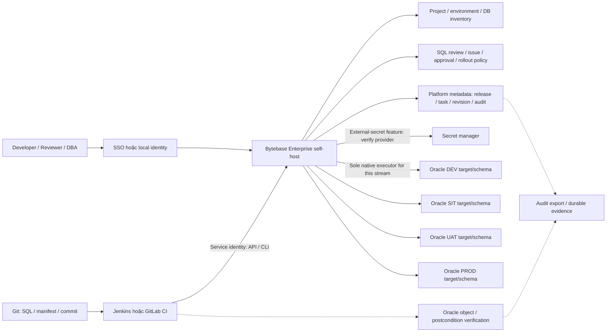
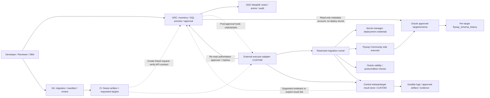
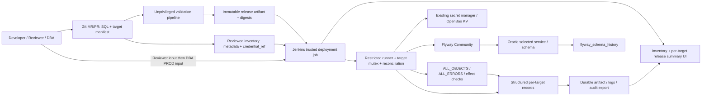

# Reference architecture: workflow tập trung cho Oracle

Ngày: **07/10/2026**. Đây là **DESIGN**, chưa triển khai/chạy SQL. Quyết định, license và evidence nằm ở [solution shortlist](solution-shortlist.md); bước dựng demo ở [POC plan](poc-plan.md). Không giả định Oracle version, Kubernetes, CI hoặc secret manager hiện hữu.

Ba kiến trúc dùng cùng release contract và cùng scenario. Mermaid dưới đây biểu diễn thành phần/boundary, không chứng minh đường integration đã hoạt động. Mũi tên nét đứt là hook/capability cần xác minh hoặc code cần tạo.

## 1. Best integrated platform — Bytebase Enterprise



**Có sẵn theo DOC/SOURCE:** instance/database/project/environment model, release/plan/issue/task APIs, SQL review, batch/progressive rollout, UI và EE approval/audit/external secrets. **Cần cấu hình/verify:** self-host edition entitlement cho số instance/seats thực, SSO/provider, service account permissions, SQL console role, policy enforcement, Git artifact binding, audit export, backup và Oracle postcheck. [Official pricing](https://www.bytebase.com/pricing/), [plan 3.23.0](https://github.com/bytebase/bytebase/blob/c8188c635465321ff930c97200742a96ef653144/backend/enterprise/plan.yaml).

Chỉ Bytebase thực thi change của stream này; không chạy Flyway cùng change để bổ sung ledger. Nếu cần migrate existing history sang Bytebase, đó là project riêng có baseline/reconcile, không đồng thời hai executor. Central revision và task SUCCESS chưa đủ Oracle object validity: [FREE runtime](../BYTEBASE-ORACLE-POC-RESULTS.md) có INVALID/promotion/review enforcement failures. EE chưa được kiểm; giữ những ca này trong adoption gates.

A là lựa chọn buy/configure gần desired UX nhất. Không dựng trial hoặc sửa feature gates trong nghiên cứu. Quote và exact edition regression quyết định có thể dùng gần nguyên trạng hay cần bổ sung.

## 2. Best OSS/composed workflow — ODC governance + Flyway



**Boundary bắt buộc:** ODC quản lý request/review/approval, Flyway quản lý engine execution; adapter quản lý release identity, hash binding, dispatch và reconciliation. ODC native ticket/SQL console không được thực thi migration của managed stream. ODC chỉ có read-only target credential nếu cần inventory/schema preview; runner giữ deploy secret riêng. Không gọi DB connection mode “read-only” đủ nếu actual DB grants vẫn cho write.

**Contract chưa establish:** supported post-approval handoff tới worker ngoài, cách loại native execution, cách lấy immutable SQL/targets/actor và result writeback. Approval integration DOC là ODC gọi approval service; không chứng minh external engine contract. [ODC integration guide](https://github.com/oceanbase/odc-doc/blob/40dc7c03522fef1968bd11b2b051bc216091e60d/en-US/1000.system-integration/300.sql-audit-integration.md), [source gaps](research-round-2/coordinator/odc-source-survey-20261006.md).

Nếu chỉ có link CI result, UI phải hiển thị rằng Oracle deployment nằm ở CI; không sửa native ticket thành SUCCESS giả. Nếu không có supported status/link path hoặc không thể ngăn creator/native executor, STOP B này. S2 không được cứu bằng cách fork toàn engine trước khi so S6.

Optional CloudDM dùng cùng layout, thay ODC/MetaDB bằng CloudDM flow/metadata. Pinned GitLab guide có exact-commit intake nhưng ghi integration tokens plaintext trong MetaDB; HttpCall action và callback/approval scope phải được kiểm riêng. [CloudDM guide](https://github.com/ClouGence/open-cdm/blob/3aa1238a471afca2579e76e6fbf0a922d9be5579/docs/guides/gitlab-cicd.en.md). Native v4.3.0 vẫn NO-GO làm Oracle migration executor.

## 3. Best CI/CD-centric composition — Git + Jenkins + Flyway



Git/Jenkins/Flyway có DOC cho các component; inventory view/target selection binding/result publisher/reconciliation là CUSTOM DESIGN. CI UI có build/input/status; DB release summary có thể bắt đầu bằng report HTML/JSON được link từ build. Một view chỉ đọc không cần platform mới. Target IDs được chọn từ allowlist trước gates; generated report SQL được escape HTML, không render SQL/comments như executable content.

GitLab Free làm Git/MR host; Jenkins reviewer/DBA gates enforce approval. Nếu tổ chức có GitLab Premium/Ultimate, GitLab CI có thể thay Jenkins với deployment approvals/protected environments. [Deployment approvals](https://docs.gitlab.com/ci/environments/deployment_approvals/) là paid-tier DOC; manual job Free không chứng minh người approver được capture/SoD. [Jenkins input](https://www.jenkins.io/doc/pipeline/steps/pipeline-input-step/) có admin exception.

Controller giữ credential references, agent tạm đọc secret khi dispatch. Không chạy pipeline từ MR untrusted trên PROD agent. Trusted library/deployment job chỉ maintainers quản trị được sửa; requester không được Configure/Replay/agent console hoặc chỉnh executable branch/command/DSN. Secret masking không ngăn script có quyền đọc secret gửi nó ra ngoài, nên boundary nằm ở code/agent authorization. [Jenkins credential docs](https://www.jenkins.io/doc/book/using/using-credentials/).

## 4. Common inventory và artifact contract

Đây là contract để lab implementation dùng chung, không API hiện có của ODC/CloudDM. Inventory system of record đầu tiên là reviewed YAML trong Git hoặc CMDB adapter nếu đã có. Import read-only platform inventory view từ cùng snapshot; tránh hai catalog edit độc lập. UI selection trả target IDs, server/runner resolve metadata. Không chấp nhận raw JDBC URL/schema/password do requester gửi tùy ý.

| Entity | Trường bắt buộc | Tại sao cần |
| --- | --- | --- |
| Instance/endpoint | instance_id, engine, environment, connection/service reference, owner/team, status | Phân biệt DB physical/logical endpoint; không giả định một schema = một instance |
| Deployment target | target_id, instance_id, service/PDB reference, schema, application, migration_stream, repo_path, baseline_ref, credential_ref | Engine state và quyền thao tác theo schema/stream; owner xác nhận target |
| Operational metadata | window/policy_ref, group/wave, inventory_revision/hash, connection_revision, observer_ref | Chọn batch, tránh mutation sau approval, observability và rotation |
| Release | release_id, commit_sha, SQL/artifact digests, targets snapshot/hash, inventory hash, policy/library version, requester, MR/change ID | Approval phải gắn với exact bytes và routing đã duyệt |
| Approval | role, authenticated actor, decision/time, artifact/target/inventory/policy hashes, expiry nếu có | Webhook báo “approved” không thay readback từ authority |
| Execution/result | release/target/migration/attempt IDs, engine/driver/image pin, executor/job ID, start/end, status, error, history/verification evidence | Trace và reconcile, không chỉ exit code |

Credential ref là đường logical, không secret value. Thay mật khẩu/version bí mật không cần đưa secret vào target-set hash; ghi secret version ID đã dùng trong restricted execution record. Thay service/schema/credential principal hoặc routing thì cần reapproval. Nếu secret manager không cung cấp username/principal metadata đủ để kiểm, runner phải xác minh identity ở target trước write.

Mẫu dưới **không executable**, các SHA và service refs là placeholder cần generate/resolve trong lab; không phải danh sách DB nội bộ:

```yaml
release_id: release-2026.10.01
application: core-customer
migration_stream: customer-schema
commit_sha: <exact-merged-commit>
artifact_sha256: <digest-of-immutable-bundle>
inventory_sha256: <digest-of-reviewed-inventory-snapshot>
target_set_sha256: <digest-of-canonical-target-snapshot>
policy_version: <trusted-policy-commit>
migrations:
  - id: "20261001.01"
    path: migrations/core-customer/V20261001_01__customer_risk_level.sql
    sha256: <digest-of-sql-bytes>
rollout:
  environment_order: [DEV, SIT, UAT, PROD]
  initial_concurrency: 1
  stop_on_error: true
targets:
  - target_id: oracle-core-dev
    instance_id: <DEV-instance-identity>
    environment: DEV
    logical_database: CORE_DEV
    service_ref: lab/core-dev
    schema: CUSTOMER_SCHEMA
    owner: core-dba
    credential_ref: oracle/core-dev/customer-schema/deployer
    observer_ref: oracle/core-dev/customer-schema/observer
  - target_id: oracle-core-sit
    instance_id: <SIT-instance-identity>
    environment: SIT
    logical_database: CORE_SIT
    service_ref: lab/core-sit
    schema: CUSTOMER_SCHEMA
    owner: core-dba
    credential_ref: oracle/core-sit/customer-schema/deployer
  - target_id: oracle-core-uat
    instance_id: <UAT-instance-identity>
    environment: UAT
    logical_database: CORE_UAT
    service_ref: lab/core-uat
    schema: CUSTOMER_SCHEMA
    owner: core-dba
    credential_ref: oracle/core-uat/customer-schema/deployer
  - target_id: oracle-core-prod
    instance_id: <MOCKPROD-instance-identity>
    environment: PROD
    logical_database: CORE_PROD
    service_ref: lab/core-mockprod
    schema: CUSTOMER_SCHEMA
    owner: core-dba
    credential_ref: oracle/core-mockprod/customer-schema/deployer
```

`PROD` trong mẫu là workflow tier; **lab chỉ MOCKPROD**. Nếu mô phỏng bằng bốn user/schema trên một service như runtime cũ, đổi mapping và labels để phản ánh đúng physical identity; không claim four-instance isolation. Same schema name trên four logical databases chỉ là scenario chưa run.

Freeze artifact gồm migrations, expected/pre/postcheck definitions, inventory snapshot/target selection và policy version. Manifest hashing phải canonicalize stable key/order và exclude field chứa chính digest của manifest; bundle digest lưu trong approval envelope bên ngoài bundle để tránh self-reference. Pin byte encoding/line endings; không tải lại mutable branch sau approval. Flyway checksum phục vụ engine validation, SHA-256 phục vụ approval; hai loại không thay nhau.

## 5. Scenario và environment promotion

Scenario để mô hình hóa, **không chạy statement**:

```sql
ALTER TABLE CUSTOMER ADD RISK_LEVEL VARCHAR2(20);
```

SQL/migration lưu một lần trong Git; target snapshot cho `CORE_DEV/SIT/UAT/PROD` với `CUSTOMER_SCHEMA`. Trước approval, UI preview SQL, commit, hash, target/service/schema, owner và policy. DevOps/DBA xác nhận baseline table/column semantics; không baselineOnMigrate tự động hoặc đoán schema trắng. Sau deploy, expectation là column tồn tại với datatype/length semantics đã duyệt; không tự mặc định BYTE/CHAR từ môi trường chưa biết.

```mermaid
sequenceDiagram
    participant D as Developer
    participant G as Git
    participant C as Workflow authority
    participant R as Reviewer / DBA
    participant E as Sole executor
    participant A as Audit/result store
    D->>G: SQL + requested target IDs
    G->>C: exact commit + immutable bundle
    C->>R: SQL diff / hash / target snapshot
    R->>C: Reviewer approval bound to envelope
    C->>E: DEV dispatch after validation
    E->>A: DEV history + postcheck
    C->>E: SIT then UAT only after verified lower stages
    E->>A: per-target verified results
    C->>R: PROD gate for same bundle and approved targets
    R->>C: DBA approval; distinct requester
    C->>E: MOCKPROD dispatch after recheck
    E->>A: execution + verification + final release state
    A-->>D: release summary / history / evidence links
```

Selecting a new target, editing SQL, changing route/schema, policy/library version hoặc executable parameters tạo envelope mới và invalidates approval. Schedule/manual/CI trigger phải đọc lại authority trước dispatch. DEV success không tự cho PROD permission. Stage order do orchestrator enforce; source/DOC progressive rollout không đủ vì old Bytebase API từng nhận early mockPROD.

## 6. Roles và ownership

| Role | Quyền trong managed workflow | Boundary |
| --- | --- | --- |
| Developer/requester | Commit SQL/manifest, request change, chọn requested targets theo inventory, trigger DEV theo policy | Không sửa trusted executor, không PROD deploy secret, không self-approve PROD |
| Reviewer | Review diff/SQL/findings và approve/reject exact envelope | Không thay SQL sau approval; quyết định capture actor/time |
| DBA/Approver | Verify target/baseline/window, approve PROD, inspect failure/recovery | Không implicit permission để native UI/console chạy cùng migration |
| Service executor | Fetch scoped credential, run approved artifact, postcheck/publish | Không tự approve/repair/clean; không tự đổi target hoặc nâng grant |
| Observer/auditor | Read permitted release results/metadata/evidence | Không write Oracle; không đọc secret hoặc raw private logs ngoài scope |
| DevOps maintainer | Inventory integration, platform/CI/worker/secrets/network, export/backup/upgrade | Privileged exception được audit; trusted code change được review |

Team 20 users dùng identity thật/SSO nếu đã có; 20 account lab chỉ là role/load smoke, không seat-certification. API principal retain initiating human và CI/service executor riêng. Không tin `requester` string client gửi: intake kiểm Git/CI authenticated event/API ownership; authority readback ghi actor.

Đề xuất ownership, cần xác nhận trước adoption: DBA sở hữu baseline/version/target privileges/recovery/postconditions; DevOps sở hữu adapter/shared library, runner/image/JDBC, inventory source sync, secret integration và durable evidence; team application sở hữu SQL/verification semantic; platform security/identity owner duyệt SoD/admin exceptions. Không invent SLA, retention duration hoặc recovery RTO.

## 7. Execution, lock và failure contract

| Bước | Action của runner | Stop condition |
| --- | --- | --- |
| 1 Pre-dispatch | Re-read approval, artifact/target/inventory/policy hashes, actor separation/window | Expired/changed/unapproved/unauthorized → no Oracle write |
| 2 Serialize | Acquire durable mutex cho canonical physical service/PDB + schema; unique execution request per release/target; check unresolved attempts | Existing RUNNING/PARTIAL/UNKNOWN → HOLD; alias phải dùng cùng lock key |
| 3 Preflight | Resolve scoped secret, identify actual DB/service/schema/user, read info/validate/baseline + touched-object state | Wrong target, unexpected history/baseline/drift, version mismatch → HOLD |
| 4 Execute | Append dispatch intent/attempt trước write; run sole Flyway executor on immutable SQL | First error → stop; no automatic `retry` quanh migrate |
| 5 Verify | Gather history + touched object status/type + diagnostics/effect queries | History success + invalid/postcondition fail → APPLIED_INVALID, block promotion |
| 6 Publish | Append per-target terminal event/evidence; aggregate release and next-stage authorization | Lost result store/ack after write → UNKNOWN_OUTCOME hoặc reconcile target success; không re-execute |

Serialize **toàn schema** qua các job/stream có thể tác động cùng objects, không chỉ theo pipeline ID hoặc migration stream. Jenkins `disableConcurrentBuilds` chỉ cùng job, GitLab resource_group chỉ trong scope áp dụng; cần common lock namespace/one deployment service hoặc proven shared mutex nếu có nhiều controller. Native Flyway history lock là bổ sung DOC/SOURCE, không thay guard cho execution đã uncertain.

Đối với lab C single-controller, dùng Jenkins Lockable Resources plugin với canonical target key, job logic giữ lock cho deploy+verify; pin plugin/license và kiểm cross-job contention. Durable attempt store độc lập giữ HOLD qua controller restart. Không nhả lock rồi launch worker mới chỉ vì lease timeout: old Oracle session có thể tiếp tục. Fencing token chỉ fence metadata/dispatch mới, **không tự fence Oracle DDL**; DBA xác minh session/process kết thúc trước reconcile/release.

Dừng wave mới khi một target failed/partial/unknown/invalid. Target đã dispatch trong bounded parallel wave có thể vẫn hoàn tất; phải collect mọi result, không claim atomic batch cancellation. Ban đầu serial 1; concurrency tăng chỉ sau POC target isolation/lock và owner chốt resource limits. Continue-on-error chỉ có thể là explicit exception cho independent non-promotion targets với approval mới; default migration release stop-on-error.

Repair/history realignment, baseline, compensating script, restore và kill/release stale session không nằm trong normal runner automatic actions. [Oracle DDL semantics](https://docs.oracle.com/en/database/oracle/oracle-database/19/tdddg/committing-transactions.html), [Flyway repair scope](https://documentation.red-gate.com/flyway/reference/commands/repair).

## 8. Audit/result storage và reconciliation

DESIGN B/C có append-only execution events và queryable release summary; implementation có thể là PostgreSQL + artifact/object store hoặc durable CI artifacts + metadata index nếu đã có. Chỉ CI artifacts với expiry ngắn chưa đủ. Không yêu cầu dựng một object store mới nếu existing storage thỏa quyền/retention/hash/backup.

Unique key dispatch là `(release_id, target_id, migration_stream, approval_envelope_hash)`; execution attempts có IDs riêng và liên kết recovery decision. Cùng request/key trả về cùng execution decision. Request hash khác cùng ID reject trước write. Lock key dựa actual DB/schema identity khác request key. Event sequence dùng append/conditional transition để delayed callback không ghi success đè failure/unknown cần reconcile.

```json
{
  "record_kind": "DESIGN_EXAMPLE_NOT_RUNTIME",
  "release_id": "release-2026.10.01",
  "target_id": "oracle-core-dev",
  "schema": "CUSTOMER_SCHEMA",
  "commit_sha": "<exact-commit>",
  "artifact_sha256": "<verified-sha256>",
  "approval_envelope_hash": "<verified-envelope-hash>",
  "requester": "<authenticated-human>",
  "reviewer": "<authenticated-reviewer>",
  "approver": "<authenticated-dba-for-PROD>",
  "executor": "<service-principal>",
  "ci_job_id": "<actual-job-id>",
  "execution_id": "<durable-execution-id>",
  "attempt_id": "<durable-attempt-id>",
  "status": "NOT_STARTED",
  "engine_history_ref": null,
  "verification_ref": null,
  "evidence_ref": "<restricted-artifact-path>"
}
```

Simulation records lưu tách với `SIMULATED_*`, không ghi APPLIED_VERIFIED/Oracle ledger proof. Runtime record sau này phải thêm engine/driver/image/Oracle version, actual canonical target identity, times/duration, statement/script references, diagnostics, secret version ref không secret value. Approved artifact chứa SQL reviewable; executed bytes/substitution parameters phải trace được. Secret substitutions không vào public audit; migration placeholders làm thay DDL cần approved values/hash riêng.

Reconciler không dispatch SQL: đọc attempt + worker state + engine history + Oracle effect, phân loại central missing ack vs target missing history vs invalid result. Nếu target ledger success/effect verified và central success thiếu, append recovered result; không migrate lại. Nếu DDL đã commit nhưng history chưa success, HOLD cho DBA decision. Backup restore audit/keys/artifacts phải đối chiếu target tiến xa hơn checkpoint; không restore metadata rồi quên những DDL đã chạy.

## 9. Deployment shape cho lab và bước kỹ thuật kế tiếp

Lab có thể ở VM/container network; không mặc định production K8s/HA. Separate controller/workflow storage, restricted runner, secrets và target; runner egress tới approved listener/service và evidence/secret endpoints, không public DB access. Pin image theo digest và driver hash, keep data/log volumes, collect backups; HA nhiều replicas không phải POC đầu.

ODC lab cần chọn exact existing image/build metadata từ [registry pin record](research-round-2/licensing/registry-pins.csv), MetaDB tương thích theo official deployment docs và wrapper provenance nếu dùng TCPS wrapper cũ. Không giả định public source tag `v4.4.1` tồn tại. Jenkins baseline reference LTS 2.580.1/Flyway 13.9.0 theo catalog, actual package/digest/plugins cần capture khi lab được phép dựng. Optional CloudDM v4.3.0 dùng exact reviewed artifact/digest, không mutable `latest`.

Làm contract POC theo [poc-plan.md](poc-plan.md): tạo skeleton lab repo/fixtures và no-DB dry runner, capture screen selection/approval/result link; chỉ sau gate mới cấp isolated Oracle target và chạy mapped correctness/recovery tests. Những file/interface trong kiến trúc này là handoff specification, **chưa có implementation trong repo**.
