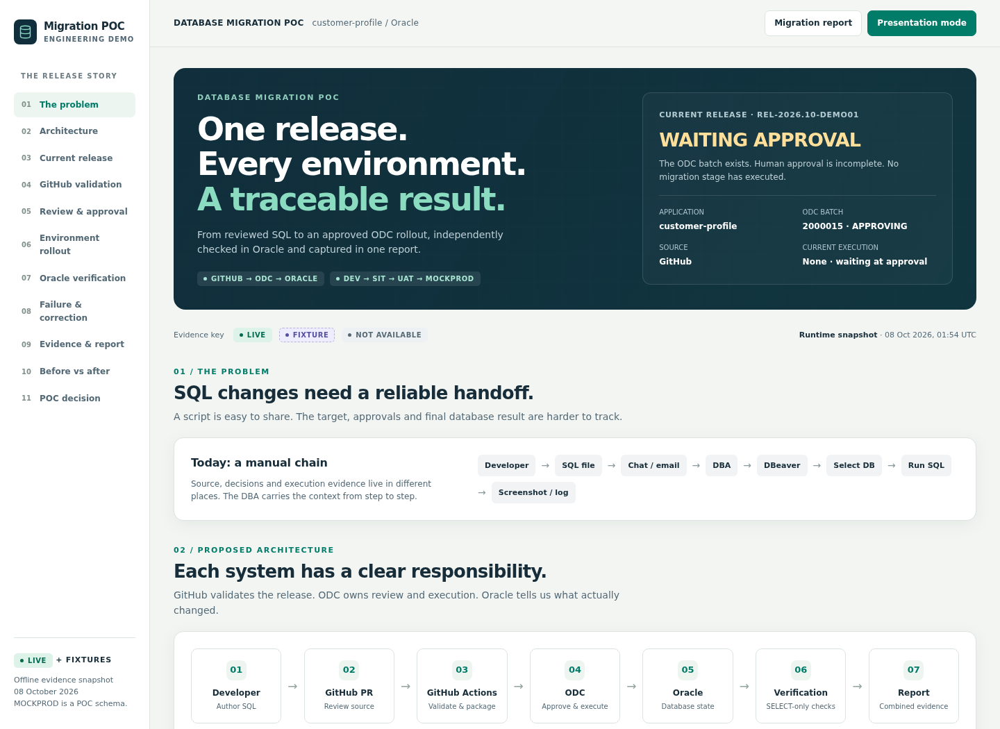
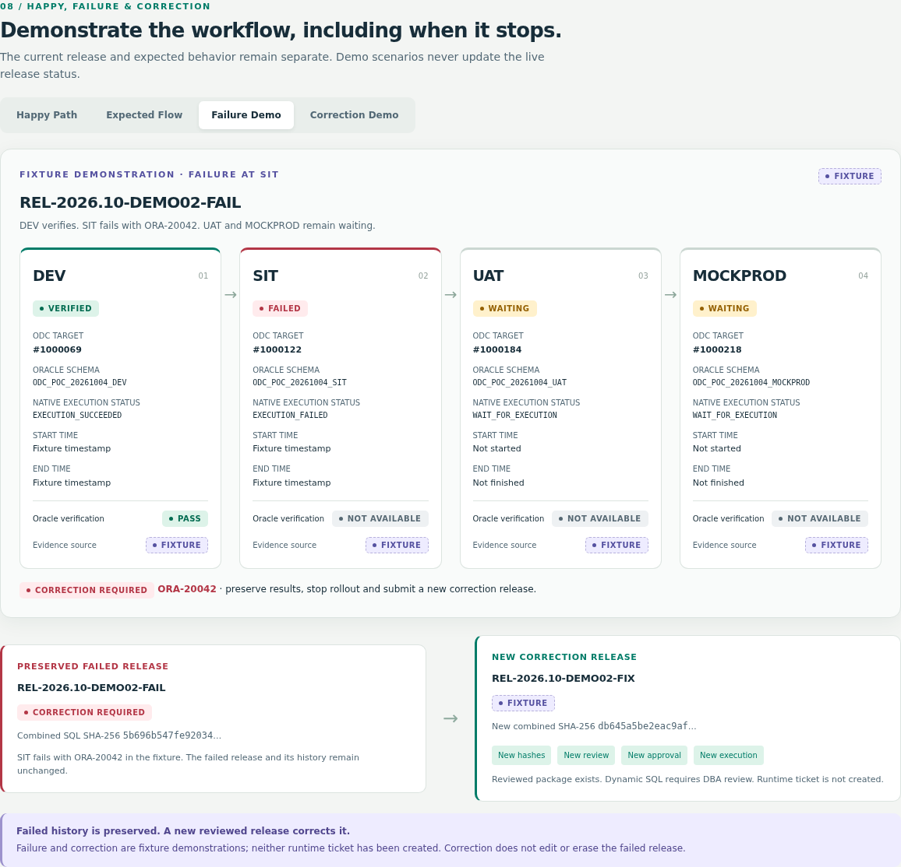

# Visual migration POC acceptance

Primary deliverables: [Open Visual POC](../demo/dashboard/index.html), [printable HTML report](../demo/dashboard/migration-report.html), and [generated status data](../demo/dashboard/data/demo-status.json). Both HTML pages contain their data, styles and script; opening a local file needs no server or network.

The dashboard walks through the manual problem, proposed architecture, release provenance, actual GitHub validation, approval timeline, environment rollout, independent Oracle checks, happy/expected/failure/correction scenarios, evidence chain, retention, before/after, ODC/Flyway boundary and pilot decision. Guided presentation controls and the formal report support an engineer or stakeholder demo.

| Acceptance area | Result |
| --- | --- |
| Current happy status | PARTIAL LIVE, batch **2000015 / APPROVING**, release **WAITING APPROVAL** |
| Approval | Requester submitted; OWNER/DBA nodes incomplete; no approval inferred from candidates/operators |
| Rollout / Oracle | Four waiting stages; no execution timestamps; **32 NOT RUN** Oracle checks |
| GitHub | PR #1 MERGED; `db-validate`, fixture `db-report`, CodeQL PASS; 34 historical tests PASS; package artifact 11504906993 verified |
| Failure / correction | Existing FIXTURE demonstrations; SIT ORA-20042; immutable failed history, new release/hashes/review/approval/execution |
| Retention | Historical LIVE PASS on 2000013/2000014, current retention configuration VERIFIED; separate from happy batch |
| Offline, links, assets, credentials | PASS; no network dependencies or browser errors; embedded JSON matches machine data; input/SQL hashes verified; hostile evidence text cannot inject HTML |
| Responsive / interaction / printing | PASS at 390px and desktop; tabs, keyboard and presentation navigation; generated A4 PDF inspected |
| Local checks | 42 tests PASS (34 existing + 8 evidence-integrity regressions); three manifests/packages/fixture reports; actionlint; research documents |
| Runtime scope | No new runtime acceptance, approval, execution or infrastructure work |

The platform decision remains **GO FOR INTERNAL PILOT**; authenticated Actions-to-ODC handoff, complete migration runtime acceptance and production rollout are pending. Successful fixture jobs and historical retention do not claim the current migration succeeded.

Verification commands, regeneration and the short demo walkthrough are in [dashboard/README.md](../demo/dashboard/README.md). [Evidence index](../evidence/visual-migration-poc-20261008/README.md) records browser results, screenshots, PDF and preserved input records. Existing Markdown/JSON migration reports remain machine/audit outputs.
